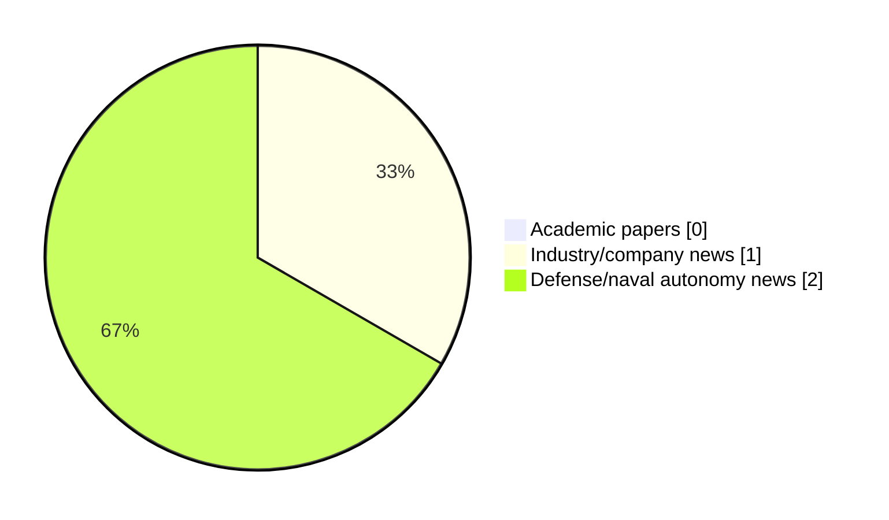

# Maritime Autonomy Watch — 2026-09-15

## Executive Summary

- Total selected items: 3
- Academic papers: 0
- Industry/company news: 1
- Defense/naval autonomy news: 2
- Failed/inaccessible sources: 1

## Contents

- [Analyst Brief](#analyst-brief)
- [Must Read](#must-read)
- [Top Signals Today](#top-signals-today)
- [Topic Signals](#topic-signals)
- [Freshness and Coverage](#freshness-and-coverage)
- [Quality Notes](#quality-notes)
- [Watchlist](#watchlist)
- [Academic Papers](#academic-papers)
- [Industry and Company News](#industry-and-company-news)
- [Defense and Naval Autonomy News](#defense-and-naval-autonomy-news)
- [Source Status Summary](#source-status-summary)

## Analyst Brief

Today's report selected 3 non-duplicate item(s), led by USV operations, planning/control, defense adoption. The strongest item is [Accurate Industrial Controls to Convert Six USVs into Navy Patrol Boats](https://www.marinelink.com/news/accurate-industrial-controls-convert-six-542929) from marinelink.com.
Coverage is weighted toward academic research (0), with 1 industry and 2 defense signal(s).

## Must Read

- [Accurate Industrial Controls to Convert Six USVs into Navy Patrol Boats](https://www.marinelink.com/news/accurate-industrial-controls-convert-six-542929) — Defense signal: USV operations
- [Robosys Automation Integrates VOYAGER AI with FarSounder Sonar for Autonomous Navigation](https://oceannews.com/news/science-technology/robosys-automation-integrates-voyager-ai-with-farsounder-sonar-for-autonomous-navigation/) — Industry signal: USV operations
- [France Launches Procurement for New Embarked Long-Endurance USV](https://www.navalnews.com/naval-news/2026/09/france-procurement-embarked-long-endurance-surface-drones/) — Defense signal: USV operations

## Top Signals Today

- USV operations: 3 selected item(s).
- planning/control: 2 selected item(s).
- defense adoption: 2 selected item(s).
- perception: 1 selected item(s).

## Topic Signals

- USV operations: 3
- planning/control: 2
- defense adoption: 2
- perception: 1

## Freshness and Coverage

- Newest selected item date: 2026-09-14
- Oldest selected item date: 2026-09-14
- Active/enabled sources: 4
- Sources with access problems: 3
- Quality flags: 0

## Quality Notes

- No quality flags on selected items.

## Watchlist

- No watchlist items today.

### Category Snapshot

| Category | Selected items |
|---|---:|
| Academic papers | 0 |
| Industry/company news | 1 |
| Defense/naval autonomy news | 2 |

## Academic Papers

_Selected items: 0_

No selected items.

## Industry and Company News

_Selected items: 1_

### [Robosys Automation Integrates VOYAGER AI with FarSounder Sonar for Autonomous Navigation](https://oceannews.com/news/science-technology/robosys-automation-integrates-voyager-ai-with-farsounder-sonar-for-autonomous-navigation/)

- Source: oceannews.com
- Date: 2026-09-14
- Relevance score: 6
- Signal: Industry signal: USV operations
- Topic tags: USV operations, perception, planning/control

**Summary**

Robosys Automation, a leader in autonomous navigation and vessel control systems, has integrated its VOYAGER AI Autonomous Navigation System (ANS) software with FarSounder's Forward Looking Sonar (FLS) technology, delivering enhanced real-time situational awareness, obstacle detection, and navigation decision support for both luxury superyachts and uncrewed surface vessels (USVs).

**Why it matters**

Signals momentum in surface-vessel operations; useful for tracking product direction, partnerships, and deployment opportunities.

---

## Defense and Naval Autonomy News

_Selected items: 2_

### [Accurate Industrial Controls to Convert Six USVs into Navy Patrol Boats](https://www.marinelink.com/news/accurate-industrial-controls-convert-six-542929)

- Source: marinelink.com
- Date: 2026-09-14
- Relevance score: 6.75
- Signal: Defense signal: USV operations
- Topic tags: USV operations, planning/control, defense adoption
- Also reported by: https://oceannews.com/feed/

**Summary**

Indian marine automation provider Accurate Industrial Controls is set to begin converting three patrol boats to Unmanned Surface Vessels (USVs) as part of a six-vessel deal with the Indian Navy. The company has already undertaken a feasibility…

**Why it matters**

Signals movement in surface-vessel operations, naval adoption; useful for tracking operational concepts, procurement direction, and fleet integration.

---

### [France Launches Procurement for New Embarked Long-Endurance USV](https://www.navalnews.com/naval-news/2026/09/france-procurement-embarked-long-endurance-surface-drones/)

- Source: navalnews.com
- Date: 2026-09-14
- Relevance score: 4.5
- Signal: Defense signal: USV operations
- Topic tags: USV operations, defense adoption

**Summary**

The French DGA has launched a formal tender for embarked, long-endurance surface drones to support French Navy ISR missions, but the technical requirements for the USV are quite challenging.

**Why it matters**

Signals movement in surface-vessel operations, naval adoption; useful for tracking operational concepts, procurement direction, and fleet integration.

---

## Inaccessible or Failed Sources

- arXiv: HTTP 429 for https://export.arxiv.org/api/query?search_query=all%3A%22maritime+autonomy%22+OR+all%3A%22marine+robotics%22+OR+all%3A%22autonomous+vessel%22+OR+all%3A%22autonomous+mission%22+OR+all%3A%22autonomous+surface+vessel%22+OR+all%3A%22autonomous+underwater+vehicle%22+OR+all%3A%22unmanned+surface+vehicle%22+OR+all%3A%22unmanned+underwater+vehicle%22&start=0&max_results=15&sortBy=submittedDate&sortOrder=descending

## Source Status Summary

| Source | Status | Notes |
|---|---|---|
| arXiv | failed | HTTP 429 for https://export.arxiv.org/api/query?search_query=all%3A%22maritime+autonomy%22+OR+all%3A%22marine+robotics%22+OR+all%3A%22autonomous+vessel%22+OR+all%3A%22autonomous+mission%22+OR+all%3A%22autonomous+surface+vessel%22+OR+all%3A%22autonomous+underwater+vehicle%22+OR+all%3A%22unmanned+surface+vehicle%22+OR+all%3A%22unmanned+underwater+vehicle%22&start=0&max_results=15&sortBy=submittedDate&sortOrder=descending |
| OpenAlex | enabled | API source, 15 items fetched |
| RSS feeds | enabled | 107 RSS items fetched |
| SMI MASG News | enabled | HTML source, 10 items fetched |
| IEEE Xplore | disabled | Missing IEEE_XPLORE_API_KEY |
| Elsevier Scopus | enabled | API source, 15 items fetched |
| NewsAPI | disabled | Missing NEWS_API_KEY |

## Metadata

- Generated at: 2026-09-15T12:59:55.936701+02:00
- Date: 2026-09-15
- Repository: ferhannb/MarineRobotics
- Relevance threshold: 4.0
- Deduplication method: DOI, canonical URL, source ID, normalized title, similar recent titles, category caps, and novelty score
