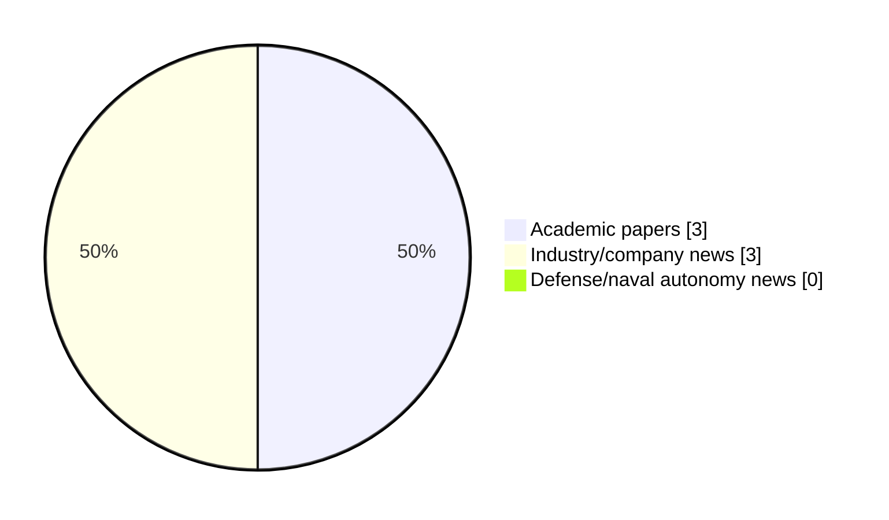

# Maritime Autonomy Watch — 2026-09-18

## Executive Summary

- Total selected items: 6
- Academic papers: 3
- Industry/company news: 3
- Defense/naval autonomy news: 0
- Failed/inaccessible sources: 2

## Contents

- [Analyst Brief](#analyst-brief)
- [Must Read](#must-read)
- [Top Signals Today](#top-signals-today)
- [Topic Signals](#topic-signals)
- [Freshness and Coverage](#freshness-and-coverage)
- [Quality Notes](#quality-notes)
- [Watchlist](#watchlist)
- [Academic Papers](#academic-papers)
- [Industry and Company News](#industry-and-company-news)
- [Defense and Naval Autonomy News](#defense-and-naval-autonomy-news)
- [Source Status Summary](#source-status-summary)

## Analyst Brief

Today's report selected 6 non-duplicate item(s), led by AUV navigation, general autonomy, USV operations. The strongest item is [SEABER Supplies European Navies with Lightweight MCM AUVs](https://oceannews.com/news/defense/seaber-supplies-european-navies-with-lightweight-mcm-auvs/) from oceannews.com.
Coverage is weighted toward academic research (3), with 3 industry and 0 defense signal(s).
Quality caveat: missing-summary=3, date-anomaly=3, low-score-unique=2.

## Must Read

- [SEABER Supplies European Navies with Lightweight MCM AUVs](https://oceannews.com/news/defense/seaber-supplies-european-navies-with-lightweight-mcm-auvs/) — Industry signal: AUV navigation
- [MBARI Showcases AUV and LRAUV Advances at AUV2026 Symposium](https://oceannews.com/news/science-technology/mbari-showcases-auv-and-lrauv-advances-at-auv2026-symposium/) — Industry signal: AUV navigation
- [Seavex & Subvex Connect Autonomous Operations Across Air, Land and Sea](https://www.oceansciencetechnology.com/news/seavex-subvex-connect-autonomous-operations-across-air-land-and-sea/) — Industry signal: general autonomy

## Top Signals Today

- AUV navigation: 2 selected item(s).
- general autonomy: 2 selected item(s).
- USV operations: 2 selected item(s).
- planning/control: 2 selected item(s).

## Topic Signals

- AUV navigation: 2
- general autonomy: 2
- USV operations: 2
- planning/control: 2

## Freshness and Coverage

- Newest selected item date: 2027-01-05
- Oldest selected item date: 2026-09-17
- Active/enabled sources: 3
- Sources with access problems: 4
- Quality flags: 8

## Quality Notes

- missing-summary: 3
- date-anomaly: 3
- low-score-unique: 2
- Date anomalies: [Data-driven fuzzy distributed reinforcement learning optimal resilient control for multi-USV systems under DoS attacks](https://api.elsevier.com/content/abstract/scopus_id/105047024186) reports 2027-01-05; [Marine data-assisted motion control for unmanned surface vehicles in dynamic unknown environments: A distributed deep reinforcement learning approach](https://api.elsevier.com/content/abstract/scopus_id/105048469959) reports 2027-01-01; [Mission-oriented dynamic resilience assessment for clustered autonomous intelligent unmanned systems: A non-Markovian load-memory and performance-health coupled evolution framework](https://api.elsevier.com/content/abstract/scopus_id/105047834390) reports 2027-01-01

## Watchlist

- [Data-driven fuzzy distributed reinforcement learning optimal resilient control for multi-USV systems under DoS attacks](https://api.elsevier.com/content/abstract/scopus_id/105047024186) — missing-summary, date-anomaly
- [Marine data-assisted motion control for unmanned surface vehicles in dynamic unknown environments: A distributed deep reinforcement learning approach](https://api.elsevier.com/content/abstract/scopus_id/105048469959) — missing-summary, date-anomaly, low-score-unique
- [Mission-oriented dynamic resilience assessment for clustered autonomous intelligent unmanned systems: A non-Markovian load-memory and performance-health coupled evolution framework](https://api.elsevier.com/content/abstract/scopus_id/105047834390) — missing-summary, date-anomaly, low-score-unique

### Category Snapshot

| Category | Selected items |
|---|---:|
| Academic papers | 3 |
| Industry/company news | 3 |
| Defense/naval autonomy news | 0 |

## Academic Papers

_Selected items: 3_

### [Data-driven fuzzy distributed reinforcement learning optimal resilient control for multi-USV systems under DoS attacks](https://api.elsevier.com/content/abstract/scopus_id/105047024186)

- Source: Elsevier Scopus
- Date: 2027-01-05
- Relevance score: 4.5
- DOI: 10.1016/j.ins.2026.123998
- Signal: Research signal: USV operations
- Topic tags: USV operations, planning/control
- Quality flags: missing-summary, date-anomaly

**Abstract**

No summary available.

**Why it matters**

Relevant to surface-vessel operations; the work may inform maritime autonomy research, testing priorities, or system design.

---

### [Marine data-assisted motion control for unmanned surface vehicles in dynamic unknown environments: A distributed deep reinforcement learning approach](https://api.elsevier.com/content/abstract/scopus_id/105048469959)

- Source: Elsevier Scopus
- Date: 2027-01-01
- Relevance score: 3.5
- DOI: 10.1016/j.tre.2026.105193
- Signal: Research signal: USV operations
- Topic tags: USV operations, planning/control
- Quality flags: missing-summary, date-anomaly, low-score-unique

**Abstract**

No summary available.

**Why it matters**

Relevant to surface-vessel operations; the work may inform maritime autonomy research, testing priorities, or system design.

---

### [Mission-oriented dynamic resilience assessment for clustered autonomous intelligent unmanned systems: A non-Markovian load-memory and performance-health coupled evolution framework](https://api.elsevier.com/content/abstract/scopus_id/105047834390)

- Source: Elsevier Scopus
- Date: 2027-01-01
- Relevance score: 3.5
- DOI: 10.1016/j.ress.2026.113335
- Signal: Research signal: general autonomy
- Topic tags: general autonomy
- Quality flags: missing-summary, date-anomaly, low-score-unique

**Abstract**

No summary available.

**Why it matters**

This paper may influence autonomy, perception, planning, or control work for maritime robotic systems.

---

## Industry and Company News

_Selected items: 3_

### [SEABER Supplies European Navies with Lightweight MCM AUVs](https://oceannews.com/news/defense/seaber-supplies-european-navies-with-lightweight-mcm-auvs/)

- Source: oceannews.com
- Date: 2026-09-17
- Relevance score: 7
- Signal: Industry signal: AUV navigation
- Topic tags: AUV navigation

**Summary**

SEABER is equipping some European navies with MCM autonomous underwater vehicles (AUVs).

**Why it matters**

Signals momentum in underwater autonomy; useful for tracking product direction, partnerships, and deployment opportunities.

---

### [MBARI Showcases AUV and LRAUV Advances at AUV2026 Symposium](https://oceannews.com/news/science-technology/mbari-showcases-auv-and-lrauv-advances-at-auv2026-symposium/)

- Source: oceannews.com
- Date: 2026-09-17
- Relevance score: 5
- Signal: Industry signal: AUV navigation
- Topic tags: AUV navigation

**Summary**

Earlier this month, engineers from MBARI's CoMPAS Lab and LRAUV Team participated in the 2026 IEEE OES AUV Symposium (AUV2026), sharing new developments from their work in autonomous robotics with peers in the ocean engineering community.

**Why it matters**

Signals momentum in underwater autonomy; useful for tracking product direction, partnerships, and deployment opportunities.

---

### [Seavex & Subvex Connect Autonomous Operations Across Air, Land and Sea](https://www.oceansciencetechnology.com/news/seavex-subvex-connect-autonomous-operations-across-air-land-and-sea/)

- Source: oceansciencetechnology.com
- Date: 2026-09-18
- Relevance score: 4.25
- Signal: Industry signal: general autonomy
- Topic tags: general autonomy

**Summary**

Quantum Systems is expanding its unmanned systems portfolio from air and land into the maritime domain with Seavex and Subvex,.

**Why it matters**

This item may signal product, market, or deployment momentum in maritime autonomy.

---

## Defense and Naval Autonomy News

_Selected items: 0_

No selected items.

## Inaccessible or Failed Sources

- arXiv: HTTP 406 for https://export.arxiv.org/api/query?search_query=all%3A%22maritime+autonomy%22+OR+all%3A%22marine+robotics%22+OR+all%3A%22autonomous+vessel%22+OR+all%3A%22autonomous+mission%22+OR+all%3A%22autonomous+surface+vessel%22+OR+all%3A%22autonomous+underwater+vehicle%22+OR+all%3A%22unmanned+surface+vehicle%22+OR+all%3A%22unmanned+underwater+vehicle%22&start=0&max_results=15&sortBy=submittedDate&sortOrder=descending
- OpenAlex: HTTP 429 for https://api.openalex.org/works?search=maritime+autonomy+marine+robotics+autonomous+vessel+autonomous+mission+autonomous+surface+vessel&per-page=15&sort=publication_date%3Adesc

## Source Status Summary

| Source | Status | Notes |
|---|---|---|
| arXiv | failed | HTTP 406 for https://export.arxiv.org/api/query?search_query=all%3A%22maritime+autonomy%22+OR+all%3A%22marine+robotics%22+OR+all%3A%22autonomous+vessel%22+OR+all%3A%22autonomous+mission%22+OR+all%3A%22autonomous+surface+vessel%22+OR+all%3A%22autonomous+underwater+vehicle%22+OR+all%3A%22unmanned+surface+vehicle%22+OR+all%3A%22unmanned+underwater+vehicle%22&start=0&max_results=15&sortBy=submittedDate&sortOrder=descending |
| OpenAlex | failed | HTTP 429 for https://api.openalex.org/works?search=maritime+autonomy+marine+robotics+autonomous+vessel+autonomous+mission+autonomous+surface+vessel&per-page=15&sort=publication_date%3Adesc |
| RSS feeds | enabled | 107 RSS items fetched |
| SMI MASG News | enabled | HTML source, 10 items fetched |
| IEEE Xplore | disabled | Missing IEEE_XPLORE_API_KEY |
| Elsevier Scopus | enabled | API source, 15 items fetched |
| NewsAPI | disabled | Missing NEWS_API_KEY |

## Metadata

- Generated at: 2026-09-18T12:30:39.472418+02:00
- Date: 2026-09-18
- Repository: ferhannb/MarineRobotics
- Relevance threshold: 4.0
- Deduplication method: DOI, canonical URL, source ID, normalized title, similar recent titles, category caps, and novelty score
