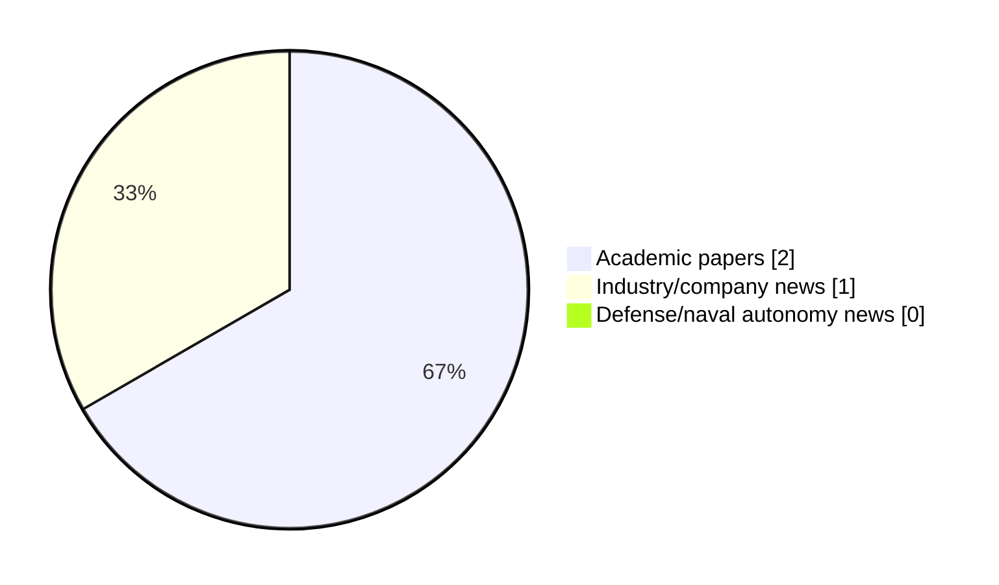

# Maritime Autonomy Watch — 2026-09-19

## Executive Summary

- Total selected items: 3
- Academic papers: 2
- Industry/company news: 1
- Defense/naval autonomy news: 0
- Failed/inaccessible sources: 1

## Contents

- [Analyst Brief](#analyst-brief)
- [Must Read](#must-read)
- [Top Signals Today](#top-signals-today)
- [Topic Signals](#topic-signals)
- [Freshness and Coverage](#freshness-and-coverage)
- [Quality Notes](#quality-notes)
- [Watchlist](#watchlist)
- [Academic Papers](#academic-papers)
- [Industry and Company News](#industry-and-company-news)
- [Defense and Naval Autonomy News](#defense-and-naval-autonomy-news)
- [Source Status Summary](#source-status-summary)

## Analyst Brief

Today's report selected 3 non-duplicate item(s), led by USV operations, swarm autonomy, planning/control. The strongest item is [Development of a Solar Autonomous Boat Navigation Guidance System for Future Swarm Unmanned-Surface-Vehicle Implementation](https://doi.org/10.55981/jet.774) from OpenAlex.
Coverage is weighted toward academic research (2), with 1 industry and 0 defense signal(s).

## Must Read

- [Development of a Solar Autonomous Boat Navigation Guidance System for Future Swarm Unmanned-Surface-Vehicle Implementation](https://doi.org/10.55981/jet.774) — Research signal: USV operations
- [Ocean Power Technologies Tests WAM-V 8 in Army Surf-Zone Trials to Advance USV Development](https://oceannews.com/news/defense/ocean-power-technologies-tests-wam-v-8-in-army-surf-zone-trials-to-advance-usv-development/) — Industry signal: USV operations
- [Global Underwater Hub Publishes Roadmap for UK Underwater Robotics and Autonomy](https://oceannews.com/news/science-technology/global-underwater-hub-publishes-roadmap-for-uk-underwater-robotics-and-autonomy/) — Research signal: general autonomy

## Top Signals Today

- USV operations: 2 selected item(s).
- swarm autonomy: 1 selected item(s).
- planning/control: 1 selected item(s).
- critical infrastructure: 1 selected item(s).
- general autonomy: 1 selected item(s).

## Topic Signals

- USV operations: 2
- swarm autonomy: 1
- planning/control: 1
- critical infrastructure: 1
- general autonomy: 1

## Freshness and Coverage

- Newest selected item date: 2026-09-18
- Oldest selected item date: 2026-08-31
- Active/enabled sources: 4
- Sources with access problems: 3
- Quality flags: 0

## Quality Notes

- No quality flags on selected items.

## Watchlist

- No watchlist items today.

### Category Snapshot

| Category | Selected items |
|---|---:|
| Academic papers | 2 |
| Industry/company news | 1 |
| Defense/naval autonomy news | 0 |

## Academic Papers

_Selected items: 2_

### [Development of a Solar Autonomous Boat Navigation Guidance System for Future Swarm Unmanned-Surface-Vehicle Implementation](https://doi.org/10.55981/jet.774)

- Source: OpenAlex
- Date: 2026-08-31
- Relevance score: 10
- Authors: Denny Darlis, Nurul Fahmi Adani Syam, Aris Hartaman
- DOI: 10.55981/jet.774
- Signal: Research signal: USV operations
- Topic tags: USV operations, swarm autonomy, planning/control

**Abstract**

Changes in the quality of the lake environment due to human activities demand efficient and sustainable monitoring solutions. This research designed a navigation guidance system for the solar autonomous boat that operates independently using solar energy and designed as a modular navigation unit to support future swarm-based cooperation between multiple vessels. The system relies on GPS ATGM336H and GY-271 digital compass sensor as positioning and direction determinants, controlled by a TTGO ESP32 LoRa microcontroller. Navigation data is processed in real-time and sent over the LoRa network to a central or intership gateway. This research focuses on the development and validation of the autonomous navigation core, providing the necessary guidance capabilities for integration into a swarm unmanned surface vehicle (USV) framework.

**Why it matters**

Relevant to surface-vessel operations, multi-vehicle coordination, planning and control; the work may inform maritime autonomy research, testing priorities, or system design.

---

### [Global Underwater Hub Publishes Roadmap for UK Underwater Robotics and Autonomy](https://oceannews.com/news/science-technology/global-underwater-hub-publishes-roadmap-for-uk-underwater-robotics-and-autonomy/)

- Source: oceannews.com
- Date: 2026-09-18
- Relevance score: 4.25
- Signal: Research signal: general autonomy
- Topic tags: general autonomy

**Abstract**

Global Underwater Hub (GUH) has published Maintaining the UK's Leading Position in Underwater Robotics and Autonomy, a new white paper setting out the opportunities and priorities for the UK to build on its established position in the sector.

**Why it matters**

Relevant to underwater autonomy; the work may inform maritime autonomy research, testing priorities, or system design.

---

## Industry and Company News

_Selected items: 1_

### [Ocean Power Technologies Tests WAM-V 8 in Army Surf-Zone Trials to Advance USV Development](https://oceannews.com/news/defense/ocean-power-technologies-tests-wam-v-8-in-army-surf-zone-trials-to-advance-usv-development/)

- Source: oceannews.com
- Date: 2026-09-18
- Relevance score: 6
- Signal: Industry signal: USV operations
- Topic tags: USV operations, critical infrastructure

**Summary**

Ocean Power Technologies, Inc. (OPT), a leader in maritime operational infrastructure and autonomous ocean systems, has announced that it conducted a formally evaluated demonstration of its WAM-V® 8 platform in challenging surf-zone conditions at the US Army Corps of Engineers' (USACE) Engineer Research and Development Center (ERDC) Field Research Facility in Duck, North Carolina.

**Why it matters**

Signals momentum in surface-vessel operations; useful for tracking product direction, partnerships, and deployment opportunities.

---

## Defense and Naval Autonomy News

_Selected items: 0_

No selected items.

## Inaccessible or Failed Sources

- arXiv: HTTP 406 for https://export.arxiv.org/api/query?search_query=all%3A%22maritime+autonomy%22+OR+all%3A%22marine+robotics%22+OR+all%3A%22autonomous+vessel%22+OR+all%3A%22autonomous+mission%22+OR+all%3A%22autonomous+surface+vessel%22+OR+all%3A%22autonomous+underwater+vehicle%22+OR+all%3A%22unmanned+surface+vehicle%22+OR+all%3A%22unmanned+underwater+vehicle%22&start=0&max_results=15&sortBy=submittedDate&sortOrder=descending

## Source Status Summary

| Source | Status | Notes |
|---|---|---|
| arXiv | failed | HTTP 406 for https://export.arxiv.org/api/query?search_query=all%3A%22maritime+autonomy%22+OR+all%3A%22marine+robotics%22+OR+all%3A%22autonomous+vessel%22+OR+all%3A%22autonomous+mission%22+OR+all%3A%22autonomous+surface+vessel%22+OR+all%3A%22autonomous+underwater+vehicle%22+OR+all%3A%22unmanned+surface+vehicle%22+OR+all%3A%22unmanned+underwater+vehicle%22&start=0&max_results=15&sortBy=submittedDate&sortOrder=descending |
| OpenAlex | enabled | API source, 15 items fetched |
| RSS feeds | enabled | 107 RSS items fetched |
| SMI MASG News | enabled | HTML source, 10 items fetched |
| IEEE Xplore | disabled | Missing IEEE_XPLORE_API_KEY |
| Elsevier Scopus | enabled | API source, 15 items fetched |
| NewsAPI | disabled | Missing NEWS_API_KEY |

## Metadata

- Generated at: 2026-09-19T12:15:29.405496+02:00
- Date: 2026-09-19
- Repository: ferhannb/MarineRobotics
- Relevance threshold: 4.0
- Deduplication method: DOI, canonical URL, source ID, normalized title, similar recent titles, category caps, and novelty score
