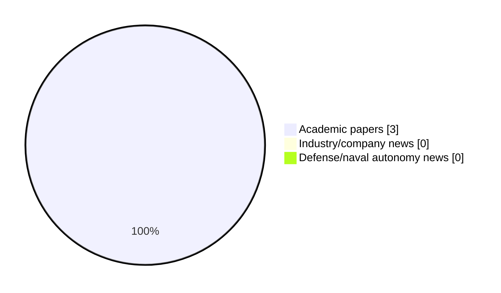

# Maritime Autonomy Watch — 2026-09-20

## Executive Summary

- Total selected items: 3
- Academic papers: 3
- Industry/company news: 0
- Defense/naval autonomy news: 0
- Failed/inaccessible sources: 1

## Contents

- [Analyst Brief](#analyst-brief)
- [Must Read](#must-read)
- [Top Signals Today](#top-signals-today)
- [Topic Signals](#topic-signals)
- [Freshness and Coverage](#freshness-and-coverage)
- [Quality Notes](#quality-notes)
- [Watchlist](#watchlist)
- [Academic Papers](#academic-papers)
- [Industry and Company News](#industry-and-company-news)
- [Defense and Naval Autonomy News](#defense-and-naval-autonomy-news)
- [Source Status Summary](#source-status-summary)

## Analyst Brief

Today's report selected 3 non-duplicate item(s), led by planning/control, USV operations, swarm autonomy. The strongest item is [Model Predictive Control for Multimodal Intelligent Transportation Systems: A Cross-Domain Review of Ground, Rail, Low-Altitude, and Marine Applications](https://doi.org/10.56578/mits050303) from OpenAlex.
Coverage is weighted toward academic research (3), with 0 industry and 0 defense signal(s).
Quality caveat: missing-summary=2, date-anomaly=2.

## Must Read

- [Model Predictive Control for Multimodal Intelligent Transportation Systems: A Cross-Domain Review of Ground, Rail, Low-Altitude, and Marine Applications](https://doi.org/10.56578/mits050303) — Research signal: planning/control

## Top Signals Today

- planning/control: 2 selected item(s).
- USV operations: 1 selected item(s).
- swarm autonomy: 1 selected item(s).

## Topic Signals

- planning/control: 2
- USV operations: 1
- swarm autonomy: 1

## Freshness and Coverage

- Newest selected item date: 2027-02-01
- Oldest selected item date: 2026-08-31
- Active/enabled sources: 4
- Sources with access problems: 3
- Quality flags: 4

## Quality Notes

- missing-summary: 2
- date-anomaly: 2
- Date anomalies: [Dynamic adaptive spatiotemporal fusion modeling and encounter danger analysis method based on Multi-USV swarms](https://api.elsevier.com/content/abstract/scopus_id/105050414069) reports 2027-02-01; [Direct propeller-speed tube model predictive control for unmanned underwater vehicle trajectory tracking with integrated nonlinear thruster mapping](https://api.elsevier.com/content/abstract/scopus_id/105050323176) reports 2027-01-01

## Watchlist

- [Dynamic adaptive spatiotemporal fusion modeling and encounter danger analysis method based on Multi-USV swarms](https://api.elsevier.com/content/abstract/scopus_id/105050414069) — missing-summary, date-anomaly
- [Direct propeller-speed tube model predictive control for unmanned underwater vehicle trajectory tracking with integrated nonlinear thruster mapping](https://api.elsevier.com/content/abstract/scopus_id/105050323176) — missing-summary, date-anomaly

### Category Snapshot

| Category | Selected items |
|---|---:|
| Academic papers | 3 |
| Industry/company news | 0 |
| Defense/naval autonomy news | 0 |

## Academic Papers

_Selected items: 3_

### [Model Predictive Control for Multimodal Intelligent Transportation Systems: A Cross-Domain Review of Ground, Rail, Low-Altitude, and Marine Applications](https://doi.org/10.56578/mits050303)

- Source: OpenAlex
- Date: 2026-08-31
- Relevance score: 4.5
- Authors: Yougang Sun, Dandan Zhang, Bing Ren, Huitong Xie, Yuejian Chen
- DOI: 10.56578/mits050303
- Signal: Research signal: planning/control
- Topic tags: planning/control

**Abstract**

Intelligent transportation systems increasingly rely on connected and autonomous platforms operating across road, rail, low-altitude, and marine environments. These systems must accommodate nonlinear and timevarying dynamics, environmental uncertainty, communication limitations, safety requirements, and tightly coupled operational constraints. Model predictive control (MPC) is well suited to such conditions because it combines futurestate prediction, constrained optimization, and closed-loop correction within a receding-horizon framework. This review examines the theoretical foundations, major formulations, and transportation applications of MPC across four domains: ground vehicles and traffic networks, railway systems, low-altitude unmanned aerial transportation, and marine autonomous systems.

**Why it matters**

Relevant to underwater autonomy, navigation safety, planning and control; the work may inform maritime autonomy research, testing priorities, or system design.

---

### [Dynamic adaptive spatiotemporal fusion modeling and encounter danger analysis method based on Multi-USV swarms](https://api.elsevier.com/content/abstract/scopus_id/105050414069)

- Source: Elsevier Scopus
- Date: 2027-02-01
- Relevance score: 4.5
- DOI: 10.1016/j.ress.2026.113473
- Signal: Research signal: USV operations
- Topic tags: USV operations, swarm autonomy
- Quality flags: missing-summary, date-anomaly

**Abstract**

No summary available.

**Why it matters**

Relevant to surface-vessel operations, multi-vehicle coordination; the work may inform maritime autonomy research, testing priorities, or system design.

---

### [Direct propeller-speed tube model predictive control for unmanned underwater vehicle trajectory tracking with integrated nonlinear thruster mapping](https://api.elsevier.com/content/abstract/scopus_id/105050323176)

- Source: Elsevier Scopus
- Date: 2027-01-01
- Relevance score: 4.25
- DOI: 10.1016/j.conengprac.2026.107258
- Signal: Research signal: planning/control
- Topic tags: planning/control
- Quality flags: missing-summary, date-anomaly

**Abstract**

No summary available.

**Why it matters**

Relevant to underwater autonomy, planning and control; the work may inform maritime autonomy research, testing priorities, or system design.

---

## Industry and Company News

_Selected items: 0_

No selected items.

## Defense and Naval Autonomy News

_Selected items: 0_

No selected items.

## Inaccessible or Failed Sources

- arXiv: HTTP 406 for https://export.arxiv.org/api/query?search_query=all%3A%22maritime+autonomy%22+OR+all%3A%22marine+robotics%22+OR+all%3A%22autonomous+vessel%22+OR+all%3A%22autonomous+mission%22+OR+all%3A%22autonomous+surface+vessel%22+OR+all%3A%22autonomous+underwater+vehicle%22+OR+all%3A%22unmanned+surface+vehicle%22+OR+all%3A%22unmanned+underwater+vehicle%22&start=0&max_results=15&sortBy=submittedDate&sortOrder=descending

## Source Status Summary

| Source | Status | Notes |
|---|---|---|
| arXiv | failed | HTTP 406 for https://export.arxiv.org/api/query?search_query=all%3A%22maritime+autonomy%22+OR+all%3A%22marine+robotics%22+OR+all%3A%22autonomous+vessel%22+OR+all%3A%22autonomous+mission%22+OR+all%3A%22autonomous+surface+vessel%22+OR+all%3A%22autonomous+underwater+vehicle%22+OR+all%3A%22unmanned+surface+vehicle%22+OR+all%3A%22unmanned+underwater+vehicle%22&start=0&max_results=15&sortBy=submittedDate&sortOrder=descending |
| OpenAlex | enabled | API source, 15 items fetched |
| RSS feeds | enabled | 107 RSS items fetched |
| SMI MASG News | enabled | HTML source, 10 items fetched |
| IEEE Xplore | disabled | Missing IEEE_XPLORE_API_KEY |
| Elsevier Scopus | enabled | API source, 15 items fetched |
| NewsAPI | disabled | Missing NEWS_API_KEY |

## Metadata

- Generated at: 2026-09-20T12:34:02.263190+02:00
- Date: 2026-09-20
- Repository: ferhannb/MarineRobotics
- Relevance threshold: 4.0
- Deduplication method: DOI, canonical URL, source ID, normalized title, similar recent titles, category caps, and novelty score
