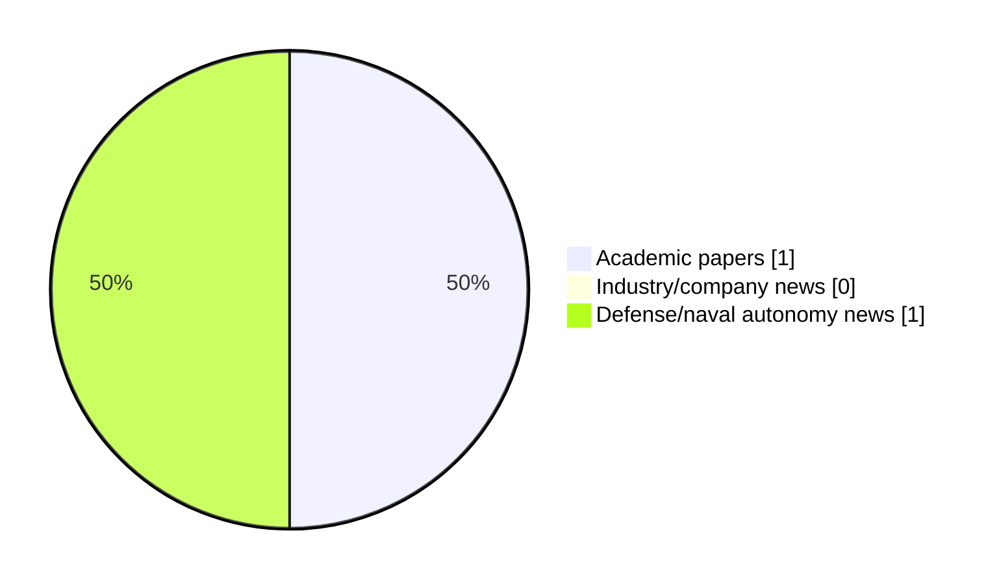

# Maritime Autonomy Watch — 2026-09-21

## Executive Summary

- Total selected items: 2
- Academic papers: 1
- Industry/company news: 0
- Defense/naval autonomy news: 1
- Failed/inaccessible sources: 1

## Contents

- [Analyst Brief](#analyst-brief)
- [Must Read](#must-read)
- [Top Signals Today](#top-signals-today)
- [Topic Signals](#topic-signals)
- [Freshness and Coverage](#freshness-and-coverage)
- [Quality Notes](#quality-notes)
- [Watchlist](#watchlist)
- [Academic Papers](#academic-papers)
- [Industry and Company News](#industry-and-company-news)
- [Defense and Naval Autonomy News](#defense-and-naval-autonomy-news)
- [Source Status Summary](#source-status-summary)

## Analyst Brief

Today's report selected 2 non-duplicate item(s), led by defense adoption, AUV navigation. The strongest item is [A Communication-Efficient Modified Consensus-Based Auction Algorithm for Distributed AUV Task Allocation](https://api.elsevier.com/content/abstract/scopus_id/105048663072) from Elsevier Scopus.
Coverage is weighted toward academic research (1), with 0 industry and 1 defense signal(s).
Quality caveat: low-score-unique=2, missing-summary=1, date-anomaly=1.

## Must Read

- [Cellula Robotics Forms Joint Venture for Autonomous Marine Handling](https://www.oceansciencetechnology.com/news/cellula-robotics-forms-joint-venture-for-autonomous-marine-handling/) — Defense signal: defense adoption

## Top Signals Today

- defense adoption: 1 selected item(s).
- AUV navigation: 1 selected item(s).

## Topic Signals

- defense adoption: 1
- AUV navigation: 1

## Freshness and Coverage

- Newest selected item date: 2027-01-01
- Oldest selected item date: 2026-09-21
- Active/enabled sources: 4
- Sources with access problems: 3
- Quality flags: 4

## Quality Notes

- low-score-unique: 2
- missing-summary: 1
- date-anomaly: 1
- Date anomalies: [A Communication-Efficient Modified Consensus-Based Auction Algorithm for Distributed AUV Task Allocation](https://api.elsevier.com/content/abstract/scopus_id/105048663072) reports 2027-01-01

## Watchlist

- [Cellula Robotics Forms Joint Venture for Autonomous Marine Handling](https://www.oceansciencetechnology.com/news/cellula-robotics-forms-joint-venture-for-autonomous-marine-handling/) — low-score-unique
- [A Communication-Efficient Modified Consensus-Based Auction Algorithm for Distributed AUV Task Allocation](https://api.elsevier.com/content/abstract/scopus_id/105048663072) — missing-summary, date-anomaly, low-score-unique

### Category Snapshot

| Category | Selected items |
|---|---:|
| Academic papers | 1 |
| Industry/company news | 0 |
| Defense/naval autonomy news | 1 |

## Academic Papers

_Selected items: 1_

### [A Communication-Efficient Modified Consensus-Based Auction Algorithm for Distributed AUV Task Allocation](https://api.elsevier.com/content/abstract/scopus_id/105048663072)

- Source: Elsevier Scopus
- Date: 2027-01-01
- Relevance score: 3.5
- DOI: 10.1007/978-3-032-34384-0_24
- Signal: Research signal: AUV navigation
- Topic tags: AUV navigation
- Quality flags: missing-summary, date-anomaly, low-score-unique

**Abstract**

No summary available.

**Why it matters**

Relevant to underwater autonomy; the work may inform maritime autonomy research, testing priorities, or system design.

---

## Industry and Company News

_Selected items: 0_

No selected items.

## Defense and Naval Autonomy News

_Selected items: 1_

### [Cellula Robotics Forms Joint Venture for Autonomous Marine Handling](https://www.oceansciencetechnology.com/news/cellula-robotics-forms-joint-venture-for-autonomous-marine-handling/)

- Source: oceansciencetechnology.com
- Date: 2026-09-21
- Relevance score: 3
- Signal: Defense signal: defense adoption
- Topic tags: defense adoption
- Quality flags: low-score-unique

**Summary**

Cellula Robotics and Industrias FERRI have formed Nautical Reach Systems, an East Coast Canadian joint venture focused on marine handling systems for autonomous operations. The company will develop smart launch and recovery and payload-handling solutions for uncrewed surface and underwater vehicles. Its systems will be engineered for naval, coast guard and offshore missions, including operations in remote, harsh and Arctic environments.

**Why it matters**

Signals movement in underwater autonomy, naval adoption; useful for tracking operational concepts, procurement direction, and fleet integration.

---

## Inaccessible or Failed Sources

- arXiv: HTTP 406 for https://export.arxiv.org/api/query?search_query=all%3A%22maritime+autonomy%22+OR+all%3A%22marine+robotics%22+OR+all%3A%22autonomous+vessel%22+OR+all%3A%22autonomous+mission%22+OR+all%3A%22autonomous+surface+vessel%22+OR+all%3A%22autonomous+underwater+vehicle%22+OR+all%3A%22unmanned+surface+vehicle%22+OR+all%3A%22unmanned+underwater+vehicle%22&start=0&max_results=15&sortBy=submittedDate&sortOrder=descending

## Source Status Summary

| Source | Status | Notes |
|---|---|---|
| arXiv | failed | HTTP 406 for https://export.arxiv.org/api/query?search_query=all%3A%22maritime+autonomy%22+OR+all%3A%22marine+robotics%22+OR+all%3A%22autonomous+vessel%22+OR+all%3A%22autonomous+mission%22+OR+all%3A%22autonomous+surface+vessel%22+OR+all%3A%22autonomous+underwater+vehicle%22+OR+all%3A%22unmanned+surface+vehicle%22+OR+all%3A%22unmanned+underwater+vehicle%22&start=0&max_results=15&sortBy=submittedDate&sortOrder=descending |
| OpenAlex | enabled | API source, 15 items fetched |
| RSS feeds | enabled | 107 RSS items fetched |
| SMI MASG News | enabled | HTML source, 10 items fetched |
| IEEE Xplore | disabled | Missing IEEE_XPLORE_API_KEY |
| Elsevier Scopus | enabled | API source, 15 items fetched |
| NewsAPI | disabled | Missing NEWS_API_KEY |

## Metadata

- Generated at: 2026-09-21T13:55:19.836345+02:00
- Date: 2026-09-21
- Repository: ferhannb/MarineRobotics
- Relevance threshold: 4.0
- Deduplication method: DOI, canonical URL, source ID, normalized title, similar recent titles, category caps, and novelty score
