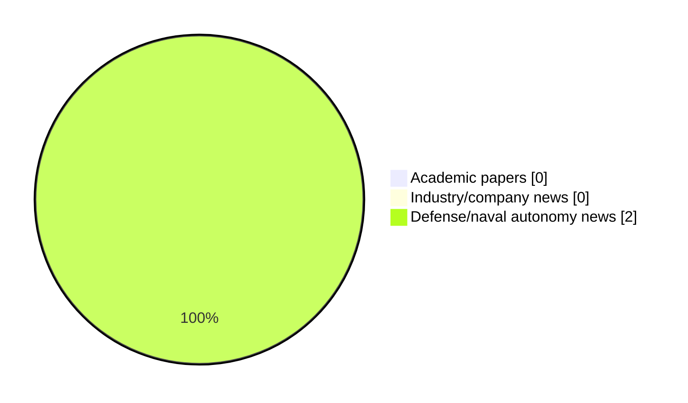

# Maritime Autonomy Watch — 2026-09-22

## Executive Summary

- Total selected items: 2
- Academic papers: 0
- Industry/company news: 0
- Defense/naval autonomy news: 2
- Failed/inaccessible sources: 2

## Contents

- [Analyst Brief](#analyst-brief)
- [Must Read](#must-read)
- [Top Signals Today](#top-signals-today)
- [Topic Signals](#topic-signals)
- [Freshness and Coverage](#freshness-and-coverage)
- [Quality Notes](#quality-notes)
- [Watchlist](#watchlist)
- [Academic Papers](#academic-papers)
- [Industry and Company News](#industry-and-company-news)
- [Defense and Naval Autonomy News](#defense-and-naval-autonomy-news)
- [Source Status Summary](#source-status-summary)

## Analyst Brief

Today's report selected 2 non-duplicate item(s), led by USV operations, defense adoption. The strongest item is [OPT Deploys Three WAM-V Classes Across Five Mission Sets at REPMUS 2026](https://oceannews.com/news/defense/opt-deploys-three-wam-v-classes-across-five-mission-sets-at-repmus-2026/) from oceannews.com.
Coverage is weighted toward academic research (0), with 0 industry and 2 defense signal(s).

## Must Read

- [OPT Deploys Three WAM-V Classes Across Five Mission Sets at REPMUS 2026](https://oceannews.com/news/defense/opt-deploys-three-wam-v-classes-across-five-mission-sets-at-repmus-2026/) — Defense signal: USV operations
- [Japan’s Onomichi Dockyard Partnering With Bulwark Dynamics On Caravel USV](https://www.navalnews.com/naval-news/2026/09/japans-onomichi-dockyard-bulwark-dynamics-caravel-usv/) — Defense signal: USV operations

## Top Signals Today

- USV operations: 2 selected item(s).
- defense adoption: 1 selected item(s).

## Topic Signals

- USV operations: 2
- defense adoption: 1

## Freshness and Coverage

- Newest selected item date: 2026-09-21
- Oldest selected item date: 2026-09-21
- Active/enabled sources: 3
- Sources with access problems: 4
- Quality flags: 0

## Quality Notes

- No quality flags on selected items.

## Watchlist

- No watchlist items today.

### Category Snapshot

| Category | Selected items |
|---|---:|
| Academic papers | 0 |
| Industry/company news | 0 |
| Defense/naval autonomy news | 2 |

## Academic Papers

_Selected items: 0_

No selected items.

## Industry and Company News

_Selected items: 0_

No selected items.

## Defense and Naval Autonomy News

_Selected items: 2_

### [OPT Deploys Three WAM-V Classes Across Five Mission Sets at REPMUS 2026](https://oceannews.com/news/defense/opt-deploys-three-wam-v-classes-across-five-mission-sets-at-repmus-2026/)

- Source: oceannews.com
- Date: 2026-09-21
- Relevance score: 6.75
- Signal: Defense signal: USV operations
- Topic tags: USV operations, defense adoption

**Summary**

Ocean Power Technologies, Inc. (OPT) has announced that three classes of its WAM-V® unmanned surface vessels (USVs) operated across multiple mission sets at REPMUS 2026, the multinational robotic experimentation exercise led by the Portuguese Navy in close collaboration with NATO, the University of Porto, and the European Defense Agency (EDA).

**Why it matters**

Signals movement in surface-vessel operations, naval adoption; useful for tracking operational concepts, procurement direction, and fleet integration.

---

### [Japan’s Onomichi Dockyard Partnering With Bulwark Dynamics On Caravel USV](https://www.navalnews.com/naval-news/2026/09/japans-onomichi-dockyard-bulwark-dynamics-caravel-usv/)

- Source: navalnews.com
- Date: 2026-09-21
- Relevance score: 5.25
- Signal: Defense signal: USV operations
- Topic tags: USV operations

**Summary**

Japan's Onomichi Dockyard entered into a partnership with Bulwark Dynamics to build 35-foot autonomous landing craft for US and allied forces.

**Why it matters**

Signals movement in surface-vessel operations; useful for tracking operational concepts, procurement direction, and fleet integration.

---

## Inaccessible or Failed Sources

- arXiv: HTTP 406 for https://export.arxiv.org/api/query?search_query=all%3A%22maritime+autonomy%22+OR+all%3A%22marine+robotics%22+OR+all%3A%22autonomous+vessel%22+OR+all%3A%22autonomous+mission%22+OR+all%3A%22autonomous+surface+vessel%22+OR+all%3A%22autonomous+underwater+vehicle%22+OR+all%3A%22unmanned+surface+vehicle%22+OR+all%3A%22unmanned+underwater+vehicle%22&start=0&max_results=15&sortBy=submittedDate&sortOrder=descending
- OpenAlex: HTTP 429 for https://api.openalex.org/works?search=maritime+autonomy+marine+robotics+autonomous+vessel+autonomous+mission+autonomous+surface+vessel&per-page=15&sort=publication_date%3Adesc

## Source Status Summary

| Source | Status | Notes |
|---|---|---|
| arXiv | failed | HTTP 406 for https://export.arxiv.org/api/query?search_query=all%3A%22maritime+autonomy%22+OR+all%3A%22marine+robotics%22+OR+all%3A%22autonomous+vessel%22+OR+all%3A%22autonomous+mission%22+OR+all%3A%22autonomous+surface+vessel%22+OR+all%3A%22autonomous+underwater+vehicle%22+OR+all%3A%22unmanned+surface+vehicle%22+OR+all%3A%22unmanned+underwater+vehicle%22&start=0&max_results=15&sortBy=submittedDate&sortOrder=descending |
| OpenAlex | failed | HTTP 429 for https://api.openalex.org/works?search=maritime+autonomy+marine+robotics+autonomous+vessel+autonomous+mission+autonomous+surface+vessel&per-page=15&sort=publication_date%3Adesc |
| RSS feeds | enabled | 107 RSS items fetched |
| SMI MASG News | enabled | HTML source, 10 items fetched |
| IEEE Xplore | disabled | Missing IEEE_XPLORE_API_KEY |
| Elsevier Scopus | enabled | API source, 15 items fetched |
| NewsAPI | disabled | Missing NEWS_API_KEY |

## Metadata

- Generated at: 2026-09-22T12:55:07.310878+02:00
- Date: 2026-09-22
- Repository: ferhannb/MarineRobotics
- Relevance threshold: 4.0
- Deduplication method: DOI, canonical URL, source ID, normalized title, similar recent titles, category caps, and novelty score
