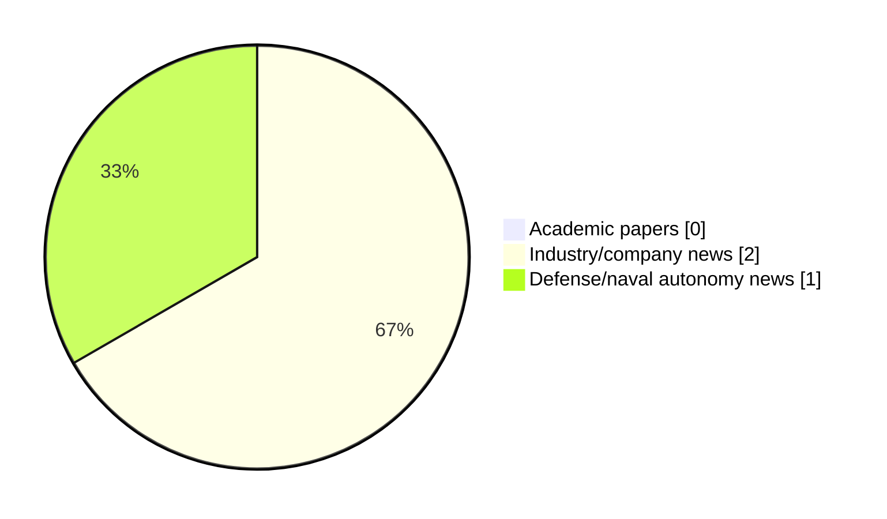

# Maritime Autonomy Watch — 2026-09-23

## Executive Summary

- Total selected items: 3
- Academic papers: 0
- Industry/company news: 2
- Defense/naval autonomy news: 1
- Failed/inaccessible sources: 2

## Contents

- [Analyst Brief](#analyst-brief)
- [Must Read](#must-read)
- [Top Signals Today](#top-signals-today)
- [Topic Signals](#topic-signals)
- [Freshness and Coverage](#freshness-and-coverage)
- [Quality Notes](#quality-notes)
- [Watchlist](#watchlist)
- [Academic Papers](#academic-papers)
- [Industry and Company News](#industry-and-company-news)
- [Defense and Naval Autonomy News](#defense-and-naval-autonomy-news)
- [Source Status Summary](#source-status-summary)

## Analyst Brief

Today's report selected 3 non-duplicate item(s), led by USV operations, critical infrastructure, planning/control. The strongest item is [OMS Group Launches Singapore Remote Operations Center for USV Survey Missions](https://oceannews.com/news/subsea-and-survey/oms-group-launches-singapore-remote-operations-center-for-usv-survey-missions/) from oceannews.com.
Coverage is weighted toward academic research (0), with 2 industry and 1 defense signal(s).

## Must Read

- [OMS Group Launches Singapore Remote Operations Center for USV Survey Missions](https://oceannews.com/news/subsea-and-survey/oms-group-launches-singapore-remote-operations-center-for-usv-survey-missions/) — Defense signal: USV operations
- [OceanAlpha Displays V180 and L42B USVs at Rio Oil and Gas 2026](https://oceannews.com/news/milestones/oceanalpha-displays-v180-and-l42b-usvs-at-rio-oil-and-gas-2026/) — Industry signal: USV operations
- [SubSea Craft Builds Maritime Autonomy on Shared Digital Control Architecture](https://oceannews.com/news/science-technology/subsea-craft-builds-maritime-autonomy-on-shared-digital-control-architecture/) — Industry signal: planning/control

## Top Signals Today

- USV operations: 2 selected item(s).
- critical infrastructure: 2 selected item(s).
- planning/control: 1 selected item(s).

## Topic Signals

- USV operations: 2
- critical infrastructure: 2
- planning/control: 1

## Freshness and Coverage

- Newest selected item date: 2026-09-22
- Oldest selected item date: 2026-09-22
- Active/enabled sources: 2
- Sources with access problems: 5
- Quality flags: 0

## Quality Notes

- No quality flags on selected items.

## Watchlist

- No watchlist items today.

### Category Snapshot

| Category | Selected items |
|---|---:|
| Academic papers | 0 |
| Industry/company news | 2 |
| Defense/naval autonomy news | 1 |

## Academic Papers

_Selected items: 0_

No selected items.

## Industry and Company News

_Selected items: 2_

### [OceanAlpha Displays V180 and L42B USVs at Rio Oil and Gas 2026](https://oceannews.com/news/milestones/oceanalpha-displays-v180-and-l42b-usvs-at-rio-oil-and-gas-2026/)

- Source: oceannews.com
- Date: 2026-09-22
- Relevance score: 8.5
- Signal: Industry signal: USV operations
- Topic tags: USV operations

**Summary**

OceanAlpha is showcasing its latest unmanned surface vessel (USV) solutions at booth ZA35 during Rio Oil & Gas 2026 (ROG.e), held from September 21–24, 2026, at Riocentro in Rio de Janeiro, Brazil.

**Why it matters**

Signals momentum in surface-vessel operations; useful for tracking product direction, partnerships, and deployment opportunities.

---

### [SubSea Craft Builds Maritime Autonomy on Shared Digital Control Architecture](https://oceannews.com/news/science-technology/subsea-craft-builds-maritime-autonomy-on-shared-digital-control-architecture/)

- Source: oceannews.com
- Date: 2026-09-22
- Relevance score: 4.25
- Signal: Industry signal: planning/control
- Topic tags: planning/control, critical infrastructure

**Summary**

When VICTA first demonstrated unmanned operation in 2023, it marked more than a successful trial.

**Why it matters**

This item may signal product, market, or deployment momentum in maritime autonomy.

---

## Defense and Naval Autonomy News

_Selected items: 1_

### [OMS Group Launches Singapore Remote Operations Center for USV Survey Missions](https://oceannews.com/news/subsea-and-survey/oms-group-launches-singapore-remote-operations-center-for-usv-survey-missions/)

- Source: oceannews.com
- Date: 2026-09-22
- Relevance score: 9.25
- Signal: Defense signal: USV operations
- Topic tags: USV operations, critical infrastructure

**Summary**

OMS Group (OMS) has announced the opening of its new Remote Operations Center (ROC) in Singapore, strengthening the capabilities of OMS Geometra, the Group's marine survey business unit. The ROC establishes a shore-based operational hub to support the Group's growing fleet of long-range unmanned surface vessels (USVs) and the delivery of full ocean-depth cable route surveys globally.

**Why it matters**

Signals movement in surface-vessel operations; useful for tracking operational concepts, procurement direction, and fleet integration.

---

## Inaccessible or Failed Sources

- arXiv: HTTP 406 for https://export.arxiv.org/api/query?search_query=all%3A%22maritime+autonomy%22+OR+all%3A%22marine+robotics%22+OR+all%3A%22autonomous+vessel%22+OR+all%3A%22autonomous+mission%22+OR+all%3A%22autonomous+surface+vessel%22+OR+all%3A%22autonomous+underwater+vehicle%22+OR+all%3A%22unmanned+surface+vehicle%22+OR+all%3A%22unmanned+underwater+vehicle%22&start=0&max_results=15&sortBy=submittedDate&sortOrder=descending
- OpenAlex: HTTP 429 for https://api.openalex.org/works?search=maritime+autonomy+marine+robotics+autonomous+vessel+autonomous+mission+autonomous+surface+vessel&per-page=15&sort=publication_date%3Adesc

## Source Status Summary

| Source | Status | Notes |
|---|---|---|
| arXiv | failed | HTTP 406 for https://export.arxiv.org/api/query?search_query=all%3A%22maritime+autonomy%22+OR+all%3A%22marine+robotics%22+OR+all%3A%22autonomous+vessel%22+OR+all%3A%22autonomous+mission%22+OR+all%3A%22autonomous+surface+vessel%22+OR+all%3A%22autonomous+underwater+vehicle%22+OR+all%3A%22unmanned+surface+vehicle%22+OR+all%3A%22unmanned+underwater+vehicle%22&start=0&max_results=15&sortBy=submittedDate&sortOrder=descending |
| OpenAlex | failed | HTTP 429 for https://api.openalex.org/works?search=maritime+autonomy+marine+robotics+autonomous+vessel+autonomous+mission+autonomous+surface+vessel&per-page=15&sort=publication_date%3Adesc |
| RSS feeds | partial | 97 RSS items fetched; failures: https://www.navalnews.com/feed/: HTTP 503 for https://www.navalnews.com/feed/ |
| SMI MASG News | enabled | HTML source, 10 items fetched |
| IEEE Xplore | disabled | Missing IEEE_XPLORE_API_KEY |
| Elsevier Scopus | enabled | API source, 15 items fetched |
| NewsAPI | disabled | Missing NEWS_API_KEY |

## Metadata

- Generated at: 2026-09-23T12:43:06.782311+02:00
- Date: 2026-09-23
- Repository: ferhannb/MarineRobotics
- Relevance threshold: 4.0
- Deduplication method: DOI, canonical URL, source ID, normalized title, similar recent titles, category caps, and novelty score
