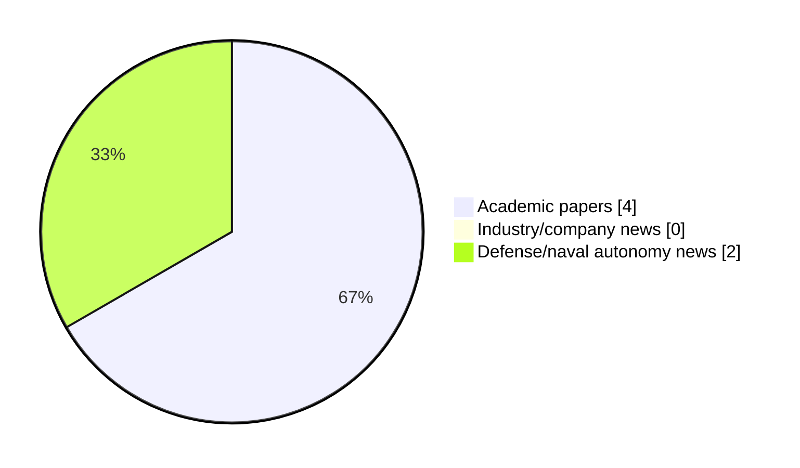

# Maritime Autonomy Watch — 2026-09-24

## Executive Summary

- Total selected items: 6
- Academic papers: 4
- Industry/company news: 0
- Defense/naval autonomy news: 2
- Failed/inaccessible sources: 1

## Contents

- [Analyst Brief](#analyst-brief)
- [Must Read](#must-read)
- [Top Signals Today](#top-signals-today)
- [Topic Signals](#topic-signals)
- [Freshness and Coverage](#freshness-and-coverage)
- [Quality Notes](#quality-notes)
- [Watchlist](#watchlist)
- [Academic Papers](#academic-papers)
- [Industry and Company News](#industry-and-company-news)
- [Defense and Naval Autonomy News](#defense-and-naval-autonomy-news)
- [Source Status Summary](#source-status-summary)

## Analyst Brief

Today's report selected 6 non-duplicate item(s), led by critical infrastructure, USV operations, perception. The strongest item is [LOTUSim-Energy: A Maritime Simulator for Human-Drone Interaction in Autonomous Offshore Operation \& Maintenance](https://doi.org/10.48550/arxiv.2609.17124) from OpenAlex.
Coverage is weighted toward academic research (4), with 0 industry and 2 defense signal(s).
Quality caveat: low-score-unique=3, missing-summary=1, date-anomaly=1.

## Must Read

- [LOTUSim-Energy: A Maritime Simulator for Human-Drone Interaction in Autonomous Offshore Operation \& Maintenance](https://doi.org/10.48550/arxiv.2609.17124) — Research signal: AUV navigation
- [Ocean-aware deep learning for civilian maritime object detection and tracking in complex ocean environments: a comprehensive review](https://doi.org/10.3389/fmars.2026.1929278) — Research signal: USV operations
- [HII boosts Massachusetts UUV site by 25% amid rising navy tech demand](https://www.naval-technology.com/news/hii-unmanned-facility-massachusetts/) — Defense signal: defense adoption
- [Belgium’s second rMCM ship ‘Tournai’ Arrives in Zeebrugge](https://www.navalnews.com/naval-news/2026/09/belgiums-second-rmcm-ship-tournai-arrives-in-zeebrugge/) — Defense signal: critical infrastructure
- [A review of underwater robot technologies for inland waterway inspection and maintenance: the pinglu canal scenario](https://doi.org/10.1007/s44443-026-01136-0) — Research signal: perception

## Top Signals Today

- critical infrastructure: 4 selected item(s).
- USV operations: 2 selected item(s).
- perception: 2 selected item(s).
- AUV navigation: 1 selected item(s).
- planning/control: 1 selected item(s).

## Topic Signals

- critical infrastructure: 4
- USV operations: 2
- perception: 2
- AUV navigation: 1
- planning/control: 1
- swarm autonomy: 1
- defense adoption: 1
- general autonomy: 1

## Freshness and Coverage

- Newest selected item date: 2027-02-01
- Oldest selected item date: 2026-08-21
- Active/enabled sources: 4
- Sources with access problems: 3
- Quality flags: 5

## Quality Notes

- low-score-unique: 3
- missing-summary: 1
- date-anomaly: 1
- Date anomalies: [Preliminary conceptual design of a micro supercritical CO2-cooled pressure-tube reactor for unmanned underwater vehicles](https://api.elsevier.com/content/abstract/scopus_id/105050631962) reports 2027-02-01

## Watchlist

- [Belgium’s second rMCM ship ‘Tournai’ Arrives in Zeebrugge](https://www.navalnews.com/naval-news/2026/09/belgiums-second-rmcm-ship-tournai-arrives-in-zeebrugge/) — low-score-unique
- [A review of underwater robot technologies for inland waterway inspection and maintenance: the pinglu canal scenario](https://doi.org/10.1007/s44443-026-01136-0) — low-score-unique
- [Preliminary conceptual design of a micro supercritical CO2-cooled pressure-tube reactor for unmanned underwater vehicles](https://api.elsevier.com/content/abstract/scopus_id/105050631962) — missing-summary, date-anomaly, low-score-unique

### Category Snapshot

| Category | Selected items |
|---|---:|
| Academic papers | 4 |
| Industry/company news | 0 |
| Defense/naval autonomy news | 2 |

## Academic Papers

_Selected items: 4_

### [LOTUSim-Energy: A Maritime Simulator for Human-Drone Interaction in Autonomous Offshore Operation \& Maintenance](https://doi.org/10.48550/arxiv.2609.17124)

- Source: OpenAlex
- Date: 2026-09-15
- Relevance score: 10
- Authors: Juliette Grosset, Marie Dubromel, Helene Lechene, Quentin Arzel, Cédric Buche
- DOI: 10.48550/arxiv.2609.17124
- Signal: Research signal: AUV navigation
- Topic tags: AUV navigation, USV operations, planning/control, critical infrastructure

**Abstract**

Offshore maintenance requires operations in the air, the surface, and the subsea domain and include human supervision. This paper presents LOTUSim-Energy, a real-time maritime simulator designed for multi-domain human--drone interaction for offshore operation and maintenance. The plat- form unifies heterogeneous unmanned vehicles (Unmanned Aerial Vehicles: UAVs, Unmanned Surface Vehicles: USVs, Autonomous Underwater Vehicles: AUVs, Remotely Operated Vehicles: ROVs) within a distributed architecture coupling environment forcing (wind, waves, currents) and provides immersive user interfaces for supervision (desktop and virtual reality). A structured offshore task library enables repeatable evaluation of autonomy stacks under realistic metocean disturbances. The simulator supports realistic physics, energy-aware battery modeling, and fault-detection pipelines as modular validation tools.

**Why it matters**

Relevant to underwater autonomy, surface-vessel operations, planning and control; the work may inform maritime autonomy research, testing priorities, or system design.

---

### [Ocean-aware deep learning for civilian maritime object detection and tracking in complex ocean environments: a comprehensive review](https://doi.org/10.3389/fmars.2026.1929278)

- Source: OpenAlex
- Date: 2026-09-04
- Relevance score: 9.5
- Authors: Faisal Alsaaq
- DOI: 10.3389/fmars.2026.1929278
- Signal: Research signal: USV operations
- Topic tags: USV operations, swarm autonomy, perception, critical infrastructure

**Abstract**

Reliable maritime object detection and tracking are essential for civilian ocean engineering applications, including vessel traffic monitoring, offshore infrastructure inspection, port management, marine debris surveillance, sea ice observation, hydrographic surveying, and environmental risk assessment. However, complex ocean environments present substantial challenges for automated perception systems because of dynamic sea surfaces, sea clutter, low SNRs, atmospheric interference, scale variation, occlusion, weak target signatures, and limited annotated datasets.

**Why it matters**

Relevant to surface-vessel operations, multi-vehicle coordination, infrastructure monitoring; the work may inform maritime autonomy research, testing priorities, or system design.

---

### [A review of underwater robot technologies for inland waterway inspection and maintenance: the pinglu canal scenario](https://doi.org/10.1007/s44443-026-01136-0)

- Source: OpenAlex
- Date: 2026-08-21
- Relevance score: 3.5
- Authors: Peijun Shi, Chee‐Onn Chow, Wei Ru Wong
- DOI: 10.1007/s44443-026-01136-0
- Signal: Research signal: perception
- Topic tags: perception, critical infrastructure
- Quality flags: low-score-unique

**Abstract**

Underwater robotics has advanced fastest in its individual capabilities. Learned optical enhancement, sonar interpretation, and tightly coupled multimodal fusion each report steady gains on dedicated benchmarks, yet whether those gains translate into reliable operation under deployment constraints remains largely untested. We examine this question for confined inland waterways, where narrow geometry, persistent turbidity, dense engineered structures, and GNSS denial jointly decide what a robot can and cannot do. The Pinglu Canal in Guangxi, China, serves as the reference scenario, and the analysis is organized around a scenario-centric evaluation framework rather than an isolated capability survey.

**Why it matters**

Relevant to underwater autonomy, infrastructure monitoring; the work may inform maritime autonomy research, testing priorities, or system design.

---

### [Preliminary conceptual design of a micro supercritical CO2-cooled pressure-tube reactor for unmanned underwater vehicles](https://api.elsevier.com/content/abstract/scopus_id/105050631962)

- Source: Elsevier Scopus
- Date: 2027-02-01
- Relevance score: 3.5
- DOI: 10.1016/j.anucene.2026.112856
- Signal: Research signal: general autonomy
- Topic tags: general autonomy
- Quality flags: missing-summary, date-anomaly, low-score-unique

**Abstract**

No summary available.

**Why it matters**

Relevant to underwater autonomy; the work may inform maritime autonomy research, testing priorities, or system design.

---

## Industry and Company News

_Selected items: 0_

No selected items.

## Defense and Naval Autonomy News

_Selected items: 2_

### [HII boosts Massachusetts UUV site by 25% amid rising navy tech demand](https://www.naval-technology.com/news/hii-unmanned-facility-massachusetts/)

- Source: naval-technology.com
- Date: 2026-09-23
- Relevance score: 5
- Signal: Defense signal: defense adoption
- Topic tags: defense adoption

**Summary**

HII has expanded its uncrewed systems production facility in Pocasset, Massachusetts, by 25%, responding to heightened global requirements for autonomous maritime technology.

**Why it matters**

Signals movement in naval adoption; useful for tracking operational concepts, procurement direction, and fleet integration.

---

### [Belgium’s second rMCM ship ‘Tournai’ Arrives in Zeebrugge](https://www.navalnews.com/naval-news/2026/09/belgiums-second-rmcm-ship-tournai-arrives-in-zeebrugge/)

- Source: navalnews.com
- Date: 2026-09-23
- Relevance score: 3.5
- Signal: Defense signal: critical infrastructure
- Topic tags: critical infrastructure
- Quality flags: low-score-unique

**Summary**

Tournai (M941), the second Belgian vessel and third in the Belgian-Dutch Mine Countermeasures replacement program (rMCM), arrived in Zeebrugge on September 22. Thanks to its advanced unmanned systems, Tournai will contribute to the protection of maritime supply routes and infrastructure. Belgian MoD press release Following the delivery of the M940 Oostende in November 2025, the Tournai represents.

**Why it matters**

This item may signal operational adoption, procurement priorities, or naval autonomy doctrine shifts.

---

## Inaccessible or Failed Sources

- arXiv: HTTP 406 for https://export.arxiv.org/api/query?search_query=all%3A%22maritime+autonomy%22+OR+all%3A%22marine+robotics%22+OR+all%3A%22autonomous+vessel%22+OR+all%3A%22autonomous+mission%22+OR+all%3A%22autonomous+surface+vessel%22+OR+all%3A%22autonomous+underwater+vehicle%22+OR+all%3A%22unmanned+surface+vehicle%22+OR+all%3A%22unmanned+underwater+vehicle%22&start=0&max_results=15&sortBy=submittedDate&sortOrder=descending

## Source Status Summary

| Source | Status | Notes |
|---|---|---|
| arXiv | failed | HTTP 406 for https://export.arxiv.org/api/query?search_query=all%3A%22maritime+autonomy%22+OR+all%3A%22marine+robotics%22+OR+all%3A%22autonomous+vessel%22+OR+all%3A%22autonomous+mission%22+OR+all%3A%22autonomous+surface+vessel%22+OR+all%3A%22autonomous+underwater+vehicle%22+OR+all%3A%22unmanned+surface+vehicle%22+OR+all%3A%22unmanned+underwater+vehicle%22&start=0&max_results=15&sortBy=submittedDate&sortOrder=descending |
| OpenAlex | enabled | API source, 15 items fetched |
| RSS feeds | enabled | 107 RSS items fetched |
| SMI MASG News | enabled | HTML source, 10 items fetched |
| IEEE Xplore | disabled | Missing IEEE_XPLORE_API_KEY |
| Elsevier Scopus | enabled | API source, 15 items fetched |
| NewsAPI | disabled | Missing NEWS_API_KEY |

## Metadata

- Generated at: 2026-09-24T13:03:53.362592+02:00
- Date: 2026-09-24
- Repository: ferhannb/MarineRobotics
- Relevance threshold: 4.0
- Deduplication method: DOI, canonical URL, source ID, normalized title, similar recent titles, category caps, and novelty score
