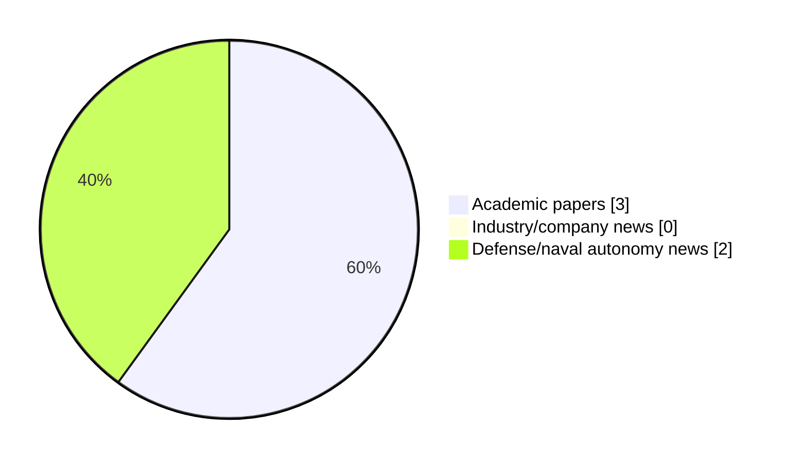

# Maritime Autonomy Watch — 2026-09-25

## Executive Summary

- Total selected items: 5
- Academic papers: 3
- Industry/company news: 0
- Defense/naval autonomy news: 2
- Failed/inaccessible sources: 1

## Contents

- [Analyst Brief](#analyst-brief)
- [Must Read](#must-read)
- [Top Signals Today](#top-signals-today)
- [Topic Signals](#topic-signals)
- [Freshness and Coverage](#freshness-and-coverage)
- [Quality Notes](#quality-notes)
- [Watchlist](#watchlist)
- [Academic Papers](#academic-papers)
- [Industry and Company News](#industry-and-company-news)
- [Defense and Naval Autonomy News](#defense-and-naval-autonomy-news)
- [Source Status Summary](#source-status-summary)

## Analyst Brief

Today's report selected 5 non-duplicate item(s), led by USV operations, defense adoption, AUV navigation. The strongest item is [Red Cat Holdings Marks Blue Ops Day with USV Manufacturing Milestone in Georgia](https://oceannews.com/news/milestones/red-cat-holdings-marks-blue-ops-day-with-usv-manufacturing-milestone-in-georgia/) from oceannews.com.
Coverage is weighted toward academic research (3), with 0 industry and 2 defense signal(s).
Quality caveat: missing-summary=2, date-anomaly=2, low-score-unique=1.

## Must Read

- [Red Cat Holdings Marks Blue Ops Day with USV Manufacturing Milestone in Georgia](https://oceannews.com/news/milestones/red-cat-holdings-marks-blue-ops-day-with-usv-manufacturing-milestone-in-georgia/) — Defense signal: USV operations
- [An Information‐Driven Multilevel Path Planning Framework for Unmanned Surface Vehicles in Environmental Monitoring of Uninhabited Islands and Reefs](https://doi.org/10.1002/rob.70322) — Research signal: USV operations
- [NTNU Acquires KONGSBERG HUGIN 6000 AUV for Ocean Research](https://oceannews.com/news/science-technology/ntnu-acquires-kongsberg-hugin-6000-auv-for-ocean-research/) — Defense signal: AUV navigation

## Top Signals Today

- USV operations: 3 selected item(s).
- defense adoption: 2 selected item(s).
- AUV navigation: 2 selected item(s).
- swarm autonomy: 2 selected item(s).
- planning/control: 2 selected item(s).

## Topic Signals

- USV operations: 3
- defense adoption: 2
- AUV navigation: 2
- swarm autonomy: 2
- planning/control: 2

## Freshness and Coverage

- Newest selected item date: 2027-03-01
- Oldest selected item date: 2026-09-07
- Active/enabled sources: 3
- Sources with access problems: 4
- Quality flags: 5

## Quality Notes

- missing-summary: 2
- date-anomaly: 2
- low-score-unique: 1
- Date anomalies: [Adaptive Risk-Aware Implicit Quantile Network: Towards Safe and Energy-Efficient USV Navigation in Dynamic Environments](https://api.elsevier.com/content/abstract/scopus_id/105046501877) reports 2027-01-01; [Formation control of AUVs for enabling safe and efficient marine operations](https://api.elsevier.com/content/abstract/scopus_id/105046585164) reports 2027-03-01

## Watchlist

- [NTNU Acquires KONGSBERG HUGIN 6000 AUV for Ocean Research](https://oceannews.com/news/science-technology/ntnu-acquires-kongsberg-hugin-6000-auv-for-ocean-research/) — low-score-unique
- [Adaptive Risk-Aware Implicit Quantile Network: Towards Safe and Energy-Efficient USV Navigation in Dynamic Environments](https://api.elsevier.com/content/abstract/scopus_id/105046501877) — missing-summary, date-anomaly
- [Formation control of AUVs for enabling safe and efficient marine operations](https://api.elsevier.com/content/abstract/scopus_id/105046585164) — missing-summary, date-anomaly

### Category Snapshot

| Category | Selected items |
|---|---:|
| Academic papers | 3 |
| Industry/company news | 0 |
| Defense/naval autonomy news | 2 |

## Academic Papers

_Selected items: 3_

### [An Information‐Driven Multilevel Path Planning Framework for Unmanned Surface Vehicles in Environmental Monitoring of Uninhabited Islands and Reefs](https://doi.org/10.1002/rob.70322)

- Source: OpenAlex
- Date: 2026-09-07
- Relevance score: 4.25
- Authors: Lin Zhou, Zhuo Wang, Nan Zhou, Zhongchao Deng, Hongde Qin, Yifan Xue
- DOI: 10.1002/rob.70322
- Signal: Research signal: USV operations
- Topic tags: USV operations, swarm autonomy, planning/control

**Abstract**

ABSTRACT With the expansion of marine resource development, the ecological health of Uninhabited Islands and Reefs urgently requires prolonged and precise monitoring. Nevertheless, the extensive spatial scale, complex topography, and dynamic temporal variations caused by tidal processes in reef regions make it challenging for traditional methods based on predefined trajectories to balance observation efficiency and accuracy. Therefore, an Information‐Driven Multilevel Path Planning Framework is proposed to achieve dual mission requirements of topographic mapping and ecological data sampling. At the global level, the Boundary Adaptive Coverage based on Grid Completeness algorithm is proposed to enhance coarse mapping coverage in irregular island and reef areas.

**Why it matters**

Relevant to surface-vessel operations, multi-vehicle coordination, planning and control; the work may inform maritime autonomy research, testing priorities, or system design.

---

### [Adaptive Risk-Aware Implicit Quantile Network: Towards Safe and Energy-Efficient USV Navigation in Dynamic Environments](https://api.elsevier.com/content/abstract/scopus_id/105046501877)

- Source: Elsevier Scopus
- Date: 2027-01-01
- Relevance score: 4.5
- DOI: 10.1007/978-981-92-3381-6_34
- Signal: Research signal: USV operations
- Topic tags: USV operations
- Quality flags: missing-summary, date-anomaly

**Abstract**

No summary available.

**Why it matters**

Relevant to surface-vessel operations; the work may inform maritime autonomy research, testing priorities, or system design.

---

### [Formation control of AUVs for enabling safe and efficient marine operations](https://api.elsevier.com/content/abstract/scopus_id/105046585164)

- Source: Elsevier Scopus
- Date: 2027-03-01
- Relevance score: 4.25
- DOI: 10.1016/j.apm.2026.117232
- Signal: Research signal: AUV navigation
- Topic tags: AUV navigation, swarm autonomy, planning/control
- Quality flags: missing-summary, date-anomaly

**Abstract**

No summary available.

**Why it matters**

Relevant to underwater autonomy, multi-vehicle coordination; the work may inform maritime autonomy research, testing priorities, or system design.

---

## Industry and Company News

_Selected items: 0_

No selected items.

## Defense and Naval Autonomy News

_Selected items: 2_

### [Red Cat Holdings Marks Blue Ops Day with USV Manufacturing Milestone in Georgia](https://oceannews.com/news/milestones/red-cat-holdings-marks-blue-ops-day-with-usv-manufacturing-milestone-in-georgia/)

- Source: oceannews.com
- Date: 2026-09-24
- Relevance score: 6
- Signal: Defense signal: USV operations
- Topic tags: USV operations, defense adoption

**Summary**

Red Cat Holdings, Inc. (Red Cat), a US-based provider of advanced all-domain drone and robotic solutions for defense and national security, announced that its Blue Ops maritime division marked the inaugural Blue Ops Day on September 21 with a celebration at the company's manufacturing facility in Valdosta, Georgia.

**Why it matters**

Signals movement in surface-vessel operations, naval adoption; useful for tracking operational concepts, procurement direction, and fleet integration.

---

### [NTNU Acquires KONGSBERG HUGIN 6000 AUV for Ocean Research](https://oceannews.com/news/science-technology/ntnu-acquires-kongsberg-hugin-6000-auv-for-ocean-research/)

- Source: oceannews.com
- Date: 2026-09-24
- Relevance score: 3.5
- Signal: Defense signal: AUV navigation
- Topic tags: AUV navigation, defense adoption
- Quality flags: low-score-unique

**Summary**

The largest university in Norway announced their largest purchase in the Norwegian Ocean Technology Centre - Fjordlab, a HUGIN 6000 by the presence of the Norwegian Minister of Defense, Tore O. Sandvik.

**Why it matters**

Signals movement in underwater autonomy, naval adoption; useful for tracking operational concepts, procurement direction, and fleet integration.

---

## Inaccessible or Failed Sources

- arXiv: HTTP 406 for https://export.arxiv.org/api/query?search_query=all%3A%22maritime+autonomy%22+OR+all%3A%22marine+robotics%22+OR+all%3A%22autonomous+vessel%22+OR+all%3A%22autonomous+mission%22+OR+all%3A%22autonomous+surface+vessel%22+OR+all%3A%22autonomous+underwater+vehicle%22+OR+all%3A%22unmanned+surface+vehicle%22+OR+all%3A%22unmanned+underwater+vehicle%22&start=0&max_results=15&sortBy=submittedDate&sortOrder=descending

## Source Status Summary

| Source | Status | Notes |
|---|---|---|
| arXiv | failed | HTTP 406 for https://export.arxiv.org/api/query?search_query=all%3A%22maritime+autonomy%22+OR+all%3A%22marine+robotics%22+OR+all%3A%22autonomous+vessel%22+OR+all%3A%22autonomous+mission%22+OR+all%3A%22autonomous+surface+vessel%22+OR+all%3A%22autonomous+underwater+vehicle%22+OR+all%3A%22unmanned+surface+vehicle%22+OR+all%3A%22unmanned+underwater+vehicle%22&start=0&max_results=15&sortBy=submittedDate&sortOrder=descending |
| OpenAlex | enabled | API source, 15 items fetched |
| RSS feeds | partial | 97 RSS items fetched; failures: https://www.navalnews.com/feed/: HTTP 503 for https://www.navalnews.com/feed/ |
| SMI MASG News | enabled | HTML source, 10 items fetched |
| IEEE Xplore | disabled | Missing IEEE_XPLORE_API_KEY |
| Elsevier Scopus | enabled | API source, 15 items fetched |
| NewsAPI | disabled | Missing NEWS_API_KEY |

## Metadata

- Generated at: 2026-09-25T13:04:06.357692+02:00
- Date: 2026-09-25
- Repository: ferhannb/MarineRobotics
- Relevance threshold: 4.0
- Deduplication method: DOI, canonical URL, source ID, normalized title, similar recent titles, category caps, and novelty score
