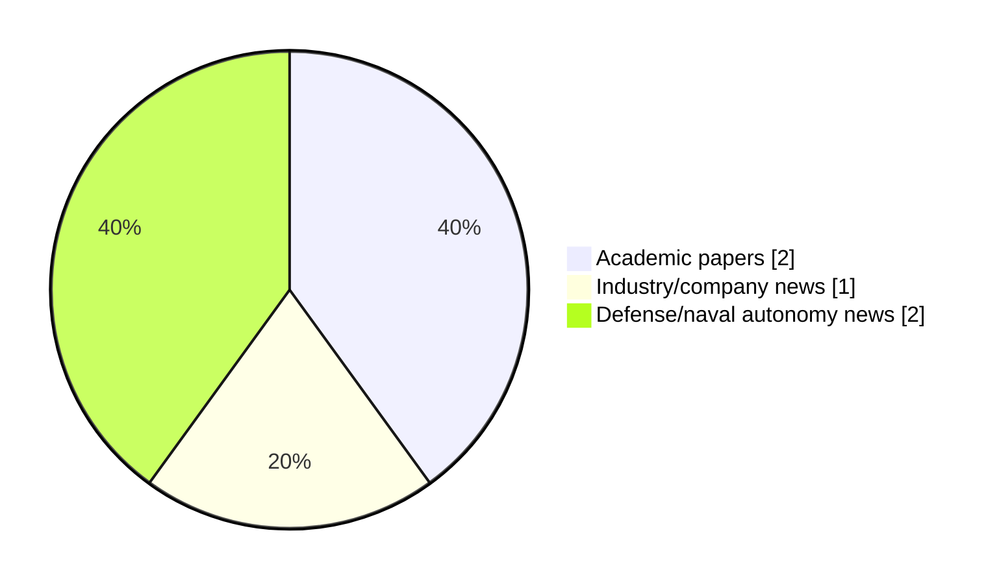

# Maritime Autonomy Watch — 2026-09-26

## Executive Summary

- Total selected items: 5
- Academic papers: 2
- Industry/company news: 1
- Defense/naval autonomy news: 2
- Failed/inaccessible sources: 1

## Contents

- [Analyst Brief](#analyst-brief)
- [Must Read](#must-read)
- [Top Signals Today](#top-signals-today)
- [Topic Signals](#topic-signals)
- [Freshness and Coverage](#freshness-and-coverage)
- [Quality Notes](#quality-notes)
- [Watchlist](#watchlist)
- [Academic Papers](#academic-papers)
- [Industry and Company News](#industry-and-company-news)
- [Defense and Naval Autonomy News](#defense-and-naval-autonomy-news)
- [Source Status Summary](#source-status-summary)

## Analyst Brief

Today's report selected 5 non-duplicate item(s), led by defense adoption, general autonomy, USV operations. The strongest item is [U.S. Navy Establishes RASWDC To Accelerate Unmanned Systems Integration](https://www.navalnews.com/naval-news/2026/09/u-s-navy-establishes-raswdc-to-accelerate-unmanned-systems-integration/) from navalnews.com.
Coverage is weighted toward academic research (2), with 1 industry and 2 defense signal(s).
Quality caveat: low-score-unique=2, missing-summary=2, date-anomaly=2.

## Must Read

- [U.S. Navy Establishes RASWDC To Accelerate Unmanned Systems Integration](https://www.navalnews.com/naval-news/2026/09/u-s-navy-establishes-raswdc-to-accelerate-unmanned-systems-integration/) — Defense signal: defense adoption
- [SMI Recruiting Director of MASG, MSTG and SMIFutures](https://www.maritimeindustries.org/news/smi-recruiting-director-masg-mstg-and-smifutures) — Industry signal: general autonomy
- [US Navy stands up hub to prepare unmanned systems for combat](https://www.defensenews.com/industry/techwatch/2026/09/25/us-navy-stands-up-hub-to-prepare-unmanned-systems-for-combat/) — Defense signal: defense adoption

## Top Signals Today

- defense adoption: 2 selected item(s).
- general autonomy: 1 selected item(s).
- USV operations: 1 selected item(s).
- swarm autonomy: 1 selected item(s).
- planning/control: 1 selected item(s).

## Topic Signals

- defense adoption: 2
- general autonomy: 1
- USV operations: 1
- swarm autonomy: 1
- planning/control: 1
- AUV navigation: 1

## Freshness and Coverage

- Newest selected item date: 2027-03-01
- Oldest selected item date: 2026-08-26
- Active/enabled sources: 4
- Sources with access problems: 3
- Quality flags: 6

## Quality Notes

- low-score-unique: 2
- missing-summary: 2
- date-anomaly: 2
- Date anomalies: [Reinforcement Learning Based Adaptive Tracking Control for Cooperative Formation of Multiple USVs](https://api.elsevier.com/content/abstract/scopus_id/105050728225) reports 2027-01-01; [Fusion-driven geometry-constrained latent flow learning for robust AUV motion anticipation from heterogeneous 3D observations](https://api.elsevier.com/content/abstract/scopus_id/105051060825) reports 2027-03-01

## Watchlist

- [US Navy stands up hub to prepare unmanned systems for combat](https://www.defensenews.com/industry/techwatch/2026/09/25/us-navy-stands-up-hub-to-prepare-unmanned-systems-for-combat/) — low-score-unique
- [Reinforcement Learning Based Adaptive Tracking Control for Cooperative Formation of Multiple USVs](https://api.elsevier.com/content/abstract/scopus_id/105050728225) — missing-summary, date-anomaly
- [Fusion-driven geometry-constrained latent flow learning for robust AUV motion anticipation from heterogeneous 3D observations](https://api.elsevier.com/content/abstract/scopus_id/105051060825) — missing-summary, date-anomaly, low-score-unique

### Category Snapshot

| Category | Selected items |
|---|---:|
| Academic papers | 2 |
| Industry/company news | 1 |
| Defense/naval autonomy news | 2 |

## Academic Papers

_Selected items: 2_

### [Reinforcement Learning Based Adaptive Tracking Control for Cooperative Formation of Multiple USVs](https://api.elsevier.com/content/abstract/scopus_id/105050728225)

- Source: Elsevier Scopus
- Date: 2027-01-01
- Relevance score: 4.5
- DOI: 10.1007/978-981-92-4392-1_60
- Signal: Research signal: USV operations
- Topic tags: USV operations, swarm autonomy, planning/control
- Quality flags: missing-summary, date-anomaly

**Abstract**

No summary available.

**Why it matters**

Relevant to surface-vessel operations, multi-vehicle coordination; the work may inform maritime autonomy research, testing priorities, or system design.

---

### [Fusion-driven geometry-constrained latent flow learning for robust AUV motion anticipation from heterogeneous 3D observations](https://api.elsevier.com/content/abstract/scopus_id/105051060825)

- Source: Elsevier Scopus
- Date: 2027-03-01
- Relevance score: 3.5
- DOI: 10.1016/j.inffus.2026.104764
- Signal: Research signal: AUV navigation
- Topic tags: AUV navigation
- Quality flags: missing-summary, date-anomaly, low-score-unique

**Abstract**

No summary available.

**Why it matters**

Relevant to underwater autonomy; the work may inform maritime autonomy research, testing priorities, or system design.

---

## Industry and Company News

_Selected items: 1_

### [SMI Recruiting Director of MASG, MSTG and SMIFutures](https://www.maritimeindustries.org/news/smi-recruiting-director-masg-mstg-and-smifutures)

- Source: maritimeindustries.org
- Date: 2026-08-26
- Relevance score: 4.25
- Signal: Industry signal: general autonomy
- Topic tags: general autonomy

**Summary**

SMI is recruiting for a director to lead our maritime autonomy, marine science and technology and SMIFutures working group activity. Applications will close on 9th September 2026.

**Why it matters**

This item may signal product, market, or deployment momentum in maritime autonomy.

---

## Defense and Naval Autonomy News

_Selected items: 2_

### [U.S. Navy Establishes RASWDC To Accelerate Unmanned Systems Integration](https://www.navalnews.com/naval-news/2026/09/u-s-navy-establishes-raswdc-to-accelerate-unmanned-systems-integration/)

- Source: navalnews.com
- Date: 2026-09-25
- Relevance score: 5
- Signal: Defense signal: defense adoption
- Topic tags: defense adoption

**Summary**

The Secretary of the U.S. Navy and the Chief of Naval Operations (CNO) officially established the Robotic and Autonomous Systems Warfighting Development Center (RASWDC), marking a critical milestone in accelerating the development, operational integration, and employment of robotic and autonomous systems (RAS) across the maritime domain. U.S. Navy press release Headquartered at Joint Expeditionary Base.

**Why it matters**

Signals movement in naval adoption; useful for tracking operational concepts, procurement direction, and fleet integration.

---

### [US Navy stands up hub to prepare unmanned systems for combat](https://www.defensenews.com/industry/techwatch/2026/09/25/us-navy-stands-up-hub-to-prepare-unmanned-systems-for-combat/)

- Source: defensenews.com
- Date: 2026-09-25
- Relevance score: 3.5
- Signal: Defense signal: defense adoption
- Topic tags: defense adoption
- Quality flags: low-score-unique

**Summary**

U.S. Chief of Naval Operations Adm. Daryl Caudle announced a new autonomous development center to train sailors and test new technology.

**Why it matters**

Signals movement in naval adoption; useful for tracking operational concepts, procurement direction, and fleet integration.

---

## Inaccessible or Failed Sources

- arXiv: HTTP 406 for https://export.arxiv.org/api/query?search_query=all%3A%22maritime+autonomy%22+OR+all%3A%22marine+robotics%22+OR+all%3A%22autonomous+vessel%22+OR+all%3A%22autonomous+mission%22+OR+all%3A%22autonomous+surface+vessel%22+OR+all%3A%22autonomous+underwater+vehicle%22+OR+all%3A%22unmanned+surface+vehicle%22+OR+all%3A%22unmanned+underwater+vehicle%22&start=0&max_results=15&sortBy=submittedDate&sortOrder=descending

## Source Status Summary

| Source | Status | Notes |
|---|---|---|
| arXiv | failed | HTTP 406 for https://export.arxiv.org/api/query?search_query=all%3A%22maritime+autonomy%22+OR+all%3A%22marine+robotics%22+OR+all%3A%22autonomous+vessel%22+OR+all%3A%22autonomous+mission%22+OR+all%3A%22autonomous+surface+vessel%22+OR+all%3A%22autonomous+underwater+vehicle%22+OR+all%3A%22unmanned+surface+vehicle%22+OR+all%3A%22unmanned+underwater+vehicle%22&start=0&max_results=15&sortBy=submittedDate&sortOrder=descending |
| OpenAlex | enabled | API source, 15 items fetched |
| RSS feeds | enabled | 107 RSS items fetched |
| SMI MASG News | enabled | HTML source, 10 items fetched |
| IEEE Xplore | disabled | Missing IEEE_XPLORE_API_KEY |
| Elsevier Scopus | enabled | API source, 15 items fetched |
| NewsAPI | disabled | Missing NEWS_API_KEY |

## Metadata

- Generated at: 2026-09-26T12:45:35.477098+02:00
- Date: 2026-09-26
- Repository: ferhannb/MarineRobotics
- Relevance threshold: 4.0
- Deduplication method: DOI, canonical URL, source ID, normalized title, similar recent titles, category caps, and novelty score
