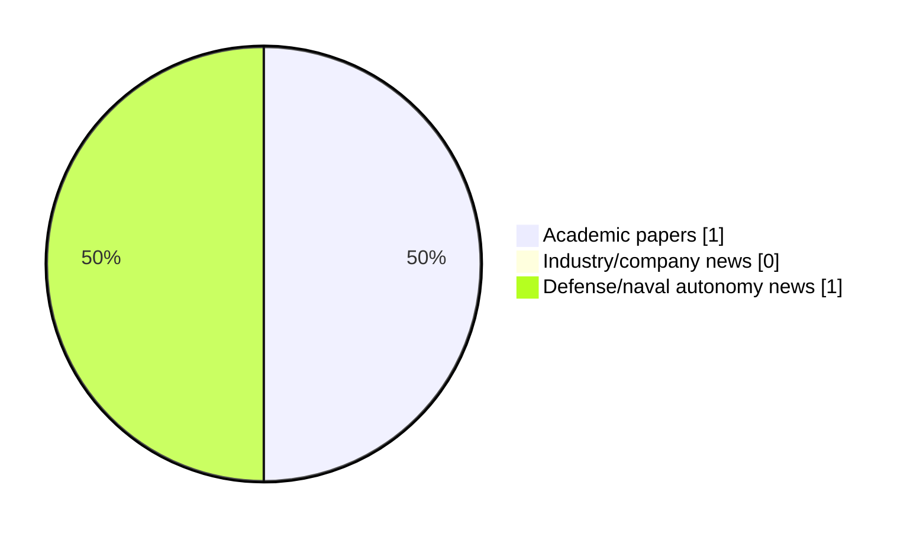

# Maritime Autonomy Watch — 2026-09-27

## Executive Summary

- Total selected items: 2
- Academic papers: 1
- Industry/company news: 0
- Defense/naval autonomy news: 1
- Failed/inaccessible sources: 2

## Contents

- [Analyst Brief](#analyst-brief)
- [Must Read](#must-read)
- [Top Signals Today](#top-signals-today)
- [Topic Signals](#topic-signals)
- [Freshness and Coverage](#freshness-and-coverage)
- [Quality Notes](#quality-notes)
- [Watchlist](#watchlist)
- [Academic Papers](#academic-papers)
- [Industry and Company News](#industry-and-company-news)
- [Defense and Naval Autonomy News](#defense-and-naval-autonomy-news)
- [Source Status Summary](#source-status-summary)

## Analyst Brief

Today's report selected 2 non-duplicate item(s), led by USV operations, swarm autonomy, perception. The strongest item is [US refutes claims that Iran captured Saildrone USV](https://www.defensenews.com/industry/techwatch/2026/09/11/us-refutes-claims-that-iran-captured-saildrone-usv/) from defensenews.com.
Coverage is weighted toward academic research (1), with 0 industry and 1 defense signal(s).
Quality caveat: missing-summary=1, date-anomaly=1, low-score-unique=1.

## Must Read

- [US refutes claims that Iran captured Saildrone USV](https://www.defensenews.com/industry/techwatch/2026/09/11/us-refutes-claims-that-iran-captured-saildrone-usv/) — Defense signal: USV operations

## Top Signals Today

- USV operations: 1 selected item(s).
- swarm autonomy: 1 selected item(s).
- perception: 1 selected item(s).

## Topic Signals

- USV operations: 1
- swarm autonomy: 1
- perception: 1

## Freshness and Coverage

- Newest selected item date: 2027-02-01
- Oldest selected item date: 2026-09-11
- Active/enabled sources: 2
- Sources with access problems: 5
- Quality flags: 3

## Quality Notes

- missing-summary: 1
- date-anomaly: 1
- low-score-unique: 1
- Date anomalies: [Edge-enhanced graph attention-based multi-agent reinforcement learning for multi-UUV cooperative area protection under communication and sensing constraints](https://api.elsevier.com/content/abstract/scopus_id/105051196107) reports 2027-02-01

## Watchlist

- [Edge-enhanced graph attention-based multi-agent reinforcement learning for multi-UUV cooperative area protection under communication and sensing constraints](https://api.elsevier.com/content/abstract/scopus_id/105051196107) — missing-summary, date-anomaly, low-score-unique

### Category Snapshot

| Category | Selected items |
|---|---:|
| Academic papers | 1 |
| Industry/company news | 0 |
| Defense/naval autonomy news | 1 |

## Academic Papers

_Selected items: 1_

### [Edge-enhanced graph attention-based multi-agent reinforcement learning for multi-UUV cooperative area protection under communication and sensing constraints](https://api.elsevier.com/content/abstract/scopus_id/105051196107)

- Source: Elsevier Scopus
- Date: 2027-02-01
- Relevance score: 3.5
- DOI: 10.1016/j.eswa.2026.134415
- Signal: Research signal: swarm autonomy
- Topic tags: swarm autonomy, perception
- Quality flags: missing-summary, date-anomaly, low-score-unique

**Abstract**

No summary available.

**Why it matters**

This paper may influence autonomy, perception, planning, or control work for maritime robotic systems.

---

## Industry and Company News

_Selected items: 0_

No selected items.

## Defense and Naval Autonomy News

_Selected items: 1_

### [US refutes claims that Iran captured Saildrone USV](https://www.defensenews.com/industry/techwatch/2026/09/11/us-refutes-claims-that-iran-captured-saildrone-usv/)

- Source: defensenews.com
- Date: 2026-09-11
- Relevance score: 5.25
- Signal: Defense signal: USV operations
- Topic tags: USV operations

**Summary**

A U.S. official denied the video shared by Iran purported to show an American Saildrone USV near the Strait of Hormuz in flames.

**Why it matters**

Signals movement in surface-vessel operations; useful for tracking operational concepts, procurement direction, and fleet integration.

---

## Inaccessible or Failed Sources

- arXiv: HTTP 406 for https://export.arxiv.org/api/query?search_query=all%3A%22maritime+autonomy%22+OR+all%3A%22marine+robotics%22+OR+all%3A%22autonomous+vessel%22+OR+all%3A%22autonomous+mission%22+OR+all%3A%22autonomous+surface+vessel%22+OR+all%3A%22autonomous+underwater+vehicle%22+OR+all%3A%22unmanned+surface+vehicle%22+OR+all%3A%22unmanned+underwater+vehicle%22&start=0&max_results=15&sortBy=submittedDate&sortOrder=descending
- OpenAlex: HTTP 429 for https://api.openalex.org/works?search=maritime+autonomy+marine+robotics+autonomous+vessel+autonomous+mission+autonomous+surface+vessel&per-page=15&sort=publication_date%3Adesc

## Source Status Summary

| Source | Status | Notes |
|---|---|---|
| arXiv | failed | HTTP 406 for https://export.arxiv.org/api/query?search_query=all%3A%22maritime+autonomy%22+OR+all%3A%22marine+robotics%22+OR+all%3A%22autonomous+vessel%22+OR+all%3A%22autonomous+mission%22+OR+all%3A%22autonomous+surface+vessel%22+OR+all%3A%22autonomous+underwater+vehicle%22+OR+all%3A%22unmanned+surface+vehicle%22+OR+all%3A%22unmanned+underwater+vehicle%22&start=0&max_results=15&sortBy=submittedDate&sortOrder=descending |
| OpenAlex | failed | HTTP 429 for https://api.openalex.org/works?search=maritime+autonomy+marine+robotics+autonomous+vessel+autonomous+mission+autonomous+surface+vessel&per-page=15&sort=publication_date%3Adesc |
| RSS feeds | partial | 97 RSS items fetched; failures: https://www.oceansciencetechnology.com/news/feed/: Invalid XML from https://www.oceansciencetechnology.com/news/feed/: XML or text declaration not at start of entity: line 2, column 0 |
| SMI MASG News | enabled | HTML source, 10 items fetched |
| IEEE Xplore | disabled | Missing IEEE_XPLORE_API_KEY |
| Elsevier Scopus | enabled | API source, 15 items fetched |
| NewsAPI | disabled | Missing NEWS_API_KEY |

## Metadata

- Generated at: 2026-09-27T13:20:25.083597+02:00
- Date: 2026-09-27
- Repository: ferhannb/MarineRobotics
- Relevance threshold: 4.0
- Deduplication method: DOI, canonical URL, source ID, normalized title, similar recent titles, category caps, and novelty score
