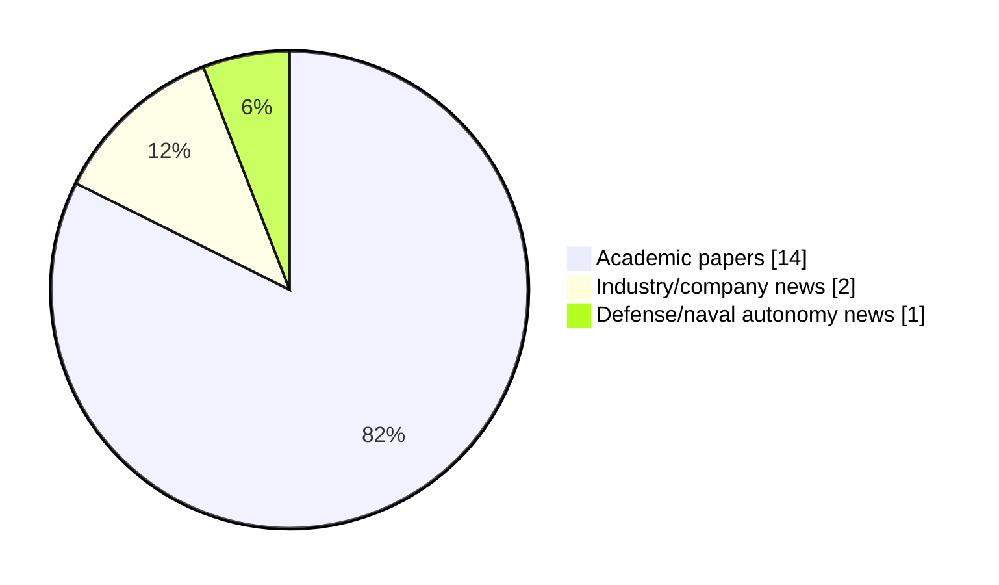

# Maritime Autonomy Watch — 2026-09-29

## Executive Summary

- Total selected items: 17
- Academic papers: 14
- Industry/company news: 2
- Defense/naval autonomy news: 1
- Failed/inaccessible sources: 1

## Contents

- [Analyst Brief](#analyst-brief)
- [Must Read](#must-read)
- [Top Signals Today](#top-signals-today)
- [Topic Signals](#topic-signals)
- [Freshness and Coverage](#freshness-and-coverage)
- [Quality Notes](#quality-notes)
- [Watchlist](#watchlist)
- [Academic Papers](#academic-papers)
- [Industry and Company News](#industry-and-company-news)
- [Defense and Naval Autonomy News](#defense-and-naval-autonomy-news)
- [Source Status Summary](#source-status-summary)

## Analyst Brief

Today's report selected 17 non-duplicate item(s), led by AUV navigation, planning/control, perception. The strongest item is [RiverVLN: Phase-Grounded Temporal Vision--Language Navigation for Unmanned Surface Vehicles](http://arxiv.org/abs/2609.23423v1) from arXiv.
Coverage is weighted toward academic research (14), with 2 industry and 1 defense signal(s).
Quality caveat: low-score-unique=2.

## Must Read

- [RiverVLN: Phase-Grounded Temporal Vision--Language Navigation for Unmanned Surface Vehicles](http://arxiv.org/abs/2609.23423v1) — Research signal: USV operations
- [Towards Effective Visual-Inertial SLAM with Passive-Only Sensors for Low-Cost Autonomous Underwater Vehicles](http://arxiv.org/abs/2609.21015v1) — Research signal: AUV navigation
- [Coastal Environment Generation with HoloOcean](http://arxiv.org/abs/2609.10484v1) — Research signal: USV operations
- [Saildrone Secures Danish Registration for European USV Operations](https://www.oceansciencetechnology.com/news/saildrone-secures-danish-registration-for-european-usv-operations/) — Industry signal: USV operations
- [Characterizing Wildlife Response to Biomimetic and Conventional Underwater Vehicles](http://arxiv.org/abs/2609.22594v1) — Research signal: AUV navigation

## Top Signals Today

- AUV navigation: 11 selected item(s).
- planning/control: 7 selected item(s).
- perception: 6 selected item(s).
- USV operations: 3 selected item(s).
- swarm autonomy: 3 selected item(s).

## Topic Signals

- AUV navigation: 11
- planning/control: 7
- perception: 6
- USV operations: 3
- swarm autonomy: 3
- underwater communications: 2
- critical infrastructure: 1
- defense adoption: 1

## Freshness and Coverage

- Newest selected item date: 2026-09-29
- Oldest selected item date: 2026-09-09
- Active/enabled sources: 3
- Sources with access problems: 4
- Quality flags: 2

## Quality Notes

- low-score-unique: 2

## Watchlist

- [Fly, Drive, Reconfigure: A Modular Reconfigurable Aerial-Ground Platform for Field Operations](http://arxiv.org/abs/2609.28887v1) — low-score-unique
- [GA-Agent: Large Language Models as Hyperparameter Optimizers for Evolutionary Controller Synthesis](http://arxiv.org/abs/2609.27725v1) — low-score-unique

### Category Snapshot

| Category | Selected items |
|---|---:|
| Academic papers | 14 |
| Industry/company news | 2 |
| Defense/naval autonomy news | 1 |

## Academic Papers

_Selected items: 14_

### [RiverVLN: Phase-Grounded Temporal Vision--Language Navigation for Unmanned Surface Vehicles](http://arxiv.org/abs/2609.23423v1)

- Source: arXiv
- Date: 2026-09-20
- Relevance score: 10
- Authors: Jieling Wu, Yuehao Huang, Jiajun Lv, Tao Huang, Yong Liu, Weiwei Liu
- Signal: Research signal: USV operations
- Topic tags: USV operations, perception, planning/control

**Abstract**

Vision-language navigation (VLN) has largely been developed for indoor and terrestrial robots, where language can often be treated as a static goal and motion is approximated by discrete or near-instantaneous actions. These assumptions break down for unmanned surface vehicles (USVs): river navigation requires continuous motion under inertia and limited maneuverability, while long-horizon instructions must be executed through sparse and visually ambiguous maritime landmarks. We introduce RiverVLN, to our knowledge the first benchmark designed for long-horizon USV VLN under continuous riverine motion, and PGT-NAV, a phase-grounded temporal navigation framework for USVs. Rather than directly mapping an entire instruction to motion, PGT-NAV converts it into an ordered sequence of visually verifiable semantic phases and maintains the active phase online through grounded visual and motion evidence.

**Why it matters**

Relevant to surface-vessel operations, planning and control; the work may inform maritime autonomy research, testing priorities, or system design.

---

### [Towards Effective Visual-Inertial SLAM with Passive-Only Sensors for Low-Cost Autonomous Underwater Vehicles](http://arxiv.org/abs/2609.21015v1)

- Source: arXiv
- Date: 2026-09-17
- Relevance score: 10
- Authors: Grant Schwidder, David Widhalm, Junaed Sattar
- Signal: Research signal: AUV navigation
- Topic tags: AUV navigation, perception

**Abstract**

Improvements to Visual-Inertial Simultaneous Localization and Mapping (VI-SLAM) for low-cost autonomous underwater vehicles (AUVs) are critical for transitioning advanced marine robotics from specialized labs to broader research and hobbyist applications. While high-end AUVs typically rely on expensive sensor suites - such as Doppler Velocity Logs (DVLs) and Ultra-Short Baseline (USBL) systems - this work demonstrates that robust, high-quality navigation is achievable using a sub-$10, 000(USD) platform equipped only with inexpensive consumer-grade sensors. By leveraging a similarly priced, open-source AUV, we evaluate the performance of stereo cameras, Micro-electromechanical System (MEMS)-based IMUs, and depth sensors in a fully unconstrained 6-degree-of-freedom (6-DOF) underwater environment.

**Why it matters**

Relevant to underwater autonomy; the work may inform maritime autonomy research, testing priorities, or system design.

---

### [Coastal Environment Generation with HoloOcean](http://arxiv.org/abs/2609.10484v1)

- Source: arXiv
- Date: 2026-09-09
- Relevance score: 10
- Authors: Abigail Austin, Brady Moon, Joshua G. Mangelson
- Signal: Research signal: USV operations
- Topic tags: USV operations, perception, critical infrastructure

**Abstract**

Marine robotic simulation provides a safe and inexpensive method of developing and testing algorithms for unmanned underwater vehicle (UUV) and unmanned surface vessel (USV) autonomy and perception before full field deployment. However, these simulations are often limited by the availability of simulated environments. Current marine robotics simulation suites offer manual ways to edit or create environments, but they require existing data or specialized knowledge of the environment system. To address these issues, we introduce a novel Unreal Engine 5 level generation pipeline that enables automatic creation of coastal environments for HoloOcean. Our pipeline relies on a user-provided overhead image of a coastal scene. The pipeline then uses the image to generate height map data, as well as automatically select assets and place them in the environment.

**Why it matters**

Relevant to underwater autonomy, surface-vessel operations; the work may inform maritime autonomy research, testing priorities, or system design.

---

### [Characterizing Wildlife Response to Biomimetic and Conventional Underwater Vehicles](http://arxiv.org/abs/2609.22594v1)

- Source: arXiv
- Date: 2026-09-18
- Relevance score: 9.25
- Authors: Huy Pham, Levi Cai, Yogesh Girdhar, Daniela Rus, Zach J. Patterson
- Signal: Research signal: AUV navigation
- Topic tags: AUV navigation

**Abstract**

Autonomous underwater vehicles (AUVs) are a promising alternative to divers for scalable collection of natural ocean ecology data. However, these robots may disturb local fauna and cause drastic behavioral differences compared to other monitoring techniques, decreasing their value as scientific tools. A promising prospect is to make AUVs that are more biomimetic, with the hope that taking on the form and behavior of a non-predatory animal may reduce adverse responses. We present the first dataset comparing fish disturbance in response to a conventional thruster-driven AUV, a sea turtle inspired flipper-driven AUV, and a diver. Experiments were conducted at a biodiversity hotspot in a Caribbean reef, and images of the scene were analyzed using computer vision to localize and study fish behavior change. Both AUVs cause measurable changes in fish behavior.

**Why it matters**

Relevant to underwater autonomy, infrastructure monitoring; the work may inform maritime autonomy research, testing priorities, or system design.

---

### [A Simulation Platform for AUV Fault Recovery: Exploring LLM-Based Diagnostic Strategies](http://arxiv.org/abs/2609.20620v1)

- Source: arXiv
- Date: 2026-09-17
- Relevance score: 9.25
- Authors: Khalid Halba, Kylie Cooper, James G. Bellingham
- Signal: Research signal: AUV navigation
- Topic tags: AUV navigation, planning/control

**Abstract**

Autonomous underwater vehicles (AUVs) operating beyond reliable communications must recover from failures without human intervention. We investigate an architecture in which conventional deterministic layered control autonomy manages normal operations, while an invokable large language model (LLM) serves as a diagnostic and recovery planner when onboard anomaly detection identifies performance outside expected limits. Because language models are stochastic, rigorous evaluation requires ensemble testing rather than individual demonstrations. We present a closed-loop simulation architecture that couples real-time C vehicle software with a higher-level orchestration layer for physics-based fault injection, structured prompting, language-model interaction, mission file generation, validation, execution, and LLM-judge scoring.

**Why it matters**

Relevant to underwater autonomy; the work may inform maritime autonomy research, testing priorities, or system design.

---

### [An Adaptive Fixed-Time Line-of-Sight Guidance Scheme for 3D Path Following of Underwater Vehicles: Theory and Experiment](http://arxiv.org/abs/2609.14756v1)

- Source: arXiv
- Date: 2026-09-13
- Relevance score: 9.25
- Authors: Hanzhi Yang, Jalil Chavez-Galaviz, Nina Mahmoudian
- Signal: Research signal: AUV navigation
- Topic tags: AUV navigation, planning/control

**Abstract**

Reliable path tracking is crucial for autonomous underwater vehicles (AUVs) operating in dynamic and uncertain marine environments. However, traditional line-of-sight (LOS) guidance methods rely on asymptotic convergence, resulting in slow disturbance recovery and unpredictable tracking performance. Existing robust control methods typically require modifications to the underlying vehicle controller, limiting their practical application on commercial AUV platforms. This paper proposes a robust fixed-time adaptive LOS guidance framework for 3D path tracking for AUVs. By combining fixed-time stability theory with LOS guidance, this method guarantees path tracking convergence within a preset time range, with the convergence time independent of initial conditions. Furthermore, a fixed-time adaptive estimator is developed to rapidly compensate for time-varying sideslip disturbances caused by ocean currents.

**Why it matters**

Relevant to underwater autonomy; the work may inform maritime autonomy research, testing priorities, or system design.

---

### [Equivariant Filter Design for Acoustic and Depth Aided Inertial Navigation Systems](http://arxiv.org/abs/2609.19742v1)

- Source: arXiv
- Date: 2026-09-17
- Relevance score: 8.5
- Authors: Arihant Lunawat, Pieter van Goor, Frank Dellaert, Stefan B. Williams
- Signal: Research signal: AUV navigation
- Topic tags: AUV navigation, underwater communications

**Abstract**

Autonomous Underwater Vehicles (AUVs) navigating without GPS typically fuse inertial measurements with acoustic Doppler Velocity Log (DVL) velocities and pressure-derived depth. Posing the navigation state on a Lie group improves accuracy and consistency. However, state-of-the-art filters based on the Invariant Extended Kalman Filter (IEKF) append the Inertial Measurement Unit (IMU) biases as a Euclidean extension, which breaks the group-affine structure required for exact log-linear error dynamics, causing the reported covariance to degrade alongside the estimate. We apply the Tangent-Group (TG) symmetry, which carries the biases within the geometry of the state space, to derive an Equivariant Filter (EqF) for this system, leaving zero linearization error in the navigation states and second-order error only in the biases.

**Why it matters**

Relevant to underwater autonomy; the work may inform maritime autonomy research, testing priorities, or system design.

---

### [Range-Aided SLAM Initialization Exploiting Accurate Heading Information](http://arxiv.org/abs/2609.24846v1)

- Source: arXiv
- Date: 2026-09-21
- Relevance score: 7.75
- Authors: Isabel Lougheed, James Richard Forbes
- Signal: Research signal: AUV navigation
- Topic tags: AUV navigation, swarm autonomy

**Abstract**

This paper presents a novel initialization method for range-aided simultaneous localization and mapping (RA-SLAM). The general SLAM problem has a well-known separable structure where landmark and robot positions can be solved for in a linear fashion given known robot headings. This paper considers the case where highly accurate heading information is available, which is typical of autonomous underwater vehicle (AUV) navigation, to solve for the range transponder and robot positions. The proposed approach consists of two steps. First, using a generalized trust region subproblem (GTRS), the positions of the transponders relative to the AUV are solved for given the nonlinear range measurements. Second, the relative transponder positions and the known heading of the AUV are used to estimate the transponder and AUV positions by solving a linear least-squares problem.

**Why it matters**

Relevant to underwater autonomy, multi-vehicle coordination; the work may inform maritime autonomy research, testing priorities, or system design.

---

### [Wave-Robust Passive AUV Localization Using FP-MUSIC](http://arxiv.org/abs/2609.27712v1)

- Source: arXiv
- Date: 2026-09-23
- Relevance score: 7
- Authors: Usama Saqib, Ola Rønning, Andrzej Wąsowski
- Signal: Research signal: AUV navigation
- Topic tags: AUV navigation

**Abstract**

Localizing an autonomous underwater vehicle without pre-deployed seabed transponders, or direct access to onboard vehicle sensors remains a core challenge. We present a receiver-passive 3-D localization and spatial mapping system utilizing a single floating surface buoy equipped with a hydrophone array and an inertial measurement unit (IMU). The central difficulty is that surface wave motion induces six-degree-of-freedom (6-DOF) perturbations that rotate the array between snapshots, degrading conventional subspace processing. We resolve this by introducing a fixed-point iterative MUltiple SIgnal Classification algorithm (FP-MUSIC) that uses IMU measurements to de-warp snapshot covariances prior to direction-of-arrival estimation. Furthermore, we employ a subspace-projected wideband matched filter to resolve beacon ranges and use power asymmetry for independent front-back identification.

**Why it matters**

Relevant to underwater autonomy; the work may inform maritime autonomy research, testing priorities, or system design.

---

### [Compressed delayed-information projection for six-degree-of-freedom underwater vehicle navigation under delayed acoustic positioning](http://arxiv.org/abs/2609.27439v1)

- Source: arXiv
- Date: 2026-09-23
- Relevance score: 7
- Authors: Shuyue Li, Miguel López-Benítez, Eng Gee Lim, Fei Ma, Qian Dong, Mengze Cao, Limin Yu, Xiaohui Qin
- Signal: Research signal: underwater communications
- Topic tags: underwater communications, swarm autonomy, planning/control

**Abstract**

Delayed acoustic positioning packets constrain historical navigation states, but a current-time update evaluates them against a mismatched state, whereas exact rewind/replay re-executes the intervening estimator history. This paper introduces compressed delayed-information projection (CDIP), a causal 15-state error-state Kalman filter (ESKF) treatment for delayed-acoustic unmanned underwater vehicle (UUV) navigation. CDIP retains a source-epoch snapshot and the historical-to-current cross-covariance, then projects the delayed source-epoch acoustic correction directly to the current state without full rewind/replay. Exact fixed-lag rewind/replay out-of-sequence-measurement (OOSM) processing serves as a high-fidelity accuracy reference. In 154 usable paired recordings at a fixed 1.5-s acoustic delay without an outage, CDIP reduced mean trajectory-position root-mean-square error (RMSE) from 1.062 m for the baseline to 0.456 m (57.1%).

**Why it matters**

Relevant to underwater autonomy, multi-vehicle coordination, planning and control; the work may inform maritime autonomy research, testing priorities, or system design.

---

### [Underwater Visual Target Tracking with Target-Specific Depth Estimation and Adaptive Model-Fusion Predictive Control](http://arxiv.org/abs/2609.20731v1)

- Source: arXiv
- Date: 2026-09-17
- Relevance score: 7
- Authors: Yuheng Zhou, Haiyang Cheng, Yanqi Feng, Pangkit Fong, Mei Xuan Lee, Marcus Gee, Chongrong Fang, Jianping He
- Signal: Research signal: AUV navigation
- Topic tags: AUV navigation, perception, planning/control

**Abstract**

Vision-based underwater target tracking is challenged by unreliable depth measurements and unknown target motion. This paper proposes a stereo visual-servoing framework for an autonomous underwater vehicle (AUV). For perception, the framework derives a stable 3D relative state from stereo images through target-specific depth extraction and Kalman filtering. It constructs a target-depth mask from color, disparity, and temporal cues to select reliable target pixels, and then filters the resulting depth measurement and detected image center separately. For control, the framework decouples yaw regulation from translational control, avoiding computationally expensive coupled multi-DOF optimization and enabling real-time translational MPC. The translational controller employs adaptive model-fusion predictive control, combining constant-velocity and zero-velocity target models to accommodate different target-motion patterns.

**Why it matters**

Relevant to underwater autonomy; the work may inform maritime autonomy research, testing priorities, or system design.

---

### [CougarTail & CUB: A General-Purpose Mast and Central Utility Board for Cylindrical Underwater Enclosures](http://arxiv.org/abs/2609.10230v1)

- Source: arXiv
- Date: 2026-09-09
- Relevance score: 7
- Authors: Ben Washburn, Clayton Smith, Eli Gaskin, Brighton Anderson, Braden Meyers, Brady Moon, Joshua Mangelson
- Signal: Research signal: planning/control
- Topic tags: planning/control

**Abstract**

Cylindrical watertight enclosures are widely used across various underwater systems, from unmanned underwater vehicles (UUVs), to remotely operated vehicles (ROVs), to various sensor platforms. However, electronics are typically built on rectangular PCBs arranged in horizontal stacks, which inefficiently occupy the circular cross-section volume that is critical for both payload capacity and buoyancy management. This paper presents CUB (Central Utility Board) and CougarTail, a general-purpose system designed to address this gap. CUB is a circular PCB sized for 4-inch-diameter enclosures that consolidates a Raspberry Pi Compute Module 5 (CM5) and an STM32 microcontroller, while also providing power management features and auxiliary connections. Mounted coaxially, CUB reduces the electronics stack of our CougUV from 200 mm of tube length and 709 g to 25 mm and 156 g, returning that length and mass budget to payload and buoyancy trim.

**Why it matters**

Relevant to underwater autonomy; the work may inform maritime autonomy research, testing priorities, or system design.

---

### [Fly, Drive, Reconfigure: A Modular Reconfigurable Aerial-Ground Platform for Field Operations](http://arxiv.org/abs/2609.28887v1)

- Source: arXiv
- Date: 2026-09-24
- Relevance score: 3.5
- Authors: Li-Yu Lo, Yanbaihui Liu, Chengchuan Shu, Tyler Harris, Jonathan Ryan, Boyuan Chen
- Signal: Research signal: swarm autonomy
- Topic tags: swarm autonomy, perception
- Quality flags: low-score-unique

**Abstract**

Heterogeneous robot teams distribute complementary capabilities across specialized agents, but their physical roles and capacities typically remain fixed throughout a mission. We present HARP, a Heterogeneous Aerial Robotic modules Platform in which independently deployable aerial robots physically reconfigure to compose their capabilities for field operations. HARP comprises sensor-equipped scouts, flydrive rover modules, and task-specific payload modules. Scouts map the environment and inform an energy-aware planner that jointly selects routes and air-ground mobility modes. Rover and payload modules fly independently across terrain that constrains ground travel, then autonomously assemble into a cooperative ground vehicle for energy-efficient payload transport.

**Why it matters**

This paper may influence autonomy, perception, planning, or control work for maritime robotic systems.

---

### [GA-Agent: Large Language Models as Hyperparameter Optimizers for Evolutionary Controller Synthesis](http://arxiv.org/abs/2609.27725v1)

- Source: arXiv
- Date: 2026-09-23
- Relevance score: 3.5
- Authors: Mohammad Narimani, Seyyed Ali Emami
- Signal: Research signal: AUV navigation
- Topic tags: AUV navigation, planning/control
- Quality flags: low-score-unique

**Abstract**

Tuning PID controllers to satisfy competing objectives - low tracking error, fast settling, limited overshoot, and moderate control effort - is labor-intensive and requires expertise. Genetic algorithms (GAs) offer gradient-free optimization of controller gains against a weighted fitness function, but success depends on meta-level choices: population size, generation budget, gain bounds, and fitness weights. These are usually set by manual trial-and-error or costly bilevel optimization, exposing a tension: GAs excel at dense numerical search, but configuring them needs high-level, context-dependent semantic reasoning. We propose GA-Agent, which decouples these modes. A standard GA handles low-level PID gain optimization. A large language model (LLM) agent operates at the meta-level: it observes completed GA runs, diagnoses gaps versus user control objectives, and proposes updated GA configurations.

**Why it matters**

Relevant to underwater autonomy; the work may inform maritime autonomy research, testing priorities, or system design.

---

## Industry and Company News

_Selected items: 2_

### [Saildrone Secures Danish Registration for European USV Operations](https://www.oceansciencetechnology.com/news/saildrone-secures-danish-registration-for-european-usv-operations/)

- Source: oceansciencetechnology.com
- Date: 2026-09-29
- Relevance score: 9.75
- Signal: Industry signal: USV operations
- Topic tags: USV operations

**Summary**

Four Saildrone Voyager unmanned surface vehicles (USVs) have officially been registered in Denmark to operate under the Danish flag, establishing.

**Why it matters**

Signals momentum in surface-vessel operations; useful for tracking product direction, partnerships, and deployment opportunities.

---

### [Autonomous Underwater Robotics & AI Systems Awarded for Ghost Gear Recovery](https://www.oceansciencetechnology.com/news/autonomous-underwater-robotics-ai-systems-awarded-for-ghost-gear-recovery/)

- Source: oceansciencetechnology.com
- Date: 2026-09-29
- Relevance score: 4.25
- Signal: Industry signal: AUV navigation
- Topic tags: AUV navigation

**Summary**

The NETTAG+ initiative has received the Atlantic-WestMED Project Award 2026 in the Biodiversity, Healthy Oceans and Resilient Coasts category for.

**Why it matters**

Signals momentum in underwater autonomy; useful for tracking product direction, partnerships, and deployment opportunities.

---

## Defense and Naval Autonomy News

_Selected items: 1_

### [NRL’s Skyfish AUV Sonar System Completes Live UXO Detection Demo at Vieques](https://oceannews.com/news/defense/nrls-skyfish-auv-sonar-system-completes-live-uxo-detection-demo-at-vieques/)

- Source: oceannews.com
- Date: 2026-09-28
- Relevance score: 7
- Signal: Defense signal: AUV navigation
- Topic tags: AUV navigation, perception, defense adoption

**Summary**

US Naval Research Laboratory scientists successfully completed their first live-site demonstration of an autonomous underwater vehicle-based sonar system designed to locate unexploded ordnance, or UXO, at a Navy munitions response site near Vieques, Puerto Rico, in June.

**Why it matters**

Signals movement in underwater autonomy, naval adoption; useful for tracking operational concepts, procurement direction, and fleet integration.

---

## Inaccessible or Failed Sources

- OpenAlex: HTTP 503 for https://api.openalex.org/works?search=maritime+autonomy+marine+robotics+autonomous+vessel+autonomous+mission+autonomous+surface+vessel&per-page=15&sort=publication_date%3Adesc

## Source Status Summary

| Source | Status | Notes |
|---|---|---|
| arXiv | enabled | API source, 15 items fetched |
| OpenAlex | failed | HTTP 503 for https://api.openalex.org/works?search=maritime+autonomy+marine+robotics+autonomous+vessel+autonomous+mission+autonomous+surface+vessel&per-page=15&sort=publication_date%3Adesc |
| RSS feeds | partial | 97 RSS items fetched; failures: https://www.navalnews.com/feed/: HTTP 503 for https://www.navalnews.com/feed/ |
| SMI MASG News | enabled | HTML source, 10 items fetched |
| IEEE Xplore | disabled | Missing IEEE_XPLORE_API_KEY |
| Elsevier Scopus | enabled | API source, 15 items fetched |
| NewsAPI | disabled | Missing NEWS_API_KEY |

## Metadata

- Generated at: 2026-09-29T14:04:20.040819+02:00
- Date: 2026-09-29
- Repository: ferhannb/MarineRobotics
- Relevance threshold: 4.0
- Deduplication method: DOI, canonical URL, source ID, normalized title, similar recent titles, category caps, and novelty score
