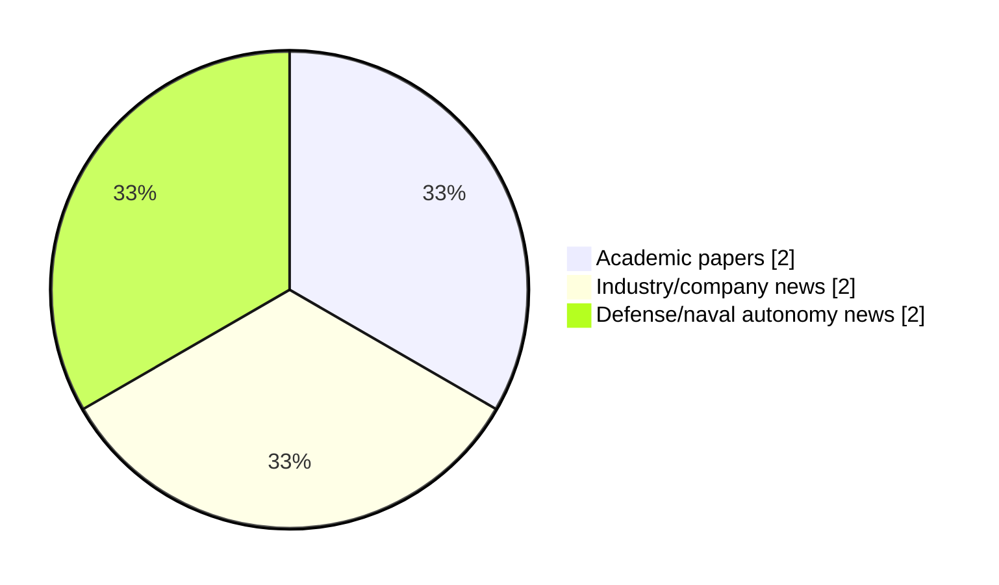

# Maritime Autonomy Watch — 2026-09-30

## Executive Summary

- Total selected items: 6
- Academic papers: 2
- Industry/company news: 2
- Defense/naval autonomy news: 2
- Failed/inaccessible sources: 0

## Contents

- [Analyst Brief](#analyst-brief)
- [Must Read](#must-read)
- [Top Signals Today](#top-signals-today)
- [Topic Signals](#topic-signals)
- [Freshness and Coverage](#freshness-and-coverage)
- [Quality Notes](#quality-notes)
- [Watchlist](#watchlist)
- [Academic Papers](#academic-papers)
- [Industry and Company News](#industry-and-company-news)
- [Defense and Naval Autonomy News](#defense-and-naval-autonomy-news)
- [Source Status Summary](#source-status-summary)

## Analyst Brief

Today's report selected 6 non-duplicate item(s), led by USV operations, perception, defense adoption. The strongest item is [HII Wins U.S. Navy Contract for 10 ROMULUS USVs](https://www.navalnews.com/naval-news/2026/09/hii-wins-u-s-navy-contract-for-10-romulus-usvs/) from navalnews.com.
Coverage is weighted toward academic research (2), with 2 industry and 2 defense signal(s).
Quality caveat: low-score-unique=1.

## Must Read

- [HII Wins U.S. Navy Contract for 10 ROMULUS USVs](https://www.navalnews.com/naval-news/2026/09/hii-wins-u-s-navy-contract-for-10-romulus-usvs/) — Defense signal: USV operations
- [Robosys Integrates VOYAGER AI with FarSounder Forward Looking Sonar, Advancing Situational Awareness for Superyachts and USVs](https://www.maritimeindustries.org/news/robosys-integrates-voyager-ai-farsounder-forward-looking-sonar-advancing-situational-awareness-superyachts-and-usvs) — Industry signal: USV operations
- [ROV & USV Integration Demonstrates Remote Subsea Operations](https://www.oceansciencetechnology.com/news/rov-usv-integration-demonstrates-remote-subsea-operations/) — Industry signal: USV operations
- [Stark and MBDA launch Vanta-12/Sea Venom combination to support NATO deterrence requirements](https://www.navalnews.com/naval-news/2026/09/stark-and-mbda-launch-vanta-12-sea-venom-combination-to-support-nato-deterrence-requirements/) — Defense signal: USV operations
- [Green Maritime Intelligence for Autonomous Shipping, Smart Ports and Low-Carbon Global Logistics](https://doi.org/10.62311/nesx/rb18ag-978-81-68314-82-5) — Research signal: perception

## Top Signals Today

- USV operations: 4 selected item(s).
- perception: 3 selected item(s).
- defense adoption: 2 selected item(s).
- planning/control: 2 selected item(s).
- critical infrastructure: 2 selected item(s).

## Topic Signals

- USV operations: 4
- perception: 3
- defense adoption: 2
- planning/control: 2
- critical infrastructure: 2
- regulation/legal: 1

## Freshness and Coverage

- Newest selected item date: 2026-09-30
- Oldest selected item date: 2026-08-30
- Active/enabled sources: 5
- Sources with access problems: 2
- Quality flags: 1

## Quality Notes

- low-score-unique: 1

## Watchlist

- [AI-Enabled Naval Architecture and Ocean Engineering for Autonomous Marine Vehicles, Offshore Structures and Renewable Ocean Systems](https://doi.org/10.62311/nesx/rb17ag-978-81-68314-83-2) — low-score-unique

### Category Snapshot

| Category | Selected items |
|---|---:|
| Academic papers | 2 |
| Industry/company news | 2 |
| Defense/naval autonomy news | 2 |

## Academic Papers

_Selected items: 2_

### [Green Maritime Intelligence for Autonomous Shipping, Smart Ports and Low-Carbon Global Logistics](https://doi.org/10.62311/nesx/rb18ag-978-81-68314-82-5)

- Source: OpenAlex
- Date: 2026-08-30
- Relevance score: 4.25
- Authors: Murali Krishna Pasupuleti
- DOI: 10.62311/nesx/rb18ag-978-81-68314-82-5
- Signal: Research signal: perception
- Topic tags: perception

**Abstract**

Abstract Green maritime intelligence integrates autonomous vessel decision systems, smart-port orchestration, climate and ocean sensing, digital twins, data engineering and low-carbon logistics into a unified research architecture. The book develops this architecture from first principles of uncertainty, causality, optimization and governance, then extends it through statistical modelling, machine learning, edge analytics and reproducible digital-twin operations. Particular attention is given to voyage and speed optimization, port congestion and energy coordination, predictive maintenance, cyber-physical assurance, renewable-energy integration and corridor-scale logistics decarbonization. The methodological position is deliberately multi-objective: safety, emissions, reliability, resilience, transparency and human oversight are evaluated together rather than optimized independently.

**Why it matters**

This paper may influence autonomy, perception, planning, or control work for maritime robotic systems.

---

### [AI-Enabled Naval Architecture and Ocean Engineering for Autonomous Marine Vehicles, Offshore Structures and Renewable Ocean Systems](https://doi.org/10.62311/nesx/rb17ag-978-81-68314-83-2)

- Source: OpenAlex
- Date: 2026-08-30
- Relevance score: 3
- Authors: Murali Krishna Pasupuleti
- DOI: 10.62311/nesx/rb17ag-978-81-68314-83-2
- Signal: Research signal: perception
- Topic tags: perception, planning/control, critical infrastructure, defense adoption, regulation/legal
- Quality flags: low-score-unique

**Abstract**

Abstract This research book develops an integrated framework for artificial-intelligence-enabled naval architecture and ocean engineering across autonomous marine vehicles, offshore structures and renewable ocean systems. It treats hydrodynamics, structural mechanics, sensing, autonomy, climate forcing and digital infrastructure as coupled elements of one engineering decision system. The manuscript progresses from foundational representations and uncertainty-aware research design to statistical explanation, causal inference, physics-informed learning, autonomous navigation, digital twins, scalable data engineering and governance. Particular attention is given to GPS-denied marine autonomy, multiphysics surrogate modelling, fatigue and corrosion analytics, edge intelligence, remote sensing, offshore renewable-energy operations, resilient ports and cyber-physical assurance.

**Why it matters**

Relevant to infrastructure monitoring, naval adoption; the work may inform maritime autonomy research, testing priorities, or system design.

---

## Industry and Company News

_Selected items: 2_

### [Robosys Integrates VOYAGER AI with FarSounder Forward Looking Sonar, Advancing Situational Awareness for Superyachts and USVs](https://www.maritimeindustries.org/news/robosys-integrates-voyager-ai-farsounder-forward-looking-sonar-advancing-situational-awareness-superyachts-and-usvs)

- Source: maritimeindustries.org
- Date: 2026-09-17
- Relevance score: 6.75
- Signal: Industry signal: USV operations
- Topic tags: USV operations, perception, planning/control

**Summary**

Providence, RI – Robosys Automation, a leader in autonomous navigation and vessel control systems, has announced the integration of its VOYAGER AI Autonomous Navigation System (ANS) software with FarSounder’s Forward Looking Sonar (FLS) technology, delivering enhanced real-time situational awareness, obstacle detection, and navigation decision support for both luxury superyachts and Uncrewed Surface Vessels (USVs).

**Why it matters**

Signals momentum in surface-vessel operations; useful for tracking product direction, partnerships, and deployment opportunities.

---

### [ROV & USV Integration Demonstrates Remote Subsea Operations](https://www.oceansciencetechnology.com/news/rov-usv-integration-demonstrates-remote-subsea-operations/)

- Source: oceansciencetechnology.com
- Date: 2026-09-30
- Relevance score: 5.25
- Signal: Industry signal: USV operations
- Topic tags: USV operations, critical infrastructure

**Summary**

ACUA Ocean and Forssea Robotics have completed joint integration trials in Plymouth, demonstrating fully remote subsea inspection using a Remotely.

**Why it matters**

Signals momentum in surface-vessel operations, infrastructure monitoring; useful for tracking product direction, partnerships, and deployment opportunities.

---

## Defense and Naval Autonomy News

_Selected items: 2_

### [HII Wins U.S. Navy Contract for 10 ROMULUS USVs](https://www.navalnews.com/naval-news/2026/09/hii-wins-u-s-navy-contract-for-10-romulus-usvs/)

- Source: navalnews.com
- Date: 2026-09-30
- Relevance score: 7.5
- Signal: Defense signal: USV operations
- Topic tags: USV operations, defense adoption

**Summary**

HII was awarded a contract by the U.S. Navy to build 10 ROMULUS unmanned surface vessels (USVs) for the Medium Unmanned Surface Vessel (MUSV) program. HII press release The award marks a major advancement in the U.S. Navy’s transition from experimentation to fleet-scale deployment of trusted, operational autonomy across the maritime domain. “HII has made.

**Why it matters**

Signals movement in surface-vessel operations, naval adoption; useful for tracking operational concepts, procurement direction, and fleet integration.

---

### [Stark and MBDA launch Vanta-12/Sea Venom combination to support NATO deterrence requirements](https://www.navalnews.com/naval-news/2026/09/stark-and-mbda-launch-vanta-12-sea-venom-combination-to-support-nato-deterrence-requirements/)

- Source: navalnews.com
- Date: 2026-09-29
- Relevance score: 5.25
- Signal: Defense signal: USV operations
- Topic tags: USV operations

**Summary**

Stark and MBDA have combined to offer a new capability package designed to support NATO requirements for projecting strike capability into the North Atlantic, to build alliance deterrence and defence. On 28 September, Stark revealed the development of its new Vanta-12 uncrewed surface vessel; the USV is set to bring a fit of MBDA’s Sea.

**Why it matters**

Signals movement in surface-vessel operations, naval adoption; useful for tracking operational concepts, procurement direction, and fleet integration.

---

## Inaccessible or Failed Sources

- None

## Source Status Summary

| Source | Status | Notes |
|---|---|---|
| arXiv | enabled | API source, 15 items fetched |
| OpenAlex | enabled | API source, 15 items fetched |
| RSS feeds | enabled | 107 RSS items fetched |
| SMI MASG News | enabled | HTML source, 10 items fetched |
| IEEE Xplore | disabled | Missing IEEE_XPLORE_API_KEY |
| Elsevier Scopus | enabled | API source, 15 items fetched |
| NewsAPI | disabled | Missing NEWS_API_KEY |

## Metadata

- Generated at: 2026-09-30T13:52:21.667119+02:00
- Date: 2026-09-30
- Repository: ferhannb/MarineRobotics
- Relevance threshold: 4.0
- Deduplication method: DOI, canonical URL, source ID, normalized title, similar recent titles, category caps, and novelty score
