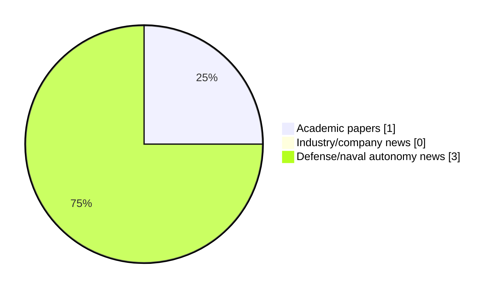

# Maritime Autonomy Watch — 2026-10-01

## Executive Summary

- Total selected items: 4
- Academic papers: 1
- Industry/company news: 0
- Defense/naval autonomy news: 3
- Failed/inaccessible sources: 0

## Contents

- [Analyst Brief](#analyst-brief)
- [Must Read](#must-read)
- [Top Signals Today](#top-signals-today)
- [Topic Signals](#topic-signals)
- [Freshness and Coverage](#freshness-and-coverage)
- [Quality Notes](#quality-notes)
- [Watchlist](#watchlist)
- [Academic Papers](#academic-papers)
- [Industry and Company News](#industry-and-company-news)
- [Defense and Naval Autonomy News](#defense-and-naval-autonomy-news)
- [Source Status Summary](#source-status-summary)

## Analyst Brief

Today's report selected 4 non-duplicate item(s), led by USV operations, defense adoption, swarm autonomy. The strongest item is [Non-Invasive Inspection of Water Canals Using Dronar](http://arxiv.org/abs/2609.40178v1) from arXiv.
Coverage is weighted toward academic research (1), with 0 industry and 3 defense signal(s).
Quality caveat: low-score-unique=1.

## Must Read

- [Non-Invasive Inspection of Water Canals Using Dronar](http://arxiv.org/abs/2609.40178v1) — Research signal: USV operations
- [Saronic Awarded Production Contract for Marauder Under U.S. Navy’s MUSV Marketplace](https://www.navalnews.com/naval-news/2026/09/saronic-awarded-production-contract-for-marauder-under-u-s-navys-musv-marketplace/) — Defense signal: USV operations
- [Historic first as Royal Navy launches torpedo from uncrewed submarine, XV Excalibur](https://www.navalnews.com/naval-news/2026/09/historic-first-as-royal-navy-launches-torpedo-from-uncrewed-submarine-xv-excalibur/) — Defense signal: planning/control
- [US industry urged to ‘build fast, build on time’ after MUSV award](https://www.naval-technology.com/news/us-navy-musv-production/) — Defense signal: USV operations

## Top Signals Today

- USV operations: 3 selected item(s).
- defense adoption: 3 selected item(s).
- swarm autonomy: 1 selected item(s).
- perception: 1 selected item(s).
- critical infrastructure: 1 selected item(s).

## Topic Signals

- USV operations: 3
- defense adoption: 3
- swarm autonomy: 1
- perception: 1
- critical infrastructure: 1
- planning/control: 1

## Freshness and Coverage

- Newest selected item date: 2026-09-30
- Oldest selected item date: 2026-09-30
- Active/enabled sources: 5
- Sources with access problems: 2
- Quality flags: 1

## Quality Notes

- low-score-unique: 1

## Watchlist

- [US industry urged to ‘build fast, build on time’ after MUSV award](https://www.naval-technology.com/news/us-navy-musv-production/) — low-score-unique

### Category Snapshot

| Category | Selected items |
|---|---:|
| Academic papers | 1 |
| Industry/company news | 0 |
| Defense/naval autonomy news | 3 |

## Academic Papers

_Selected items: 1_

### [Non-Invasive Inspection of Water Canals Using Dronar](http://arxiv.org/abs/2609.40178v1)

- Source: arXiv
- Date: 2026-09-30
- Relevance score: 7.25
- Authors: Michael Zielinski, Zhizhan Wang, Benjamin Dymond, Reza Razavian, Zhongwang Dou
- Signal: Research signal: USV operations
- Topic tags: USV operations, swarm autonomy, perception, critical infrastructure

**Abstract**

Open concrete canals play a vital role in water transportation, serving as primary water infrastructure for millions of people across the Phoenix, Arizona, metro area. Over time, the concrete canals can experience a range of issues, including canal lining deformation, cracked concrete, and sediment buildup on the canal floor. Identifying such critical issues is a resource-intensive process, which currently happens only during four-year dry-up cycles. This prevents the maintenance crew from prioritizing operations on the most affected canal segments. To address this issue, the research team has developed and verified an easily deployable and non-invasive method to inspect canal beds without draining the water. This inspection system integrates affordable, off-the-shelf drone and sonar technology (termed dronar).

**Why it matters**

Relevant to surface-vessel operations, multi-vehicle coordination, infrastructure monitoring; the work may inform maritime autonomy research, testing priorities, or system design.

---

## Industry and Company News

_Selected items: 0_

No selected items.

## Defense and Naval Autonomy News

_Selected items: 3_

### [Saronic Awarded Production Contract for Marauder Under U.S. Navy’s MUSV Marketplace](https://www.navalnews.com/naval-news/2026/09/saronic-awarded-production-contract-for-marauder-under-u-s-navys-musv-marketplace/)

- Source: navalnews.com
- Date: 2026-09-30
- Relevance score: 4.25
- Signal: Defense signal: USV operations
- Topic tags: USV operations, defense adoption

**Summary**

Saronic Technologies has been awarded a production Other Transaction (OT) under the U.S. Navy’s Medium Unmanned Surface Vessel (MUSV) Marketplace for Marauder, the company’s dual-use 180-foot autonomous ship. Saronic Technologies press release The Firm-Fixed Price award, executed under the authority of 10 U.S.C. § 4022(f), reflects a streamlined acquisition approach that enables the Navy to procure capabilities.

**Why it matters**

Signals movement in surface-vessel operations, naval adoption; useful for tracking operational concepts, procurement direction, and fleet integration.

---

### [Historic first as Royal Navy launches torpedo from uncrewed submarine, XV Excalibur](https://www.navalnews.com/naval-news/2026/09/historic-first-as-royal-navy-launches-torpedo-from-uncrewed-submarine-xv-excalibur/)

- Source: navalnews.com
- Date: 2026-09-30
- Relevance score: 4.25
- Signal: Defense signal: planning/control
- Topic tags: planning/control, defense adoption

**Summary**

For the first time, a Royal Navy robot submarine has successfully fired a torpedo in a milestone trial pushing the boundaries of undersea warfare off Scotland. Royal Navy press release XV Excalibur, an Extra-Large Uncrewed Underwater Vessel or XLUUV, was adapted with a specialist management system to successfully fire and control US Navy Mk48 Mod.

**Why it matters**

Signals movement in underwater autonomy, naval adoption; useful for tracking operational concepts, procurement direction, and fleet integration.

---

### [US industry urged to ‘build fast, build on time’ after MUSV award](https://www.naval-technology.com/news/us-navy-musv-production/)

- Source: naval-technology.com
- Date: 2026-09-30
- Relevance score: 3.5
- Signal: Defense signal: USV operations
- Topic tags: USV operations, defense adoption
- Quality flags: low-score-unique

**Summary**

The US Navy has selected three contractors to build 30 Medium Unmanned Surface Vessels, following the completion of Phase I at-sea testing.

**Why it matters**

Signals movement in surface-vessel operations, naval adoption; useful for tracking operational concepts, procurement direction, and fleet integration.

---

## Inaccessible or Failed Sources

- None

## Source Status Summary

| Source | Status | Notes |
|---|---|---|
| arXiv | enabled | API source, 15 items fetched |
| OpenAlex | enabled | API source, 15 items fetched |
| RSS feeds | enabled | 107 RSS items fetched |
| SMI MASG News | enabled | HTML source, 10 items fetched |
| IEEE Xplore | disabled | Missing IEEE_XPLORE_API_KEY |
| Elsevier Scopus | enabled | API source, 15 items fetched |
| NewsAPI | disabled | Missing NEWS_API_KEY |

## Metadata

- Generated at: 2026-10-01T14:22:35.239915+02:00
- Date: 2026-10-01
- Repository: ferhannb/MarineRobotics
- Relevance threshold: 4.0
- Deduplication method: DOI, canonical URL, source ID, normalized title, similar recent titles, category caps, and novelty score
