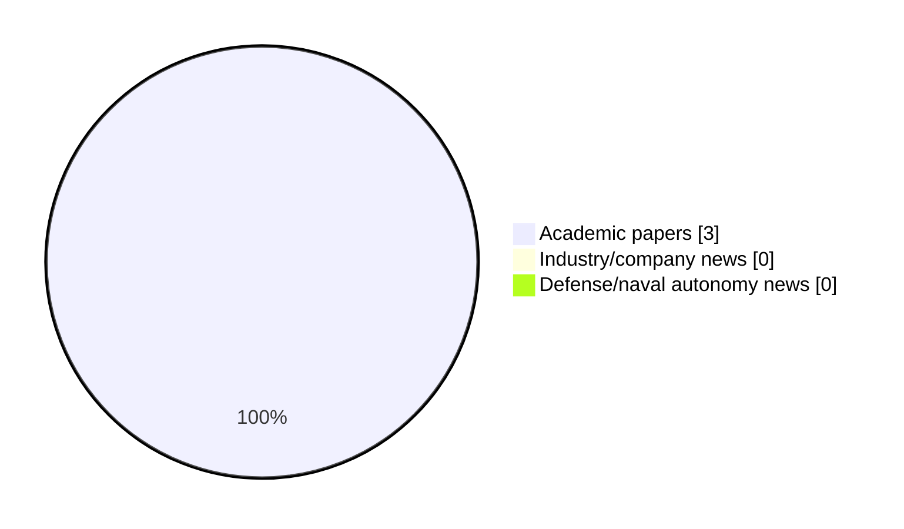

# Maritime Autonomy Watch — 2026-10-02

## Executive Summary

- Total selected items: 3
- Academic papers: 3
- Industry/company news: 0
- Defense/naval autonomy news: 0
- Failed/inaccessible sources: 0

## Contents

- [Analyst Brief](#analyst-brief)
- [Must Read](#must-read)
- [Top Signals Today](#top-signals-today)
- [Topic Signals](#topic-signals)
- [Freshness and Coverage](#freshness-and-coverage)
- [Quality Notes](#quality-notes)
- [Watchlist](#watchlist)
- [Academic Papers](#academic-papers)
- [Industry and Company News](#industry-and-company-news)
- [Defense and Naval Autonomy News](#defense-and-naval-autonomy-news)
- [Source Status Summary](#source-status-summary)

## Analyst Brief

Today's report selected 3 non-duplicate item(s), led by USV operations, critical infrastructure, AUV navigation. The strongest item is [H-SPAR: Hydrodynamic-aware Simulation for Particle Transport and Autonomous Robots](http://arxiv.org/abs/2610.01985v1) from arXiv.
Coverage is weighted toward academic research (3), with 0 industry and 0 defense signal(s).

## Must Read

- [H-SPAR: Hydrodynamic-aware Simulation for Particle Transport and Autonomous Robots](http://arxiv.org/abs/2610.01985v1) — Research signal: USV operations
- [Reliability-aware short-term roll prediction for unmanned surface vehicles via multi-task learning and adaptive centralization](http://arxiv.org/abs/2610.00996v1) — Research signal: USV operations
- [SonarVoxNet: Diver Detection in 3D Bounding Box using 3D Sonar](http://arxiv.org/abs/2610.01644v1) — Research signal: AUV navigation

## Top Signals Today

- USV operations: 2 selected item(s).
- critical infrastructure: 1 selected item(s).
- AUV navigation: 1 selected item(s).
- swarm autonomy: 1 selected item(s).
- perception: 1 selected item(s).

## Topic Signals

- USV operations: 2
- critical infrastructure: 1
- AUV navigation: 1
- swarm autonomy: 1
- perception: 1
- planning/control: 1

## Freshness and Coverage

- Newest selected item date: 2026-10-01
- Oldest selected item date: 2026-10-01
- Active/enabled sources: 5
- Sources with access problems: 2
- Quality flags: 0

## Quality Notes

- No quality flags on selected items.

## Watchlist

- No watchlist items today.

### Category Snapshot

| Category | Selected items |
|---|---:|
| Academic papers | 3 |
| Industry/company news | 0 |
| Defense/naval autonomy news | 0 |

## Academic Papers

_Selected items: 3_

### [H-SPAR: Hydrodynamic-aware Simulation for Particle Transport and Autonomous Robots](http://arxiv.org/abs/2610.01985v1)

- Source: arXiv
- Date: 2026-10-01
- Relevance score: 9.5
- Authors: Navid Zarrabi, Nariman Yousefi, Sajad Saeedi
- Signal: Research signal: USV operations
- Topic tags: USV operations

**Abstract**

Environmental robotic sampling requires considering the dual influence of water currents on robotic motion and particle transport. Existing marine robotics simulators generally model flow, autonomy, and sampling targets separately, limiting joint evaluation of mission cost and sampling performance. H-SPAR integrates spatially and temporally varying velocity fields, Lagrangian particle transport, probabilistic sampling, and ROS 2/Gazebo-based uncrewed surface vehicle (USV) autonomy. In this work, shared precomputed flow fields drive particle advection and current-induced forces during closed-loop vehicle execution. Path-planning experiments show that the existing current-aware planner SVF-RRT* achieves 69.4% lower upstream cost than conventional RRT* at the planning level, but this reduction falls to 41.

**Why it matters**

Relevant to surface-vessel operations; the work may inform maritime autonomy research, testing priorities, or system design.

---

### [Reliability-aware short-term roll prediction for unmanned surface vehicles via multi-task learning and adaptive centralization](http://arxiv.org/abs/2610.00996v1)

- Source: arXiv
- Date: 2026-10-01
- Relevance score: 8
- Authors: Kaizhen Li, Xi Zhou, Zihao Wang, Dan Zhang, Jianjian Liu, Xiaowei Li
- Signal: Research signal: USV operations
- Topic tags: USV operations, critical infrastructure

**Abstract**

Reliable roll prediction of unmanned surface vehicles (USVs) is essential for ensuring navi?gational safety and enhancing autonomous decision-making. While existing studies primarily focus on improving prediction accuracy, the quantification of prediction reliability remains insufficiently addressed. To bridge this gap, this paper proposes a reliability-aware prediction paradigm that integrates confidence assessment into the predictive pipeline. The architecture utilizes a multi-task learning structure where a shared feature extraction backbone feeds into dual heads: a regression head for precise roll prediction and a quantification head for confidence scoring. This configuration provides accurate prediction and corresponding confidence for risk?sensitive downstream tasks. In addition, an adaptive centralization strategy tailored for short?

**Why it matters**

Relevant to surface-vessel operations; the work may inform maritime autonomy research, testing priorities, or system design.

---

### [SonarVoxNet: Diver Detection in 3D Bounding Box using 3D Sonar](http://arxiv.org/abs/2610.01644v1)

- Source: arXiv
- Date: 2026-10-01
- Relevance score: 7.75
- Authors: Eugene Park, Jiwon Lee, Seyoung Kan, Trung Dong, Xiaomin Lin, Jane Shin
- Signal: Research signal: AUV navigation
- Topic tags: AUV navigation, swarm autonomy, perception, planning/control

**Abstract**

Autonomous underwater vehicles (AUVs) assisting human divers must continuously track not only the diver's 3D position but also their full-body orientation. However, vision-based perception is unreliable underwater, and forward-looking sonar -- despite being widely used -- discards the elevation information needed for orientation estimation, posing a fundamental limitation. Recently commercialized 3D sonar preserves elevation but produces sparse, noisy returns, and existing detectors are built for dense LiDAR data and for targets that remain upright and rotate only about the yaw axis (e.g., vehicles, pedestrians), making them unable to represent a freely pitching and rolling diver. To address this gap, we present two contributions.

**Why it matters**

Relevant to underwater autonomy, multi-vehicle coordination; the work may inform maritime autonomy research, testing priorities, or system design.

---

## Industry and Company News

_Selected items: 0_

No selected items.

## Defense and Naval Autonomy News

_Selected items: 0_

No selected items.

## Inaccessible or Failed Sources

- None

## Source Status Summary

| Source | Status | Notes |
|---|---|---|
| arXiv | enabled | API source, 15 items fetched |
| OpenAlex | enabled | API source, 15 items fetched |
| RSS feeds | enabled | 107 RSS items fetched |
| SMI MASG News | enabled | HTML source, 10 items fetched |
| IEEE Xplore | disabled | Missing IEEE_XPLORE_API_KEY |
| Elsevier Scopus | enabled | API source, 15 items fetched |
| NewsAPI | disabled | Missing NEWS_API_KEY |

## Metadata

- Generated at: 2026-10-02T13:49:46.583227+02:00
- Date: 2026-10-02
- Repository: ferhannb/MarineRobotics
- Relevance threshold: 4.0
- Deduplication method: DOI, canonical URL, source ID, normalized title, similar recent titles, category caps, and novelty score
