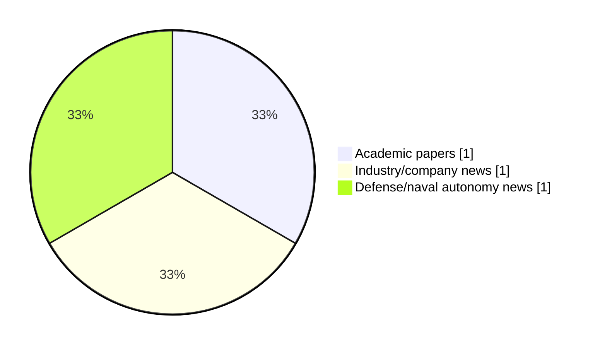

# Maritime Autonomy Watch — 2026-10-03

## Executive Summary

- Total selected items: 3
- Academic papers: 1
- Industry/company news: 1
- Defense/naval autonomy news: 1
- Failed/inaccessible sources: 0

## Contents

- [Analyst Brief](#analyst-brief)
- [Must Read](#must-read)
- [Top Signals Today](#top-signals-today)
- [Topic Signals](#topic-signals)
- [Freshness and Coverage](#freshness-and-coverage)
- [Quality Notes](#quality-notes)
- [Watchlist](#watchlist)
- [Academic Papers](#academic-papers)
- [Industry and Company News](#industry-and-company-news)
- [Defense and Naval Autonomy News](#defense-and-naval-autonomy-news)
- [Source Status Summary](#source-status-summary)

## Analyst Brief

Today's report selected 3 non-duplicate item(s), led by AUV navigation, USV operations, critical infrastructure. The strongest item is [Mariner X USV and CORAX 600 AUV Team Up for Uncrewed Mine Countermeasures at REPMUS 2026](https://oceannews.com/news/defense/mariner-x-usv-and-corax-600-auv-team-up-for-uncrewed-mine-countermeasures-at-repmus-2026/) from oceannews.com.
Coverage is weighted toward academic research (1), with 1 industry and 1 defense signal(s).

## Must Read

- [Mariner X USV and CORAX 600 AUV Team Up for Uncrewed Mine Countermeasures at REPMUS 2026](https://oceannews.com/news/defense/mariner-x-usv-and-corax-600-auv-team-up-for-uncrewed-mine-countermeasures-at-repmus-2026/) — Industry signal: AUV navigation
- [Adaptive Unmanned Surface Vehicles swarm optimization for target tracking in dynamic environments](https://doi.org/10.1007/s00773-026-01145-8) — Research signal: USV operations
- [Vatn Systems SIGURD AUV Wins DIU Mine Countermeasure Prize Challenge](https://oceannews.com/news/defense/vatn-systems-sigurd-auv-wins-diu-mine-countermeasure-prize-challenge/) — Defense signal: AUV navigation

## Top Signals Today

- AUV navigation: 2 selected item(s).
- USV operations: 2 selected item(s).
- critical infrastructure: 1 selected item(s).
- defense adoption: 1 selected item(s).
- swarm autonomy: 1 selected item(s).

## Topic Signals

- AUV navigation: 2
- USV operations: 2
- critical infrastructure: 1
- defense adoption: 1
- swarm autonomy: 1
- perception: 1
- regulation/legal: 1

## Freshness and Coverage

- Newest selected item date: 2026-10-02
- Oldest selected item date: 2026-09-04
- Active/enabled sources: 5
- Sources with access problems: 2
- Quality flags: 0

## Quality Notes

- No quality flags on selected items.

## Watchlist

- No watchlist items today.

### Category Snapshot

| Category | Selected items |
|---|---:|
| Academic papers | 1 |
| Industry/company news | 1 |
| Defense/naval autonomy news | 1 |

## Academic Papers

_Selected items: 1_

### [Adaptive Unmanned Surface Vehicles swarm optimization for target tracking in dynamic environments](https://doi.org/10.1007/s00773-026-01145-8)

- Source: OpenAlex
- Date: 2026-09-04
- Relevance score: 9.75
- Authors: Oren Gal
- DOI: 10.1007/s00773-026-01145-8
- Signal: Research signal: USV operations
- Topic tags: USV operations, swarm autonomy, perception, regulation/legal

**Abstract**

Abstract This research investigates the performance and efficiency of Unmanned Surface Vehicles (USVs) in multi-target tracking scenarios using the Adaptive Particle Swarm Optimization with k-Nearest Neighbors (APSO–kNN) algorithm. This study explores various search patterns—Random Walk, Spiral, Lawnmower, and Cluster Search—to assess their effectiveness in dynamic environments. Through extensive simulations, this work evaluates the impact of different search strategies, varying the number of targets and USVs’ sensing capabilities, and integrating a Pursuit–Evasion model to test adaptability. The study findings demonstrate that systematic search patterns like Spiral and Lawnmower provide superior coverage and tracking accuracy, making them ideal for thorough area exploration.

**Why it matters**

Relevant to surface-vessel operations, multi-vehicle coordination, infrastructure monitoring; the work may inform maritime autonomy research, testing priorities, or system design.

---

## Industry and Company News

_Selected items: 1_

### [Mariner X USV and CORAX 600 AUV Team Up for Uncrewed Mine Countermeasures at REPMUS 2026](https://oceannews.com/news/defense/mariner-x-usv-and-corax-600-auv-team-up-for-uncrewed-mine-countermeasures-at-repmus-2026/)

- Source: oceannews.com
- Date: 2026-10-02
- Relevance score: 10
- Signal: Industry signal: AUV navigation
- Topic tags: AUV navigation, USV operations, critical infrastructure

**Summary**

Skarv Technologies and Maritime Robotics demonstrated coordinated uncrewed surface and subsea operations during REPMUS 2026 in Portugal, pairing Maritime Robotics' Mariner X USV with Skarv Technologies' CORAX 600 AUV.

**Why it matters**

Signals momentum in underwater autonomy, surface-vessel operations; useful for tracking product direction, partnerships, and deployment opportunities.

---

## Defense and Naval Autonomy News

_Selected items: 1_

### [Vatn Systems SIGURD AUV Wins DIU Mine Countermeasure Prize Challenge](https://oceannews.com/news/defense/vatn-systems-sigurd-auv-wins-diu-mine-countermeasure-prize-challenge/)

- Source: oceannews.com
- Date: 2026-10-02
- Relevance score: 8.5
- Signal: Defense signal: AUV navigation
- Topic tags: AUV navigation, defense adoption

**Summary**

Vatn Systems, a leading defense technology company building autonomous underwater vehicles (AUVs) for the US military, allied nations, and commercial customers, today announced it is a winner of the Defense Innovation Unit's (DIU) Mine Counter Measure Modernization Prize Challenge. Vatn's SIGURD system, built on the company's Skelmir S6 platform, successfully competed in the Near Surface and Volume Mine Engage Test and Evaluation segment, earning recognition as one of the top-performing solutions.

**Why it matters**

Signals movement in underwater autonomy, naval adoption; useful for tracking operational concepts, procurement direction, and fleet integration.

---

## Inaccessible or Failed Sources

- None

## Source Status Summary

| Source | Status | Notes |
|---|---|---|
| arXiv | enabled | API source, 15 items fetched |
| OpenAlex | enabled | API source, 15 items fetched |
| RSS feeds | enabled | 107 RSS items fetched |
| SMI MASG News | enabled | HTML source, 10 items fetched |
| IEEE Xplore | disabled | Missing IEEE_XPLORE_API_KEY |
| Elsevier Scopus | enabled | API source, 15 items fetched |
| NewsAPI | disabled | Missing NEWS_API_KEY |

## Metadata

- Generated at: 2026-10-03T13:03:38.930379+02:00
- Date: 2026-10-03
- Repository: ferhannb/MarineRobotics
- Relevance threshold: 4.0
- Deduplication method: DOI, canonical URL, source ID, normalized title, similar recent titles, category caps, and novelty score
