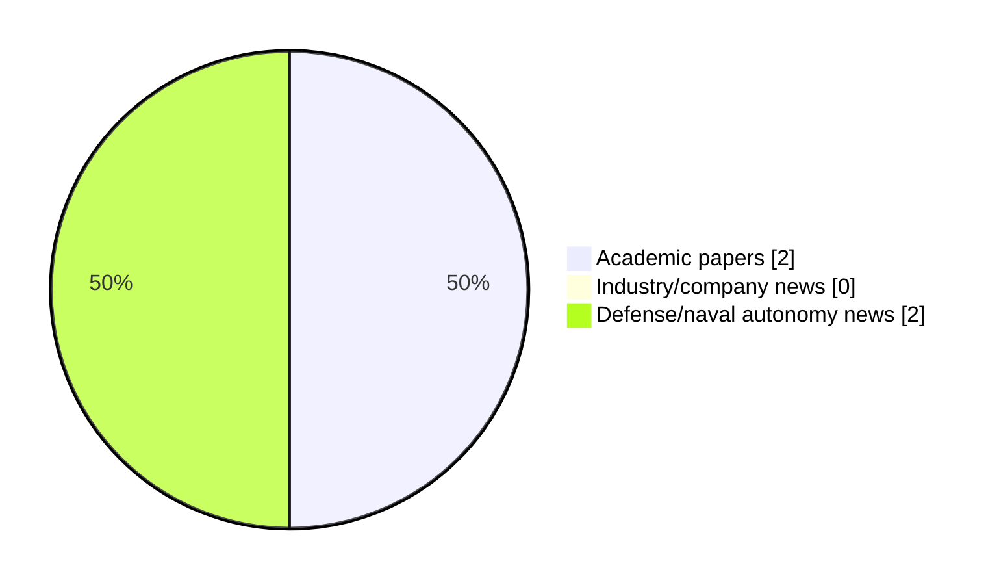

# Maritime Autonomy Watch — 2026-10-05

## Executive Summary

- Total selected items: 4
- Academic papers: 2
- Industry/company news: 0
- Defense/naval autonomy news: 2
- Failed/inaccessible sources: 0

## Contents

- [Analyst Brief](#analyst-brief)
- [Must Read](#must-read)
- [Top Signals Today](#top-signals-today)
- [Topic Signals](#topic-signals)
- [Freshness and Coverage](#freshness-and-coverage)
- [Quality Notes](#quality-notes)
- [Watchlist](#watchlist)
- [Academic Papers](#academic-papers)
- [Industry and Company News](#industry-and-company-news)
- [Defense and Naval Autonomy News](#defense-and-naval-autonomy-news)
- [Source Status Summary](#source-status-summary)

## Analyst Brief

Today's report selected 4 non-duplicate item(s), led by USV operations, defense adoption, critical infrastructure. The strongest item is [POINT CLOUD PROCESSING ON 3D LIDAR DATA FOR UNMANNED SURFACE VEHICLES NAVIGATION IN MARINE ENVIRONMENTS](https://doi.org/10.35631/jistm.1144015) from OpenAlex.
Coverage is weighted toward academic research (2), with 0 industry and 2 defense signal(s).
Quality caveat: missing-summary=1, date-anomaly=1.

## Must Read

- [POINT CLOUD PROCESSING ON 3D LIDAR DATA FOR UNMANNED SURFACE VEHICLES NAVIGATION IN MARINE ENVIRONMENTS](https://doi.org/10.35631/jistm.1144015) — Research signal: USV operations
- [Seasats Lightfish USV Fleet To Support US Gulf Border Surveillance Mission](https://oceannews.com/news/defense/seasats-lightfish-usv-fleet-to-support-us-gulf-border-surveillance-mission/) — Defense signal: USV operations
- [Kraken & Saab UK Integrate K3 SCOUT with Giraffe 1X Radar for Maritime Drone Detection](https://oceannews.com/news/defense/kraken-saab-uk-integrate-k3-scout-with-giraffe-1x-radar-for-maritime-drone-detection/) — Defense signal: USV operations

## Top Signals Today

- USV operations: 4 selected item(s).
- defense adoption: 2 selected item(s).
- critical infrastructure: 1 selected item(s).
- swarm autonomy: 1 selected item(s).

## Topic Signals

- USV operations: 4
- defense adoption: 2
- critical infrastructure: 1
- swarm autonomy: 1

## Freshness and Coverage

- Newest selected item date: 2027-02-01
- Oldest selected item date: 2026-09-15
- Active/enabled sources: 4
- Sources with access problems: 3
- Quality flags: 2

## Quality Notes

- missing-summary: 1
- date-anomaly: 1
- Date anomalies: [Dynamic adaptive spatiotemporal fusion modeling and encounter danger analysis method based on Multi-USV swarms](https://api.elsevier.com/content/abstract/scopus_id/105050414069) reports 2027-02-01

## Watchlist

- [Dynamic adaptive spatiotemporal fusion modeling and encounter danger analysis method based on Multi-USV swarms](https://api.elsevier.com/content/abstract/scopus_id/105050414069) — missing-summary, date-anomaly

### Category Snapshot

| Category | Selected items |
|---|---:|
| Academic papers | 2 |
| Industry/company news | 0 |
| Defense/naval autonomy news | 2 |

## Academic Papers

_Selected items: 2_

### [POINT CLOUD PROCESSING ON 3D LIDAR DATA FOR UNMANNED SURFACE VEHICLES NAVIGATION IN MARINE ENVIRONMENTS](https://doi.org/10.35631/jistm.1144015)

- Source: OpenAlex
- Date: 2026-09-15
- Relevance score: 10
- Authors: Aiman Norazaruddin, Zulkifli Zainal Abidin
- DOI: 10.35631/jistm.1144015
- Signal: Research signal: USV operations
- Topic tags: USV operations, critical infrastructure

**Abstract**

Unmanned Surface Vehicles (USVs) require reliable autonomous navigation systems in dynamic maritime environments. LiDAR sensors, while effective for obstacle detection, are susceptible to noise and distortion from wave oscillations and water surface absorption, generating false positives and negatives in point cloud data. Most existing preprocessing-clustering evaluations are confined to terrestrial or simulated settings, with limited benchmarking under real maritime conditions marked by wave-induced motion, surface reflections, and sparse returns. This study addresses that gap through one of the first systematic evaluations of preprocessing-clustering combinations using real harbour LiDAR data collected under genuine environmental disturbance. A Velodyne HDL-32E LiDAR sensor was deployed at Klang Harbour, Malaysia, to collect real-world point cloud datasets.

**Why it matters**

Relevant to surface-vessel operations; the work may inform maritime autonomy research, testing priorities, or system design.

---

### [Dynamic adaptive spatiotemporal fusion modeling and encounter danger analysis method based on Multi-USV swarms](https://api.elsevier.com/content/abstract/scopus_id/105050414069)

- Source: Elsevier Scopus
- Date: 2027-02-01
- Relevance score: 4.5
- DOI: 10.1016/j.ress.2026.113473
- Signal: Research signal: USV operations
- Topic tags: USV operations, swarm autonomy
- Quality flags: missing-summary, date-anomaly

**Abstract**

No summary available.

**Why it matters**

Relevant to surface-vessel operations, multi-vehicle coordination; the work may inform maritime autonomy research, testing priorities, or system design.

---

## Industry and Company News

_Selected items: 0_

No selected items.

## Defense and Naval Autonomy News

_Selected items: 2_

### [Seasats Lightfish USV Fleet To Support US Gulf Border Surveillance Mission](https://oceannews.com/news/defense/seasats-lightfish-usv-fleet-to-support-us-gulf-border-surveillance-mission/)

- Source: oceannews.com
- Date: 2026-10-05
- Relevance score: 8.5
- Signal: Defense signal: USV operations
- Topic tags: USV operations, defense adoption

**Summary**

Seasats has announced that a fleet of Lightfish USVs has been deployed in support of US maritime border security operations, expanding an existing autonomous maritime surveillance program under the Office of the Assistant Secretary of War for Homeland Defense and Americas Security Affairs.

**Why it matters**

Signals movement in surface-vessel operations, naval adoption; useful for tracking operational concepts, procurement direction, and fleet integration.

---

### [Kraken & Saab UK Integrate K3 SCOUT with Giraffe 1X Radar for Maritime Drone Detection](https://oceannews.com/news/defense/kraken-saab-uk-integrate-k3-scout-with-giraffe-1x-radar-for-maritime-drone-detection/)

- Source: oceannews.com
- Date: 2026-10-05
- Relevance score: 6
- Signal: Defense signal: USV operations
- Topic tags: USV operations, defense adoption

**Summary**

World-leading USV company Kraken Technology Group and defense prime Saab UK have developed and tested a pioneering prototype autonomous "drone seeker" vessel for maritime environments.

**Why it matters**

Signals movement in surface-vessel operations, naval adoption; useful for tracking operational concepts, procurement direction, and fleet integration.

---

## Inaccessible or Failed Sources

- None

## Source Status Summary

| Source | Status | Notes |
|---|---|---|
| arXiv | enabled | API source, 15 items fetched |
| OpenAlex | enabled | API source, 15 items fetched |
| RSS feeds | partial | 97 RSS items fetched; failures: https://www.navalnews.com/feed/: HTTP 503 for https://www.navalnews.com/feed/ |
| SMI MASG News | enabled | HTML source, 10 items fetched |
| IEEE Xplore | disabled | Missing IEEE_XPLORE_API_KEY |
| Elsevier Scopus | enabled | API source, 15 items fetched |
| NewsAPI | disabled | Missing NEWS_API_KEY |

## Metadata

- Generated at: 2026-10-05T15:31:17.881574+02:00
- Date: 2026-10-05
- Repository: ferhannb/MarineRobotics
- Relevance threshold: 4.0
- Deduplication method: DOI, canonical URL, source ID, normalized title, similar recent titles, category caps, and novelty score
