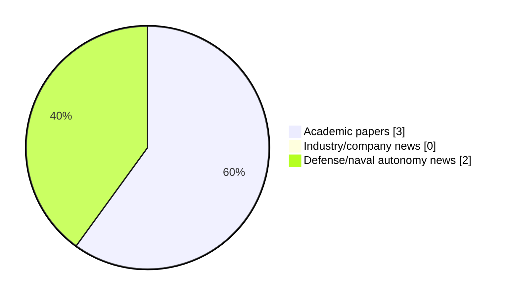

# Maritime Autonomy Watch — 2026-10-06

## Executive Summary

- Total selected items: 5
- Academic papers: 3
- Industry/company news: 0
- Defense/naval autonomy news: 2
- Failed/inaccessible sources: 0

## Contents

- [Analyst Brief](#analyst-brief)
- [Must Read](#must-read)
- [Top Signals Today](#top-signals-today)
- [Topic Signals](#topic-signals)
- [Freshness and Coverage](#freshness-and-coverage)
- [Quality Notes](#quality-notes)
- [Watchlist](#watchlist)
- [Academic Papers](#academic-papers)
- [Industry and Company News](#industry-and-company-news)
- [Defense and Naval Autonomy News](#defense-and-naval-autonomy-news)
- [Source Status Summary](#source-status-summary)

## Analyst Brief

Today's report selected 5 non-duplicate item(s), led by USV operations, planning/control, regulation/legal. The strongest item is [Review of Applications, Technologies and Future Trends of Maritime UAV Systems for Smart Ocean Operations](https://doi.org/10.3390/drones10100737) from OpenAlex.
Coverage is weighted toward academic research (3), with 0 industry and 2 defense signal(s).
Quality caveat: low-score-unique=2.

## Must Read

- [Review of Applications, Technologies and Future Trends of Maritime UAV Systems for Smart Ocean Operations](https://doi.org/10.3390/drones10100737) — Research signal: USV operations
- [Reinforcement Learning-Based 3D Beam Adaptation for Underwater Wireless Optical Communication with AUVs](http://arxiv.org/abs/2610.06407v1) — Research signal: AUV navigation
- [Incat Crowther Joins HII on U.S. Navy ROMULUS USVs](https://www.marinelink.com/news/incat-crowther-joins-hii-us-navy-romulus-543487) — Defense signal: USV operations
- [Saab and Kraken develop autonomous vessel for drone detection](https://www.naval-technology.com/news/saab-kraken-k3-scout/) — Defense signal: USV operations
- [Nesterov-Accelerated Concurrent Learning for Lyapunov-Based Deep Neural Networks](http://arxiv.org/abs/2610.04200v1) — Research signal: planning/control

## Top Signals Today

- USV operations: 3 selected item(s).
- planning/control: 3 selected item(s).
- regulation/legal: 2 selected item(s).
- swarm autonomy: 1 selected item(s).
- perception: 1 selected item(s).

## Topic Signals

- USV operations: 3
- planning/control: 3
- regulation/legal: 2
- swarm autonomy: 1
- perception: 1
- AUV navigation: 1
- defense adoption: 1
- critical infrastructure: 1

## Freshness and Coverage

- Newest selected item date: 2026-10-06
- Oldest selected item date: 2026-09-30
- Active/enabled sources: 5
- Sources with access problems: 2
- Quality flags: 2

## Quality Notes

- low-score-unique: 2

## Watchlist

- [Saab and Kraken develop autonomous vessel for drone detection](https://www.naval-technology.com/news/saab-kraken-k3-scout/) — low-score-unique
- [Nesterov-Accelerated Concurrent Learning for Lyapunov-Based Deep Neural Networks](http://arxiv.org/abs/2610.04200v1) — low-score-unique

### Category Snapshot

| Category | Selected items |
|---|---:|
| Academic papers | 3 |
| Industry/company news | 0 |
| Defense/naval autonomy news | 2 |

## Academic Papers

_Selected items: 3_

### [Review of Applications, Technologies and Future Trends of Maritime UAV Systems for Smart Ocean Operations](https://doi.org/10.3390/drones10100737)

- Source: OpenAlex
- Date: 2026-09-30
- Relevance score: 10
- Authors: Mina Y. Tadros, Amir Bordbar, Amin Nazemian, Myo Zin Aung, Evangelos K. Boulougouris
- DOI: 10.3390/drones10100737
- Signal: Research signal: USV operations
- Topic tags: USV operations, swarm autonomy, perception, planning/control, regulation/legal

**Abstract**

Maritime unmanned aerial vehicles (UAVs) are increasingly transforming ocean, coastal, port, and offshore operations through rapid sensing, intelligent communication, autonomous perception, and cooperative decision support. This trend-oriented review analyses 471 peer-reviewed journal articles published between 2020 and March 2026, supported by selected foundational pre-2020 studies, to examine the evolution, technological structure, methodological maturity, and deployment readiness of maritime UAV systems. The bibliometric analysis shows rapid publication growth, from 22 papers in 2020 to 160 in 2025, and identifies five interconnected research clusters centred on maritime communications and networking; artificial intelligence (AI)-enabled perception, surveillance, and search and rescue; navigation and cooperative operations; distributed and federated intelligence; and multi-agent autonomous systems.

**Why it matters**

Relevant to underwater autonomy, surface-vessel operations, infrastructure monitoring; the work may inform maritime autonomy research, testing priorities, or system design.

---

### [Reinforcement Learning-Based 3D Beam Adaptation for Underwater Wireless Optical Communication with AUVs](http://arxiv.org/abs/2610.06407v1)

- Source: arXiv
- Date: 2026-10-05
- Relevance score: 8.5
- Authors: Viviana Centritto~Arrojo, Ama Bandara, Sergi Abadal, Evgenii Vinogradov
- Signal: Research signal: AUV navigation
- Topic tags: AUV navigation, planning/control

**Abstract**

Underwater Wireless Optical Communications (UWOC) provide essential high data rates for Autonomous Underwater Vehicles (AUVs), but reliable connectivity is critically affected by transmitter-receiver misalignment. This work addresses the beam pointing problem for a moving AUV subject to unknown ocean currents through a Deep Reinforcement Learning (DRL) framework. We develop a comprehensive 3D UWOC channel model incorporating depth-dependent attenuation, turbulence, and a discrete-ray method to accurately quantify geometric and misalignment losses. The resulting agent jointly optimizes beam steering and divergence angles, learning a policy that prioritizes continuous link maintenance. Evaluated using real oceanographic data, the framework's performance is assessed via the excess outage metric, which isolates outages occurring exclusively due to pointing errors.

**Why it matters**

Relevant to underwater autonomy; the work may inform maritime autonomy research, testing priorities, or system design.

---

### [Nesterov-Accelerated Concurrent Learning for Lyapunov-Based Deep Neural Networks](http://arxiv.org/abs/2610.04200v1)

- Source: arXiv
- Date: 2026-10-03
- Relevance score: 3.5
- Authors: Hossein Papi, Omkar Sudhir Patil
- Signal: Research signal: planning/control
- Topic tags: planning/control, regulation/legal
- Quality flags: low-score-unique

**Abstract**

Concurrent learning (CL) has recently been extended to Lyapunov-based deep neural networks (DNNs) to obtain parameter convergence under finite rather than persistent excitation. However, the existing first-order law converges slowly, especially for high-dimensional systems and overparameterized networks. To address this problem, this paper develops a Nesterov-accelerated concurrent learning (NACL) adaptation law for uncertain second-order control-affine systems. The developed law drives momentum dynamics with recorded state-input data, so that all hidden layers of the DNN are updated online under a verifiable finite excitation condition. A dynamic state-derivative observer is designed to reconstruct the recorded input without acceleration measurements.

**Why it matters**

Relevant to underwater autonomy; the work may inform maritime autonomy research, testing priorities, or system design.

---

## Industry and Company News

_Selected items: 0_

No selected items.

## Defense and Naval Autonomy News

_Selected items: 2_

### [Incat Crowther Joins HII on U.S. Navy ROMULUS USVs](https://www.marinelink.com/news/incat-crowther-joins-hii-us-navy-romulus-543487)

- Source: marinelink.com
- Date: 2026-10-06
- Relevance score: 6.75
- Signal: Defense signal: USV operations
- Topic tags: USV operations, defense adoption

**Summary**

Incat Crowther will provide naval architecture and design services to America’s largest shipbuilder HII for ROMULUS unmanned surface vessels (USVs) being built under the U.S. Navy's Medium Unmanned Surface Vessel (MUSV) program. HII has been awarded a U.S.

**Why it matters**

Signals movement in surface-vessel operations, naval adoption; useful for tracking operational concepts, procurement direction, and fleet integration.

---

### [Saab and Kraken develop autonomous vessel for drone detection](https://www.naval-technology.com/news/saab-kraken-k3-scout/)

- Source: naval-technology.com
- Date: 2026-10-06
- Relevance score: 3.5
- Signal: Defense signal: USV operations
- Topic tags: USV operations, critical infrastructure
- Quality flags: low-score-unique

**Summary**

Saab UK and Kraken have developed an experimental uncrewed surface vessel intended to detect aerial drones that could threaten shipping and critical infrastructure.

**Why it matters**

Signals movement in surface-vessel operations, infrastructure monitoring; useful for tracking operational concepts, procurement direction, and fleet integration.

---

## Inaccessible or Failed Sources

- None

## Source Status Summary

| Source | Status | Notes |
|---|---|---|
| arXiv | enabled | API source, 15 items fetched |
| OpenAlex | enabled | API source, 15 items fetched |
| RSS feeds | enabled | 107 RSS items fetched |
| SMI MASG News | enabled | HTML source, 10 items fetched |
| IEEE Xplore | disabled | Missing IEEE_XPLORE_API_KEY |
| Elsevier Scopus | enabled | API source, 15 items fetched |
| NewsAPI | disabled | Missing NEWS_API_KEY |

## Metadata

- Generated at: 2026-10-06T14:42:04.734368+02:00
- Date: 2026-10-06
- Repository: ferhannb/MarineRobotics
- Relevance threshold: 4.0
- Deduplication method: DOI, canonical URL, source ID, normalized title, similar recent titles, category caps, and novelty score
