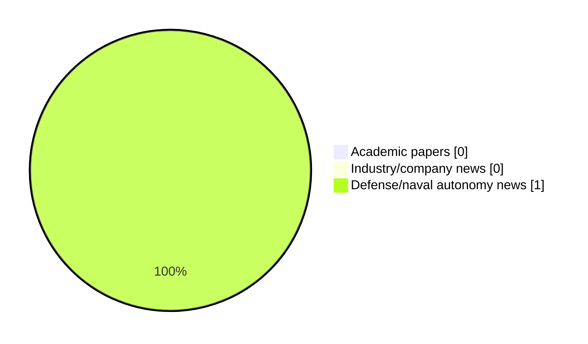

# Maritime Autonomy Watch — 2026-10-07

## Executive Summary

- Total selected items: 1
- Academic papers: 0
- Industry/company news: 0
- Defense/naval autonomy news: 1
- Failed/inaccessible sources: 0

## Contents

- [Analyst Brief](#analyst-brief)
- [Must Read](#must-read)
- [Top Signals Today](#top-signals-today)
- [Topic Signals](#topic-signals)
- [Freshness and Coverage](#freshness-and-coverage)
- [Quality Notes](#quality-notes)
- [Watchlist](#watchlist)
- [Academic Papers](#academic-papers)
- [Industry and Company News](#industry-and-company-news)
- [Defense and Naval Autonomy News](#defense-and-naval-autonomy-news)
- [Source Status Summary](#source-status-summary)

## Analyst Brief

Today's report selected 1 non-duplicate item(s), led by defense adoption. The strongest item is [Saronic Technologies Names Kevin Humphreys VP of Commercial to Drive Autonomous Vessel Growth](https://oceannews.com/news/milestones/saronic-technologies-names-kevin-humphreys-vp-of-commercial-to-drive-autonomous-vessel-growth/) from oceannews.com.
Coverage is weighted toward academic research (0), with 0 industry and 1 defense signal(s).

## Must Read

- [Saronic Technologies Names Kevin Humphreys VP of Commercial to Drive Autonomous Vessel Growth](https://oceannews.com/news/milestones/saronic-technologies-names-kevin-humphreys-vp-of-commercial-to-drive-autonomous-vessel-growth/) — Defense signal: defense adoption

## Top Signals Today

- defense adoption: 1 selected item(s).

## Topic Signals

- defense adoption: 1

## Freshness and Coverage

- Newest selected item date: 2026-10-06
- Oldest selected item date: 2026-10-06
- Active/enabled sources: 5
- Sources with access problems: 2
- Quality flags: 0

## Quality Notes

- No quality flags on selected items.

## Watchlist

- No watchlist items today.

### Category Snapshot

| Category | Selected items |
|---|---:|
| Academic papers | 0 |
| Industry/company news | 0 |
| Defense/naval autonomy news | 1 |

## Academic Papers

_Selected items: 0_

No selected items.

## Industry and Company News

_Selected items: 0_

No selected items.

## Defense and Naval Autonomy News

_Selected items: 1_

### [Saronic Technologies Names Kevin Humphreys VP of Commercial to Drive Autonomous Vessel Growth](https://oceannews.com/news/milestones/saronic-technologies-names-kevin-humphreys-vp-of-commercial-to-drive-autonomous-vessel-growth/)

- Source: oceannews.com
- Date: 2026-10-06
- Relevance score: 6.25
- Signal: Defense signal: defense adoption
- Topic tags: defense adoption

**Summary**

Saronic Technologies, a leading developer of maritime autonomy for both defense and commercial applications, has announced the appointment of maritime industry stalwart Kevin Humphreys as the company's Vice President of Commercial.

**Why it matters**

Signals movement in naval adoption; useful for tracking operational concepts, procurement direction, and fleet integration.

---

## Inaccessible or Failed Sources

- None

## Source Status Summary

| Source | Status | Notes |
|---|---|---|
| arXiv | enabled | API source, 15 items fetched |
| OpenAlex | enabled | API source, 15 items fetched |
| RSS feeds | enabled | 107 RSS items fetched |
| SMI MASG News | enabled | HTML source, 10 items fetched |
| IEEE Xplore | disabled | Missing IEEE_XPLORE_API_KEY |
| Elsevier Scopus | enabled | API source, 15 items fetched |
| NewsAPI | disabled | Missing NEWS_API_KEY |

## Metadata

- Generated at: 2026-10-07T14:35:42.574576+02:00
- Date: 2026-10-07
- Repository: ferhannb/MarineRobotics
- Relevance threshold: 4.0
- Deduplication method: DOI, canonical URL, source ID, normalized title, similar recent titles, category caps, and novelty score
