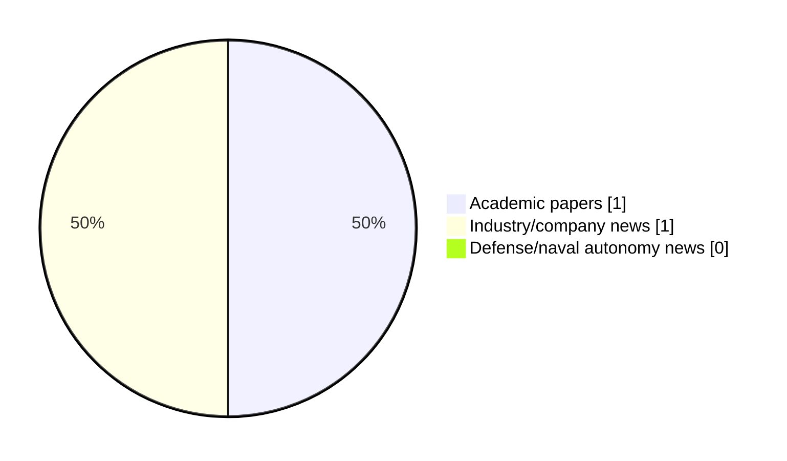

# Maritime Autonomy Watch — 2026-10-08

## Executive Summary

- Total selected items: 2
- Academic papers: 1
- Industry/company news: 1
- Defense/naval autonomy news: 0
- Failed/inaccessible sources: 0

## Contents

- [Analyst Brief](#analyst-brief)
- [Must Read](#must-read)
- [Top Signals Today](#top-signals-today)
- [Topic Signals](#topic-signals)
- [Freshness and Coverage](#freshness-and-coverage)
- [Quality Notes](#quality-notes)
- [Watchlist](#watchlist)
- [Academic Papers](#academic-papers)
- [Industry and Company News](#industry-and-company-news)
- [Defense and Naval Autonomy News](#defense-and-naval-autonomy-news)
- [Source Status Summary](#source-status-summary)

## Analyst Brief

Today's report selected 2 non-duplicate item(s), led by AUV navigation, perception, general autonomy. The strongest item is [NAViLoss: An Underwater Navigation-Aware Dual-Residual Objective for Physics-Consistent Learning](http://arxiv.org/abs/2610.09690v1) from arXiv.
Coverage is weighted toward academic research (1), with 1 industry and 0 defense signal(s).
Quality caveat: low-score-unique=1.

## Must Read

- [NAViLoss: An Underwater Navigation-Aware Dual-Residual Objective for Physics-Consistent Learning](http://arxiv.org/abs/2610.09690v1) — Research signal: AUV navigation
- [StrateSea & HII Demonstrate In-Water Autonomous Target Recognition](https://www.oceansciencetechnology.com/news/stratesea-hii-demonstrate-in-water-autonomous-target-recognition/) — Industry signal: general autonomy

## Top Signals Today

- AUV navigation: 1 selected item(s).
- perception: 1 selected item(s).
- general autonomy: 1 selected item(s).

## Topic Signals

- AUV navigation: 1
- perception: 1
- general autonomy: 1

## Freshness and Coverage

- Newest selected item date: 2026-10-08
- Oldest selected item date: 2026-10-07
- Active/enabled sources: 5
- Sources with access problems: 2
- Quality flags: 1

## Quality Notes

- low-score-unique: 1

## Watchlist

- [StrateSea & HII Demonstrate In-Water Autonomous Target Recognition](https://www.oceansciencetechnology.com/news/stratesea-hii-demonstrate-in-water-autonomous-target-recognition/) — low-score-unique

### Category Snapshot

| Category | Selected items |
|---|---:|
| Academic papers | 1 |
| Industry/company news | 1 |
| Defense/naval autonomy news | 0 |

## Academic Papers

_Selected items: 1_

### [NAViLoss: An Underwater Navigation-Aware Dual-Residual Objective for Physics-Consistent Learning](http://arxiv.org/abs/2610.09690v1)

- Source: arXiv
- Date: 2026-10-07
- Relevance score: 8.5
- Authors: Arup Kumar Sahoo, Itzik Klein
- Signal: Research signal: AUV navigation
- Topic tags: AUV navigation, perception

**Abstract**

Autonomous underwater vehicles (AUVs) commonly rely on inertial navigation systems (INS) aided by Doppler velocity logs (DVLs) for reliable underwater navigation. Accurate DVL velocity estimation is therefore essential for successful operation. Recent learning-based methods have demonstrated improved DVL velocity estimation, particularly under degraded measurement conditions. However, their training objectives typically rely on conventional regression losses that are highly sensitive to large residuals and corrupted observations. Additionally, they do not explicitly account for the physical consistency and measurement uncertainty associated with the underlying sensing process. To address these limitations, this paper introduces navigation-aware loss (NAViLoss), a robust and uncertainty-aware objective function for learning-based AUV velocity estimation.

**Why it matters**

Relevant to underwater autonomy; the work may inform maritime autonomy research, testing priorities, or system design.

---

## Industry and Company News

_Selected items: 1_

### [StrateSea & HII Demonstrate In-Water Autonomous Target Recognition](https://www.oceansciencetechnology.com/news/stratesea-hii-demonstrate-in-water-autonomous-target-recognition/)

- Source: oceansciencetechnology.com
- Date: 2026-10-08
- Relevance score: 3.5
- Signal: Industry signal: general autonomy
- Topic tags: general autonomy
- Quality flags: low-score-unique

**Summary**

StrateSea and the HII Unmanned Systems team recently completed a successful in-water demonstration of closed-loop autonomous target recognition behavior, marking.

**Why it matters**

This item may signal product, market, or deployment momentum in maritime autonomy.

---

## Defense and Naval Autonomy News

_Selected items: 0_

No selected items.

## Inaccessible or Failed Sources

- None

## Source Status Summary

| Source | Status | Notes |
|---|---|---|
| arXiv | enabled | API source, 15 items fetched |
| OpenAlex | enabled | API source, 15 items fetched |
| RSS feeds | enabled | 107 RSS items fetched |
| SMI MASG News | enabled | HTML source, 10 items fetched |
| IEEE Xplore | disabled | Missing IEEE_XPLORE_API_KEY |
| Elsevier Scopus | enabled | API source, 15 items fetched |
| NewsAPI | disabled | Missing NEWS_API_KEY |

## Metadata

- Generated at: 2026-10-08T14:46:06.230729+02:00
- Date: 2026-10-08
- Repository: ferhannb/MarineRobotics
- Relevance threshold: 4.0
- Deduplication method: DOI, canonical URL, source ID, normalized title, similar recent titles, category caps, and novelty score
