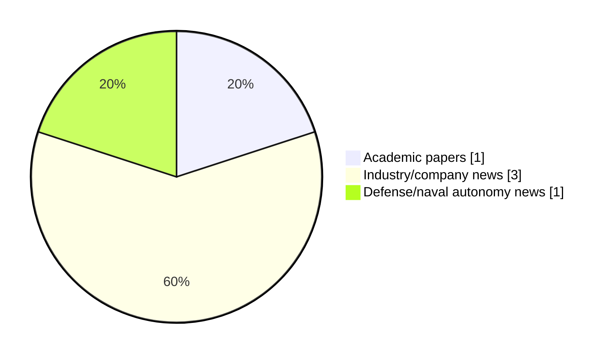

# Maritime Autonomy Watch — 2026-10-09

## Executive Summary

- Total selected items: 5
- Academic papers: 1
- Industry/company news: 3
- Defense/naval autonomy news: 1
- Failed/inaccessible sources: 0

## Contents

- [Analyst Brief](#analyst-brief)
- [Must Read](#must-read)
- [Top Signals Today](#top-signals-today)
- [Topic Signals](#topic-signals)
- [Freshness and Coverage](#freshness-and-coverage)
- [Quality Notes](#quality-notes)
- [Watchlist](#watchlist)
- [Academic Papers](#academic-papers)
- [Industry and Company News](#industry-and-company-news)
- [Defense and Naval Autonomy News](#defense-and-naval-autonomy-news)
- [Source Status Summary](#source-status-summary)

## Analyst Brief

Today's report selected 5 non-duplicate item(s), led by general autonomy, AUV navigation, critical infrastructure. The strongest item is [Subsea Docking & AUV Hangar System Selected for New Research Vessel](https://www.oceansciencetechnology.com/news/subsea-docking-auv-hangar-system-selected-for-new-research-vessel/) from oceansciencetechnology.com.
Coverage is weighted toward academic research (1), with 3 industry and 1 defense signal(s).
Quality caveat: low-score-unique=3, missing-summary=1, date-anomaly=1.

## Must Read

- [Subsea Docking & AUV Hangar System Selected for New Research Vessel](https://www.oceansciencetechnology.com/news/subsea-docking-auv-hangar-system-selected-for-new-research-vessel/) — Industry signal: AUV navigation
- [Sea Machines Robotics Names Courtney Bradbury VP of Program Management for Autonomous Vessel Builds](https://oceannews.com/news/milestones/sea-machines-robotics-names-courtney-bradbury-vp-of-program-management-for-autonomous-vessel-builds/) — Industry signal: general autonomy
- [REPMUS 2026 Puts NATO Uncrewed Maritime Systems to the Test in Portugal](https://oceannews.com/news/defense/repmus-2026-puts-nato-uncrewed-maritime-systems-to-the-test-in-portugal/) — Defense signal: defense adoption
- [Gecko Robotics and Anduril Partner to Accelerate Submarine Production](https://oceannews.com/news/milestones/gecko-robotics-and-anduril-partner-to-accelerate-submarine-production/) — Industry signal: general autonomy

## Top Signals Today

- general autonomy: 3 selected item(s).
- AUV navigation: 1 selected item(s).
- critical infrastructure: 1 selected item(s).
- defense adoption: 1 selected item(s).

## Topic Signals

- general autonomy: 3
- AUV navigation: 1
- critical infrastructure: 1
- defense adoption: 1

## Freshness and Coverage

- Newest selected item date: 2027-02-01
- Oldest selected item date: 2026-10-08
- Active/enabled sources: 4
- Sources with access problems: 3
- Quality flags: 5

## Quality Notes

- low-score-unique: 3
- missing-summary: 1
- date-anomaly: 1
- Date anomalies: [Preliminary conceptual design of a micro supercritical CO2-cooled pressure-tube reactor for unmanned underwater vehicles](https://api.elsevier.com/content/abstract/scopus_id/105050631962) reports 2027-02-01

## Watchlist

- [REPMUS 2026 Puts NATO Uncrewed Maritime Systems to the Test in Portugal](https://oceannews.com/news/defense/repmus-2026-puts-nato-uncrewed-maritime-systems-to-the-test-in-portugal/) — low-score-unique
- [Gecko Robotics and Anduril Partner to Accelerate Submarine Production](https://oceannews.com/news/milestones/gecko-robotics-and-anduril-partner-to-accelerate-submarine-production/) — low-score-unique
- [Preliminary conceptual design of a micro supercritical CO2-cooled pressure-tube reactor for unmanned underwater vehicles](https://api.elsevier.com/content/abstract/scopus_id/105050631962) — missing-summary, date-anomaly, low-score-unique

### Category Snapshot

| Category | Selected items |
|---|---:|
| Academic papers | 1 |
| Industry/company news | 3 |
| Defense/naval autonomy news | 1 |

## Academic Papers

_Selected items: 1_

### [Preliminary conceptual design of a micro supercritical CO2-cooled pressure-tube reactor for unmanned underwater vehicles](https://api.elsevier.com/content/abstract/scopus_id/105050631962)

- Source: Elsevier Scopus
- Date: 2027-02-01
- Relevance score: 3.5
- DOI: 10.1016/j.anucene.2026.112856
- Signal: Research signal: general autonomy
- Topic tags: general autonomy
- Quality flags: missing-summary, date-anomaly, low-score-unique

**Abstract**

No summary available.

**Why it matters**

Relevant to underwater autonomy; the work may inform maritime autonomy research, testing priorities, or system design.

---

## Industry and Company News

_Selected items: 3_

### [Subsea Docking & AUV Hangar System Selected for New Research Vessel](https://www.oceansciencetechnology.com/news/subsea-docking-auv-hangar-system-selected-for-new-research-vessel/)

- Source: oceansciencetechnology.com
- Date: 2026-10-09
- Relevance score: 7.75
- Signal: Industry signal: AUV navigation
- Topic tags: AUV navigation, critical infrastructure

**Summary**

Kongsberg Maritime has secured a contract with shipbuilder VARD to deliver a specialized Autonomous Underwater Vehicle (AUV) hangar and subsea.

**Why it matters**

Signals momentum in underwater autonomy; useful for tracking product direction, partnerships, and deployment opportunities.

---

### [Sea Machines Robotics Names Courtney Bradbury VP of Program Management for Autonomous Vessel Builds](https://oceannews.com/news/milestones/sea-machines-robotics-names-courtney-bradbury-vp-of-program-management-for-autonomous-vessel-builds/)

- Source: oceannews.com
- Date: 2026-10-08
- Relevance score: 4.25
- Signal: Industry signal: general autonomy
- Topic tags: general autonomy

**Summary**

Sea Machines Robotics, a world leader in marine autonomous technology, is growing its leadership team with the hire of Courtney Bradbury, PE, as Vice President of Program Management, a newly created role overseeing the company's management and delivery of large-scale autonomous vessel programs.

**Why it matters**

This item may signal product, market, or deployment momentum in maritime autonomy.

---

### [Gecko Robotics and Anduril Partner to Accelerate Submarine Production](https://oceannews.com/news/milestones/gecko-robotics-and-anduril-partner-to-accelerate-submarine-production/)

- Source: oceannews.com
- Date: 2026-10-08
- Relevance score: 3
- Signal: Industry signal: general autonomy
- Topic tags: general autonomy
- Quality flags: low-score-unique

**Summary**

Gecko Robotics has announced a partnership with Anduril Industries to help accelerate American shipbuilding using advanced robotics, AI-powered software, and automated quality assurance. The partnership is a direct response to America's maritime production challenge, helping rebuild the industrial capacity required to deliver the next generation of submarines, ships, and autonomous maritime systems.

**Why it matters**

This item may signal product, market, or deployment momentum in maritime autonomy.

---

## Defense and Naval Autonomy News

_Selected items: 1_

### [REPMUS 2026 Puts NATO Uncrewed Maritime Systems to the Test in Portugal](https://oceannews.com/news/defense/repmus-2026-puts-nato-uncrewed-maritime-systems-to-the-test-in-portugal/)

- Source: oceannews.com
- Date: 2026-10-08
- Relevance score: 3.5
- Signal: Defense signal: defense adoption
- Topic tags: defense adoption
- Quality flags: low-score-unique

**Summary**

From August 31 to September 25, 2026, Portugal hosted REPMUS 2026, a large-scale exercise which included integrating and assessing uncrewed maritime systems. It involved more than 3,700 participants, 300 unmanned systems, 60 research and development companies, and representatives of 36 navies. Uncrewed systems offer new ways for NATO to maintain a credible and persistent presence, even in remote locations, helping enhance deterrence and defense.

**Why it matters**

Signals movement in naval adoption; useful for tracking operational concepts, procurement direction, and fleet integration.

---

## Inaccessible or Failed Sources

- None

## Source Status Summary

| Source | Status | Notes |
|---|---|---|
| arXiv | enabled | API source, 15 items fetched |
| OpenAlex | enabled | API source, 15 items fetched |
| RSS feeds | partial | 97 RSS items fetched; failures: https://www.navalnews.com/feed/: HTTP 503 for https://www.navalnews.com/feed/ |
| SMI MASG News | enabled | HTML source, 10 items fetched |
| IEEE Xplore | disabled | Missing IEEE_XPLORE_API_KEY |
| Elsevier Scopus | enabled | API source, 15 items fetched |
| NewsAPI | disabled | Missing NEWS_API_KEY |

## Metadata

- Generated at: 2026-10-09T14:31:32.451394+02:00
- Date: 2026-10-09
- Repository: ferhannb/MarineRobotics
- Relevance threshold: 4.0
- Deduplication method: DOI, canonical URL, source ID, normalized title, similar recent titles, category caps, and novelty score
