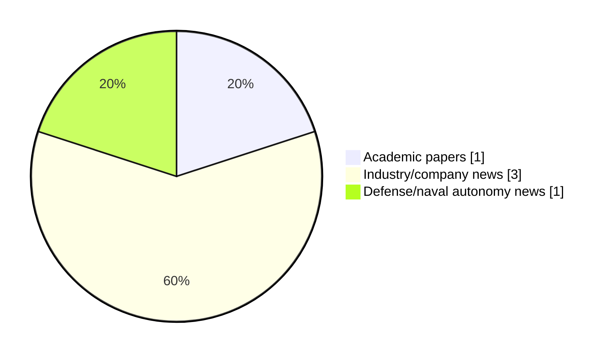

# Maritime Autonomy Watch — 2026-10-10

## Executive Summary

- Total selected items: 5
- Academic papers: 1
- Industry/company news: 3
- Defense/naval autonomy news: 1
- Failed/inaccessible sources: 0

## Contents

- [Analyst Brief](#analyst-brief)
- [Must Read](#must-read)
- [Top Signals Today](#top-signals-today)
- [Topic Signals](#topic-signals)
- [Freshness and Coverage](#freshness-and-coverage)
- [Quality Notes](#quality-notes)
- [Watchlist](#watchlist)
- [Academic Papers](#academic-papers)
- [Industry and Company News](#industry-and-company-news)
- [Defense and Naval Autonomy News](#defense-and-naval-autonomy-news)
- [Source Status Summary](#source-status-summary)

## Analyst Brief

Today's report selected 5 non-duplicate item(s), led by planning/control, AUV navigation, general autonomy. The strongest item is [Exail Introduces Neptis Uncrewed Maritime Surveillance System](https://www.navalnews.com/event-news/euronaval-2026/2026/10/exail-introduces-neptis-uncrewed-maritime-surveillance-system/) from navalnews.com.
Coverage is weighted toward academic research (1), with 3 industry and 1 defense signal(s).
Quality caveat: missing-summary=1, date-anomaly=1.

## Must Read

- [Exail Introduces Neptis Uncrewed Maritime Surveillance System](https://www.navalnews.com/event-news/euronaval-2026/2026/10/exail-introduces-neptis-uncrewed-maritime-surveillance-system/) — Defense signal: USV operations
- [Subnero Acoustic Modems Integrate Natively with OceanScan LAUV](https://oceannews.com/news/science-technology/subnero-acoustic-modems-integrate-natively-with-oceanscan-lauv/) — Industry signal: AUV navigation
- [Robosys Validates VOYAGER AI Maritime Autonomy Software](https://www.marinelink.com/news/robosys-validates-voyager-ai-maritime-543595) — Industry signal: general autonomy
- [EvoLogics Harbor Protection Network Debuts at NATO REPMUS 2026](https://oceannews.com/news/defense/evologics-harbor-protection-network-debuts-at-nato-repmus-2026/) — Industry signal: general autonomy

## Top Signals Today

- planning/control: 2 selected item(s).
- AUV navigation: 2 selected item(s).
- general autonomy: 2 selected item(s).
- USV operations: 1 selected item(s).
- critical infrastructure: 1 selected item(s).

## Topic Signals

- planning/control: 2
- AUV navigation: 2
- general autonomy: 2
- USV operations: 1
- critical infrastructure: 1
- defense adoption: 1
- underwater communications: 1
- swarm autonomy: 1

## Freshness and Coverage

- Newest selected item date: 2027-03-01
- Oldest selected item date: 2026-10-09
- Active/enabled sources: 5
- Sources with access problems: 2
- Quality flags: 2

## Quality Notes

- missing-summary: 1
- date-anomaly: 1
- Date anomalies: [Formation control of AUVs for enabling safe and efficient marine operations](https://api.elsevier.com/content/abstract/scopus_id/105046585164) reports 2027-03-01

## Watchlist

- [Formation control of AUVs for enabling safe and efficient marine operations](https://api.elsevier.com/content/abstract/scopus_id/105046585164) — missing-summary, date-anomaly

### Category Snapshot

| Category | Selected items |
|---|---:|
| Academic papers | 1 |
| Industry/company news | 3 |
| Defense/naval autonomy news | 1 |

## Academic Papers

_Selected items: 1_

### [Formation control of AUVs for enabling safe and efficient marine operations](https://api.elsevier.com/content/abstract/scopus_id/105046585164)

- Source: Elsevier Scopus
- Date: 2027-03-01
- Relevance score: 4.25
- DOI: 10.1016/j.apm.2026.117232
- Signal: Research signal: AUV navigation
- Topic tags: AUV navigation, swarm autonomy, planning/control
- Quality flags: missing-summary, date-anomaly

**Abstract**

No summary available.

**Why it matters**

Relevant to underwater autonomy, multi-vehicle coordination; the work may inform maritime autonomy research, testing priorities, or system design.

---

## Industry and Company News

_Selected items: 3_

### [Subnero Acoustic Modems Integrate Natively with OceanScan LAUV](https://oceannews.com/news/science-technology/subnero-acoustic-modems-integrate-natively-with-oceanscan-lauv/)

- Source: oceannews.com
- Date: 2026-10-09
- Relevance score: 5.5
- Signal: Industry signal: AUV navigation
- Topic tags: AUV navigation, underwater communications

**Summary**

Subnero, a Singapore developer of underwater communication and networking technologies, has announced that its smart acoustic modems are now natively supported in the Light Autonomous Underwater Vehicle (LAUV) from OceanScan MST. The integration was carried out independently by the Acoustic Research Laboratory (ARL) at the National University of Singapore. It required no modification to the modem, the vehicle, or the software on either side.

**Why it matters**

Signals momentum in underwater autonomy; useful for tracking product direction, partnerships, and deployment opportunities.

---

### [Robosys Validates VOYAGER AI Maritime Autonomy Software](https://www.marinelink.com/news/robosys-validates-voyager-ai-maritime-543595)

- Source: marinelink.com
- Date: 2026-10-09
- Relevance score: 5
- Signal: Industry signal: general autonomy
- Topic tags: general autonomy

**Summary**

Robosys Automation, a developer of intelligent marine autonomy systems, took part in a test campaign with its VOYAGER AI Autonomous Navigation System (ANS) software at MARIN (Maritime Research Institute Netherlands) against the 55 recognized DNV…

**Why it matters**

This item may signal product, market, or deployment momentum in maritime autonomy.

---

### [EvoLogics Harbor Protection Network Debuts at NATO REPMUS 2026](https://oceannews.com/news/defense/evologics-harbor-protection-network-debuts-at-nato-repmus-2026/)

- Source: oceannews.com
- Date: 2026-10-09
- Relevance score: 4.25
- Signal: Industry signal: general autonomy
- Topic tags: general autonomy

**Summary**

For nearly three weeks, an EvoLogics team and its sensor network guarded the Portuguese port of Sesimbra during REPMUS 2026, one of the world's largest exercises for maritime unmanned systems. Between September 7 and 17 alone, the sensors generated hundreds of alerts. The network listened for combat divers and underwater drones sent in by a red team at night—and helped reconstruct a real collision between a fishing boat and one of its own sensor buoys.

**Why it matters**

Signals momentum in underwater autonomy, navigation safety; useful for tracking product direction, partnerships, and deployment opportunities.

---

## Defense and Naval Autonomy News

_Selected items: 1_

### [Exail Introduces Neptis Uncrewed Maritime Surveillance System](https://www.navalnews.com/event-news/euronaval-2026/2026/10/exail-introduces-neptis-uncrewed-maritime-surveillance-system/)

- Source: navalnews.com
- Date: 2026-10-09
- Relevance score: 7.5
- Signal: Defense signal: USV operations
- Topic tags: USV operations, planning/control, critical infrastructure, defense adoption
- Also reported by: https://oceannews.com/feed/

**Summary**

Exail introduced its Neptis uncrewed maritime surveillance system during the Euronaval press tour. Bringing together Oryx-family uncrewed surface vessels (USVs), mission-specific sensors and command-and-control software, the system can be configured for maritime surveillance, anti-submarine warfare and the protection of critical underwater infrastructure. Exail describes Neptis as a “system of systems” designed to support persistent operations.

**Why it matters**

Signals movement in underwater autonomy, surface-vessel operations, naval adoption; useful for tracking operational concepts, procurement direction, and fleet integration.

---

## Inaccessible or Failed Sources

- None

## Source Status Summary

| Source | Status | Notes |
|---|---|---|
| arXiv | enabled | API source, 15 items fetched |
| OpenAlex | enabled | API source, 15 items fetched |
| RSS feeds | enabled | 107 RSS items fetched |
| SMI MASG News | enabled | HTML source, 10 items fetched |
| IEEE Xplore | disabled | Missing IEEE_XPLORE_API_KEY |
| Elsevier Scopus | enabled | API source, 15 items fetched |
| NewsAPI | disabled | Missing NEWS_API_KEY |

## Metadata

- Generated at: 2026-10-10T13:51:22.005781+02:00
- Date: 2026-10-10
- Repository: ferhannb/MarineRobotics
- Relevance threshold: 4.0
- Deduplication method: DOI, canonical URL, source ID, normalized title, similar recent titles, category caps, and novelty score
